# Big Brain Time Design Studio — Combined Edition

This compiled edition contains the principal design-studio documents in reading order. The individual Markdown files remain the preferred editable sources. Templates and preserved source materials are included in the package but not repeated in full here.


---

# Big Brain Time Design Studio

**Prepared:** 2026-07-27  
**Mode:** research, architecture, product design, and deliberate experimentation  
**Starting point:** the current Big Brain Time repository is treated as an instrumented proof of concept—not as a frozen product architecture.

## What this package is for

Big Brain Time has already crossed an important threshold: it is no longer only a collection of notes or a speculative architecture. It is a working prototype that exposes real questions about memory, truth, continuity, synthesis, planning, autonomy, and human–AI collaboration.

That is exactly the point at which building faster can become less useful than **designing more deliberately**.

This package creates a temporary “design studio” around the prototype. Its purpose is to let Jonathan:

1. Understand what has actually been built and what maturity claims are justified.
2. Separate the cognitive model, product model, technical architecture, and delivery process.
3. Explore multiple architectures without prematurely choosing one.
4. study relevant research as a source of constraints and experiments—not as a list of features to copy.
5. Turn broad ideas into explicit design questions, options, criteria, prototypes, and evidence.
6. Decide what belongs in a universal product kernel, what is Jonathan-specific, and what should remain external.
7. Resume implementation only when the next design risk is understood well enough to justify a small probe.

The package is intentionally larger than an implementation plan and smaller than a final specification. It is a **thinking environment**.

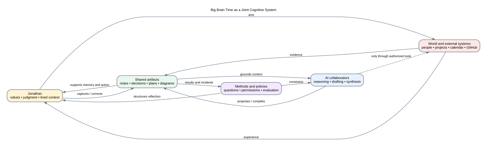

## Central product hypothesis

> Big Brain Time can become a durable human–AI capability platform by preserving source and history, representing multiple cognitive object types and perspectives, compiling purpose-specific context, supporting commitments and re-entry, and permitting action only through explicit policy and evaluation.

The original blueprint correctly identified a narrower first opportunity: accurate resumption, conflict detection, and source-grounded context. The design studio keeps that practical kernel while exploring the larger ambition of a secondary cognitive system.

## Five distinctions to keep visible

The package uses five distinctions repeatedly because much of the architectural confusion comes from collapsing them:

### 1. Prototype versus product

A prototype proves that an interaction or mechanism can exist. A product must also be understandable, recoverable, governable, maintainable, and useful over time.

### 2. Cognitive object versus factual claim

Episodes, narratives, preferences, goals, plans, decisions, hypotheses, and simulations are all useful memory objects, but they do not all have the same truth conditions.

### 3. Canonical authority versus derived representation

A search index, graph, summary, context pack, or embedding may be useful without becoming the authoritative place where the underlying meaning lives.

### 4. Research result versus design decision

Research constrains what is plausible and reveals failure modes. It rarely determines a product choice without considering this system’s goals, users, scale, privacy, and maintenance burden.

### 5. Technical correctness versus joint-system improvement

A module can pass tests and still make Jonathan’s overall workflow slower, noisier, harder to trust, or more dependent on maintenance.

## Recommended reading path

The documents can be read linearly, but the package is designed for repeated passes.

### Pass 1 — Orient to the proof of concept

1. `00_DESIGN_STUDIO_CHARTER.md`
2. `01_CURRENT_PRODUCT_AND_PROOF_OF_CONCEPT.md`
3. `02_PRODUCT_THESIS_AND_CAPABILITY_MODEL.md`

**Output:** a one-page statement of what Big Brain Time is trying to make possible and which current capabilities should be preserved.

### Pass 2 — Understand the whole system

4. `03_SYSTEM_LANDSCAPE_AND_ARCHITECTURE.md`
5. `04_SUBSYSTEM_ATLAS.md`
6. `12_DIAGRAM_ATLAS.md`

**Output:** mark each subsystem as `core`, `capability pack`, `adapter`, `external authority`, `derived`, or `not yet justified`.

### Pass 3 — Study the cognitive model

7. `05_COGNITIVE_AND_MEMORY_MODEL.md`
8. `06_SYNTHESIS_CONSOLIDATION_AND_FORGETTING.md`

**Output:** work through three real memories, one changing belief, one preference, one decision, and one scenario using the proposed object model.

### Pass 4 — Preserve alternatives

9. `07_DESIGN_TENSIONS_AND_OPTION_SPACES.md`
10. `08_RESEARCH_AGENDA_AND_EVIDENCE_MAP.md`

**Output:** select no more than three design questions for deeper research or prototype work.

### Pass 5 — Establish the design method

11. `09_PRODUCT_DESIGN_METHOD_AND_GOVERNANCE.md`
12. `11_EXPERIMENT_PORTFOLIO_AND_DECISION_GATES.md`
13. the templates in `templates/`

**Output:** create one complete design-question packet and one experiment card before writing new production code.

### Pass 6 — Think beyond the personal prototype

14. `10_GENERALIZATION_AND_PRODUCTIZATION.md`
15. `13_DESIGN_WORKBOOK.md`
16. `14_GLOSSARY.md`
17. `SOURCES_AND_TRACEABILITY.md`

**Output:** distinguish the universal kernel from Jonathan’s profile and choose the smallest reusable product surface worth testing.

## A paced twelve-session study plan

A “session” can be an hour, an evening, or a week. The sequence is deliberately slower than a sprint plan.

| Session | Focus | Concrete artifact |
|---|---|---|
| 1 | Current proof of concept | Keep / question / retire list |
| 2 | Product thesis | Product promise and anti-promise |
| 3 | Jobs and quality attributes | Top five capability scenarios |
| 4 | System boundaries | Authority and external-system map |
| 5 | Cognitive object model | Five worked memory examples |
| 6 | Retrieval and context | Two context-contract examples |
| 7 | Synthesis and forgetting | One compression contract and one purge case |
| 8 | Design tensions | Two QOC option maps |
| 9 | Research agenda | Three bounded research questions |
| 10 | Generalization | Kernel / profile / capability-pack split |
| 11 | Experiment design | Baseline, probe, measures, stop rule |
| 12 | Architecture review | Decision packet and next smallest build |

No session is required to end in a decision. An explicit unresolved question is a valid outcome.

## Document map

| Document | Primary question |
|---|---|
| `00_DESIGN_STUDIO_CHARTER.md` | How should this design phase operate? |
| `01_CURRENT_PRODUCT_AND_PROOF_OF_CONCEPT.md` | What exists now, and how mature is it? |
| `02_PRODUCT_THESIS_AND_CAPABILITY_MODEL.md` | What product is being designed? |
| `03_SYSTEM_LANDSCAPE_AND_ARCHITECTURE.md` | What are the system boundaries and major layers? |
| `04_SUBSYSTEM_ATLAS.md` | What does each subsystem do, depend on, and risk? |
| `05_COGNITIVE_AND_MEMORY_MODEL.md` | What kinds of memory and mental objects must be represented? |
| `06_SYNTHESIS_CONSOLIDATION_AND_FORGETTING.md` | When and how may information be compressed or removed? |
| `07_DESIGN_TENSIONS_AND_OPTION_SPACES.md` | Which choices should remain open, and how can they be compared? |
| `08_RESEARCH_AGENDA_AND_EVIDENCE_MAP.md` | Which research threads can materially change the design? |
| `09_PRODUCT_DESIGN_METHOD_AND_GOVERNANCE.md` | How are questions converted into evidence-backed decisions? |
| `10_GENERALIZATION_AND_PRODUCTIZATION.md` | How can a personal prototype become a reusable platform? |
| `11_EXPERIMENT_PORTFOLIO_AND_DECISION_GATES.md` | Which probes should be run, in what order, with what stop rules? |
| `12_DIAGRAM_ATLAS.md` | How can the product and subsystems be inspected visually? |
| `13_DESIGN_WORKBOOK.md` | What should Jonathan fill out while studying the system? |
| `14_GLOSSARY.md` | What does the package mean by its recurring terms? |
| `SOURCES_AND_TRACEABILITY.md` | Which ideas came from the current system, prior blueprint, research, or new proposals? |

## Evidence labels

The documents preserve the source package’s practice of distinguishing evidence from proposals, with a few additional labels:

- **`[CURRENT]`** — observed in the current repository or its current documentation.
- **`[SOURCE]`** — supported by the supplied Big Brain Time blueprint and planning materials.
- **`[RESEARCH]`** — supported by cited external primary research, standards, or official documentation.
- **`[PROPOSAL]`** — a design recommendation introduced in this package.
- **`[QUESTION]`** — a deliberately unresolved design issue.
- **`[EXPERIMENT]`** — a proposed probe, benchmark, or field study.
- **`[INFERENCE]`** — a conclusion drawn by combining current evidence and design reasoning.

A proposal does not become an architectural commitment merely because it is written clearly.

## Maturity vocabulary

The package uses the following ladder:

1. **Concept** — a reasoned idea exists.
2. **Prototype** — an inspectable artifact demonstrates feasibility.
3. **Tested** — deterministic tests pass for the stated scope.
4. **Benchmarked** — a declared evaluation suite meets its threshold.
5. **Piloted** — used in real work with recorded feedback.
6. **Trusted** — sustained evidence supports reliance in a defined scope.
7. **Authorized** — policy allows the capability to take a defined action.

These are independent of marketing language. A feature can be technically tested but not productively piloted, or trusted for retrieval but not authorized for mutation.

## Package layout

```text
big-brain-time-design-studio/
├── README.md
├── 00_... through 14_...       # principal design documents
├── SOURCES_AND_TRACEABILITY.md
├── BIG_BRAIN_TIME_DESIGN_STUDIO.md
├── diagrams/                   # Graphviz source and rendered SVGs
├── templates/                  # reusable design and experiment packets
└── reference/source-blueprint/ # preserved copies of supplied planning material
```

## How to edit this package

- Add a dated annotation instead of silently replacing an important unresolved tension.
- Keep design alternatives visible until evidence or an explicit value choice selects one.
- When changing an architectural recommendation, record the scenario or finding that changed it.
- Do not turn every sentence into a requirement.
- Keep diagrams as views over the written model; do not let a diagram become the only definition.
- Prefer one complete worked example over ten abstract fields.
- Remove sections that do not help a decision. The design studio must not become another archive that is hard to use.

## First action

Read `00_DESIGN_STUDIO_CHARTER.md`, then spend one session on the “keep, question, retire” worksheet at the end of `01_CURRENT_PRODUCT_AND_PROOF_OF_CONCEPT.md`. Do not begin with the roadmap. The next build should emerge from the design risk that matters most, not from the next numbered sprint.


---

# 00 — Design Studio Charter

## 1. Purpose

Big Brain Time has a credible proof of concept, a substantial architecture package, and multiple working mechanisms. The next phase is not primarily an implementation phase. It is a period of **design inquiry** intended to clarify the product, cognitive model, subsystem boundaries, architectural tradeoffs, and evidence required before deeper commitment.

The studio exists to answer a different question from a normal sprint:

> What must be understood, represented, compared, and tested so that Big Brain Time can grow into a durable secondary cognitive system without hardening prototype assumptions into permanent constraints?

## 2. Why step back now

The supplied audit and blueprint identified accurate resumption and contradiction detection as the clearest immediate opportunity. It also documented concrete propagation, identity, temporal, retrieval, and recovery failures. The subsequent prototype demonstrates that many proposed capabilities can be implemented, but it also reveals that implementation names can outrun semantic guarantees.

This creates a productive moment:

- There is enough software to expose real rough edges.
- There is enough architecture to see the intended whole.
- There is not yet so much product adoption that redesign is prohibitively expensive.
- Jonathan is still the primary user, making close observation and rapid qualitative learning possible.
- The larger ambition—another brain or capability platform—requires conceptual foundations beyond a collection of features.

The studio treats the repository as a **research instrument**. Its purpose is not to prove the current design correct. Its purpose is to make important assumptions observable.

## 3. Studio mission

> Develop a coherent, evidence-backed design language and product architecture for a local-first human–AI cognitive system that can preserve experience and knowledge, support accurate resumption and action, represent changing perspectives, synthesize without hiding loss, and remain recoverable, governable, and adaptable.

## 4. Scope

The studio covers four connected but distinct layers.

### Layer A — Human and cognitive model

Questions include:

- What types of memory and mental object matter?
- How do facts, observations, interpretations, preferences, values, goals, decisions, plans, narratives, and simulations differ?
- How should source, perspective, confidence, time, and revision be represented?
- What should remain embodied in Jonathan rather than offloaded?
- How should the system help construct futures, not merely reconstruct the past?

### Layer B — Product capability model

Questions include:

- What jobs should Big Brain Time perform?
- Which capabilities form the product kernel?
- What makes a “project brain,” “personal brain,” or “team brain” meaningfully different?
- Which experiences should feel transformative?
- What must the system explicitly refuse to promise?

### Layer C — Technical architecture

Questions include:

- What is canonical, derived, external, or ephemeral?
- Which modules share universal infrastructure?
- Where do Markdown, SQLite, Git, models, graphs, and external systems belong?
- How do retrieval, synthesis, planning, propagation, permissions, and lifecycle interact?
- What must be deterministic, and where is model judgment useful?

### Layer D — Design and evaluation process

Questions include:

- How are alternatives preserved and compared?
- What is the smallest useful probe for a design risk?
- Which measures reflect joint-system improvement?
- When should a feature be simplified or removed?
- What evidence justifies movement from prototype to trusted or authorized behavior?

## 5. Out of scope for the studio phase

The studio does not require:

- a complete rewrite of the current repository;
- implementation of every proposed schema;
- choosing a final mobile, sync, hosting, or model-provider strategy;
- designing for hypothetical scale before a use case requires it;
- turning the personal prototype into a public SaaS product;
- adopting a complete cognitive theory, ontology, graph database, or agent framework;
- producing a final five-year roadmap with fixed dates;
- treating all research findings as product requirements;
- maximizing documentation volume.

Implementation is allowed only when it is the cheapest way to test a material design question.

## 6. Operating principles

### 6.1 Preserve the prototype; do not worship it

The current system contains valuable learned structure. Preserve the repository and record its behavior, but allow any module, schema, taxonomy, or workflow to be redesigned if evidence warrants it.

### 6.2 Separate representation levels

Do not solve a cognitive-model question by immediately adding a database column. First clarify the concept and examples; then decide whether the concept needs durable structure, derived structure, or prose.

### 6.3 Keep alternatives alive long enough to learn

A design question should normally have at least two credible options. A single proposed solution is often an unexamined assumption.

### 6.4 Work from scenarios

Every important architectural property should be grounded in a concrete scenario:

- a project resumed after 90 days;
- a belief corrected after new evidence;
- a preference that changes gradually;
- a summary that hides an exception;
- a private memory that must be purged;
- a model output that is useful but not authoritative;
- a collaborator who disagrees with Jonathan;
- a device or provider that becomes unavailable.

### 6.5 Design for correction

The system will be wrong. The product should make the location, cause, influence, and repair of an error understandable.

### 6.6 Treat maintenance as a product cost

Every schema, marker, relation, prompt, policy, view, and workflow creates ongoing cognitive and technical cost. A concept is not free because it is stored in Markdown.

### 6.7 Preserve authentic human meaning

Formalization should improve addressability and reasoning without erasing narrative, ambiguity, voice, emotion, or historical perspective.

### 6.8 Earn complexity

A more sophisticated method must outperform a simpler baseline on a declared problem. This applies to embeddings, graphs, multi-agent orchestration, formal epistemic systems, CRDTs, complex ontologies, and proactive automation.

### 6.9 Evaluate the joint system

The unit of improvement is not the model or database alone. It is Jonathan + AI + artifacts + language + methods + environment over time.

### 6.10 Preserve exits

Every major commitment needs a way to export, rollback, rebuild, replace, archive, or retire it.

## 7. Studio workflow

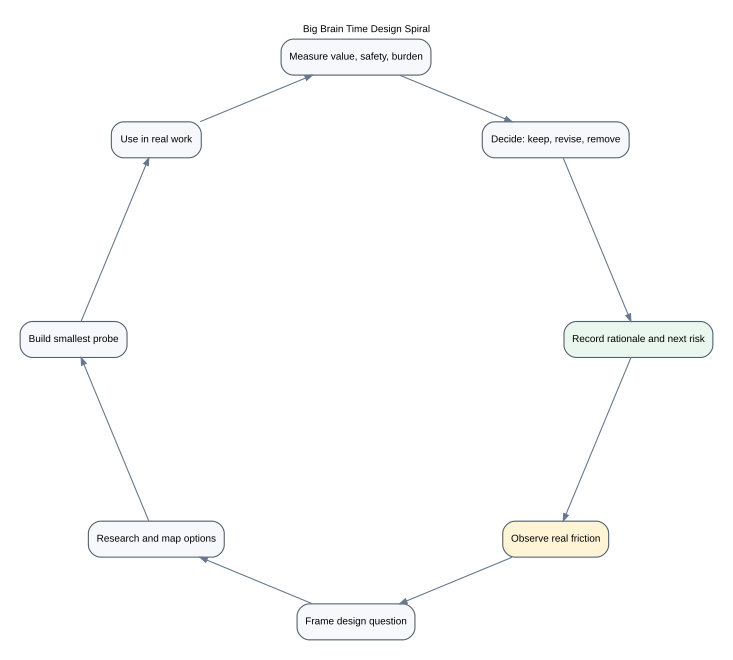

Each design cycle follows eight stages.

### 1. Observe

Capture a real friction, surprise, failure, repeated reconstruction, or emerging opportunity. Preserve the raw example.

### 2. Frame

Convert the observation into a design question. Avoid framing that assumes a solution.

Poor framing:

> How should we add vector search to memory?

Better framing:

> Which retrieval failures remain after exact, lexical, temporal, and link-based retrieval, and what additional mechanism addresses them with acceptable privacy and maintenance cost?

### 3. Research

Review current system evidence, comparable systems, primary literature, standards, and implementation constraints. Record what the evidence supports and what remains an inference.

### 4. Map options

Use Questions–Options–Criteria or an equivalent design-space map. Include the current design as one option, not the default winner.

### 5. Build a probe

Create the smallest artifact that can discriminate among options. A probe may be a paper model, mock interaction, schema example, benchmark fixture, command-line prototype, diagram, or throwaway script.

### 6. Pilot

Use the probe in a real or faithfully simulated workflow. Record confusion, workarounds, maintenance, emotional response, and unexpected use—not only task success.

### 7. Evaluate

Compare results with a baseline and stop rule. Distinguish technical correctness from practical value.

### 8. Decide and communicate

Keep, revise, defer, or remove the design. Record rationale, scope, confidence, reconsideration trigger, and the next unresolved risk.

## 8. Core studio artifacts

Every major investigation should produce a small set of durable artifacts:

1. **Friction record** — what happened in real use.
2. **Design question** — what is genuinely unresolved.
3. **Scenario set** — where the design must work or fail safely.
4. **Option map** — plausible choices and criteria.
5. **Research brief** — relevant evidence and limitations.
6. **Probe** — smallest discriminating artifact.
7. **Evaluation record** — measures, observations, confounders.
8. **Decision record** — choice, rationale, scope, reconsideration trigger.
9. **Migration note** — impact on current implementation, if any.
10. **Ready-to-Resume note** — the next micro-action for the design inquiry.

Templates are provided in `templates/`.

## 9. Quality attributes to reason about

The original blueprint already prioritizes reliability, provenance, privacy, reversibility, low maintenance, and human authority. The studio will make tradeoffs among these attributes explicit.

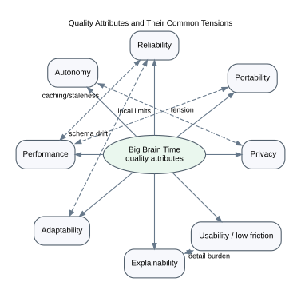

For each architecture question, consider at least:

- usefulness;
- cognitive friction;
- fidelity to source and authentic voice;
- temporal correctness;
- explainability;
- recoverability;
- privacy;
- security;
- adaptability;
- portability;
- performance;
- maintainability;
- interoperability;
- accessibility;
- autonomy and predictability;
- generalizability;
- cost of correction.

No design maximizes all of them.

## 10. Decision discipline

A studio finding may have one of five outcomes:

- **Adopt now** — enough evidence exists for a bounded commitment.
- **Prototype next** — the question is important and can be tested cheaply.
- **Research next** — evidence is too weak or conflicting for a meaningful probe.
- **Defer with trigger** — not currently important; name what would reopen it.
- **Reject or retire** — evidence indicates the complexity or behavior is not worthwhile.

A decision must state its scope. “Use SQLite” is not a sufficient decision. “Use SQLite as a disposable local projection for sections and FTS under a deterministic rebuild contract” is closer.

## 11. Stop rules

Pause a design line when:

- the question cannot be connected to a real capability or risk;
- the documentation required to maintain it exceeds its likely value;
- the probe cannot distinguish among options;
- the result depends entirely on imagined future scale;
- the design creates a second source of truth without a migration boundary;
- the system cannot explain or reverse the consequence;
- the proposal rigidly models Jonathan from sparse evidence;
- a simpler representation supports the observed workflow;
- the work becomes architecture theater rather than learning.

## 12. Studio success criteria

The studio phase is successful when:

1. The current prototype has an honest maturity map.
2. The product kernel and product boundaries are understandable without referring to implementation packages.
3. The cognitive model can represent several real examples without forcing all content into factual claims.
4. Major subsystems have clear responsibilities, inputs, outputs, authority, failure modes, and evaluation plans.
5. At least five significant design tensions have credible option spaces.
6. The research agenda is prioritized by expected decision impact.
7. A repeatable design-question-to-experiment workflow exists.
8. Jonathan can identify the next smallest build and explain which uncertainty it tests.
9. The design package is easier to navigate than the collection of ideas it organizes.
10. It remains acceptable to simplify or discard parts of the prototype.

## 13. Initial studio backlog

The first ten design inquiries should be treated as candidates, not a fixed sequence:

1. What kinds of cognitive objects belong in the kernel?
2. What does “current truth” mean across facts, memories, perspectives, and commitments?
3. What should remain Markdown-canonical, become operationally structured, or remain external?
4. What is the minimum useful synthesis contract?
5. Which information must never be compressed away?
6. How should memory visibility, archive, retraction, redaction, and purge differ?
7. Which project/re-entry workflow produces the most measurable daily value?
8. Which shared foundations are genuinely reusable across domains?
9. What aspects of Jonathan’s profile may be learned, and only under what review?
10. What would make a reusable “project brain” valuable to another person without requiring them to adopt Jonathan’s ontology?

## 14. Current phase statement

**Current status:** Design Studio Open  
**Implementation posture:** maintenance and narrow probes only  
**Primary output:** design understanding and experiment-ready decisions  
**Reconsider implementation mode when:** one design question has a bounded option space, discriminating probe, acceptance criteria, and recovery path.


---

# 01 — Current Product and Proof of Concept

## 1. Review boundary

This document combines:

- the supplied architecture and planning package;
- a static review of the current `admiralorbiter/bigbraintime` repository on 2026-07-27;
- the current project history and claimed test milestones;
- design inferences about maturity and product direction.

The repository was not independently executed as part of this package. Statements about passing test counts are therefore treated as repository-reported evidence, not fresh verification.

## 2. What the current product is

The strongest source-backed framing is not “a second-brain app.” The supplied audit identified the immediate need as accurate resumption without rereading the corpus and detection of disagreements, stale state, broken propagation, and incomplete knowledge. The larger blueprint then framed Big Brain Time as a local-first, source-grounded, temporal capability platform and a kind of knowledge compiler.

The current proof of concept combines five product identities:

1. **Personal knowledge repository** — canonical Markdown, decisions, projects, records, ideas, and views.
2. **Knowledge assurance tool** — diagnostics, identity checks, link checks, temporal and contradiction concerns.
3. **Retrieval and context compiler** — FTS, hybrid retrieval, graph traversal, project packs, handoff packets.
4. **Operational continuity tool** — project state, Ready-to-Resume plans, briefings, re-entry reports.
5. **Human–AI change-control environment** — captured claims, proposals, patches, undo, staging, review, audit, and reconciliation.

This breadth is a strength as a research prototype: it exposes how the subsystems interact. It is also a risk: each name can imply a level of completeness that the underlying implementation has not yet earned.

## 3. Current north star

The original blueprint’s product mission remains a useful anchor:

> Big Brain Time is a local-first, source-grounded, temporal personal capability platform that helps a human–AI partnership remember, resume, decide, act, learn, and improve without losing provenance, history, privacy, or human authority.

For the design phase, that mission should be paired with a more concrete product kernel:

> Preserve enough trustworthy state, perspective, and rationale to resume meaningful work; compile only the context needed for the current purpose; expose uncertainty and change; and help convert understanding into safe commitments and actions.

## 4. Current capability inventory

The repository history reports rapid delivery across a wide set of modules. The following inventory treats the implementation as a proof-of-concept capability map.

| Capability | Current proof | Likely maturity | Key unresolved product question |
|---|---|---|---|
| Canonical Markdown corpus | Established repository structure, front matter, decisions, projects, records | Piloted for Jonathan’s use | Which information types should remain Markdown-canonical forever? |
| Backup command | Manifest-bearing archive and restore-oriented documentation | Tested, restore evidence should remain recurring | What counts as an independent recovery boundary? |
| `bbt doctor` diagnostics | Parser and registry rules for known defects | Tested on seeded cases | Does it remain precise enough in daily use to avoid alert fatigue? |
| Evaluation harness | Gold cases, answer-state concepts, metrics | Prototype/tested | Are benchmarks faithful to actual workflows or overfit to seeded defects? |
| Context packs | Project-scoped token-bounded compiler | Prototype/tested | Is selection purpose-driven and claim-complete enough for real handoffs? |
| SQLite read model | Documents, sections, links, claims, migrations | Tested as projection | Is rebuild semantically deterministic, especially for identity and time? |
| FTS5 and hybrid retrieval | Lexical search, embeddings, rank fusion | Prototype/tested | Which retrieval additions provide measured net value? |
| Graph traversal | Recursive CTE neighborhood and diagnostics | Prototype/tested | Which edges are meaningful, inferred, canonical, or merely retrieval aids? |
| Capture and patching | Smart target, patch generation, atomic apply, undo | Prototype/tested | Does capture processing reduce or increase maintenance and categorization burden? |
| Synthesis engine | Claim harvesting and generated knowledge notes | Prototype | What does synthesis mean beyond collation, and how is loss evaluated? |
| Daily briefing and re-entry | Structured project summaries and transition fields | Prototype | Do they reduce time to first productive action in live use? |
| Flask workbench | Local visual interface over search, graph, patches, audit | Prototype | Which workflows genuinely require a visual interaction surface? |
| File watcher | Background indexing and event handling | Prototype/tested | Is continuous operation worth complexity compared with explicit refresh? |
| Audit ledger | JSONL events, hash chain, projection | Prototype | Does the ledger actually preserve full-event integrity and remain privacy-minimized? |
| Staging | Threshold-based ephemeral candidates | Prototype | What constitutes readiness to synthesize, and how are unrelated claims prevented? |
| Handoff packets | Typed Markdown/JSON packet concept | Prototype/tested | Can a packet be compiled from live evidence rather than hardcoded state? |
| Reconciliation | Candidate retrieval, pair adjudication, Socratic review | Prototype | Is the ontology broad enough, and are temporal/scope/authority invariants correct? |

“Maturity” here is intentionally conservative. Code and unit tests establish feasibility; they do not establish sustained usefulness, semantic completeness, or safe product behavior.

## 5. Strong foundations worth preserving

### 5.1 Local-first, inspectable sources

The system’s bias toward local operation, readable files, Git history, exportability, and replaceable models is a durable advantage. Even if some operational state migrates to SQLite, the user should retain the ability to inspect and recover meaningful information without a vendor or a particular model.

### 5.2 Canonical versus derived separation

The blueprint repeatedly distinguishes authoritative state from indexes, graphs, embeddings, context packs, and summaries. This is one of the most important architectural laws and should survive redesign.

### 5.3 Time and correction as first-class concerns

The insistence that current, historical, proposed, valid, recorded, superseded, and unresolved states differ is essential to a longitudinal personal system.

### 5.4 Re-entry as a product capability

The Ready-to-Resume protocol is unusually concrete and tied to a real cognitive friction. It gives Big Brain Time a clear user outcome rather than only a storage or search feature.

### 5.5 Human-reviewed mutation

The read → propose → review → write pattern creates a strong basis for safe AI participation. It should be refined, not discarded.

### 5.6 Evaluation and stop rules

The source package explicitly allows features to be dropped when they fail value or safety experiments. That is unusually healthy for an ambitious personal platform.

### 5.7 Shared foundations across interfaces

Keeping CLI, web, voice, API, and agents over common services is the right direction for durability and productization.

## 6. Current rough edges that matter for design

The static repository review found several issues that should be treated as **design evidence**, not merely bugs.

### 6.1 Epistemic taxonomy fragmentation

Different modules recognize different claim classes. Some distinguish interpretation, plan, and unknown; others introduce requirement, assumption, and open question. The normalized claim model currently risks defaulting unreviewed content to fully confident fact/user authority.

**Design implication:** the system needs a single conceptual model that separates object kind, source mode, stance, perspective, logical proposition, and resolution. One flat enum is unlikely to represent all of these safely.

### 6.2 Derived rebuilds may mutate epistemic meaning

The importer’s generated identities and timestamps can depend on rebuild time or line order. That means a projection rebuild can accidentally look like a new belief event.

**Design implication:** source identity, semantic identity, recorded time, build time, and database row identity must be distinct.

### 6.3 Reconciliation is not yet equivalent to reasoning

Pair adjudication can over-rely on normalized subject/predicate/object differences and simplified temporal checks. Scope, authority, population, environment, interval overlap, argument order, and evidence status need stronger invariants.

**Design implication:** candidate retrieval, logical relation, temporal resolution, authority resolution, and human review are separate stages.

### 6.4 Synthesis is currently closer to collection than compression

The current synthesis path harvests marked lines and emits a structured note. It does not yet establish semantic deduplication, information-loss boundaries, minority-view preservation, or purpose-specific evaluation. Repeated application can produce duplicated generated documents.

**Design implication:** synthesis needs its own artifact contract and idempotent lifecycle. It should not be treated as an append convenience.

### 6.5 Thresholds can create false coherence

The staging system uses claim counts as a major readiness signal and can fall back to broad claim collection. The richer source/session/duplicate/conflict criteria in the ADR are not fully reflected in the implementation.

**Design implication:** consolidation readiness is a semantic and use-driven question, not a raw volume threshold.

### 6.6 Assurance claims can be hardcoded

The handoff compiler contains repository-state claims and evidence references that can become stale. The audit hash covers only part of an event payload, and cross-process serialization requires stronger proof.

**Design implication:** Big Brain Time must apply its epistemic discipline to claims about itself. Test status, benchmark status, current revision, and evidence references should be compiled from artifacts.

### 6.7 Rapid milestone completion can hide maturity differences

The repository history reports many completed milestones in a short period. This shows remarkable prototyping throughput, but “implemented,” “tested,” “benchmarked,” “piloted,” “trusted,” and “authorized” are not interchangeable.

**Design implication:** the next phase should use maturity classes at the capability level rather than declaring broad milestones complete because their code exists.

## 7. Proof-of-concept architecture versus product architecture

The current repository is valuable partly because it compresses many experiments into one environment. A product architecture should be more selective.

### Proof-of-concept behavior

- Implement a module to make a concept tangible.
- Use a simplified schema to expose interactions.
- Optimize for fast feedback and inspectability.
- Accept hand-authored fixtures and placeholders.
- Place adjacent concerns together to learn where seams exist.

### Product architecture behavior

- Name the user outcome and quality attributes.
- Define authority and lifecycle per information type.
- Keep interfaces thin and contracts versioned.
- Distinguish generated artifacts from canonical decisions.
- Provide migration, recovery, privacy, and deletion behavior.
- Earn complexity through benchmarks and live use.
- Remove mechanisms that do not improve capability.

The design studio should not try to “clean up” the proof of concept into production one module at a time. It should first decide which modules belong in the product at all.

## 8. What to freeze during the design phase

Freeze means “preserve as a baseline,” not “declare correct.”

1. Tag or branch the current proof of concept.
2. Capture its command list, repository map, schema versions, and reported test results.
3. Preserve representative output artifacts: a briefing, context pack, handoff, synthesis note, reconciliation card, audit trace, search result, and patch flow.
4. Record current friction using the system for at least two normal weeks.
5. Avoid broad refactors that make before/after comparison impossible.
6. Allow only maintenance, recovery, and small design probes on the main line.
7. Keep new design documents separate from locked decisions until explicitly accepted.

## 9. Product surfaces visible in the prototype

The proof of concept already suggests several possible products. They should not all be assumed to be one product.

### A. Knowledge observatory

Inspect corpus state, integrity, temporal drift, conflict, provenance, search, and evidence.

### B. Project continuity workbench

Capture transition state, compile re-entry capsules, track commitments, and resume work.

### C. Research and synthesis laboratory

Ingest sources, preserve claims and perspectives, compare evidence, synthesize purpose-bound understanding, and record open questions.

### D. AI collaboration and handoff layer

Compile context and trust state for another model or collaborator; receive structured handback evidence.

### E. Personal operations platform

Projects, tasks, reminders, routines, calendar boundaries, and review triggers.

### F. Cognitive operating system

A shared kernel supporting memory, reasoning, identity, planning, learning, simulation, and action across domains.

The first four may share a near-term kernel. The last two require much more product discovery and should not be assumed to follow automatically.

## 10. Maturity map

Use this table as an editable hypothesis.

| Domain | Concept | Prototype | Tested | Benchmarked | Piloted | Trusted | Authorized |
|---|---:|---:|---:|---:|---:|---:|---:|
| Canonical Markdown practice | ✓ | ✓ | — | — | ✓ | partial | n/a |
| Recovery | ✓ | ✓ | ✓ | — | limited | unknown | n/a |
| Diagnostics | ✓ | ✓ | ✓ | limited | limited | no | read-only |
| Search | ✓ | ✓ | ✓ | limited | unknown | no | read-only |
| Temporal truth | ✓ | ✓ | partial | fixture-only | no | no | read-only |
| Context packs | ✓ | ✓ | ✓ | partial | limited | no | read-only |
| Re-entry | ✓ | ✓ | ✓ | not established | limited | no | proposal |
| Synthesis | ✓ | ✓ | partial | no | no | no | proposal only |
| Reconciliation | ✓ | ✓ | partial | narrow | no | no | review only |
| Audit | ✓ | ✓ | partial | no | no | no | internal |
| Patch/write workflow | ✓ | ✓ | ✓ | narrow | limited | no | explicit review |
| Proactive monitoring | ✓ | prototype | partial | no | no | no | shadow only |
| External action | concept | no | no | no | no | no | prohibited/default deny |

The purpose is not to criticize the prototype. It is to prevent “working code” from carrying product trust that has not yet been measured.

## 11. Keep, question, retire worksheet

Complete this after using the proof of concept rather than from memory alone.

### Keep and strengthen

| Capability or principle | Evidence it helps | What must remain true |
|---|---|---|
| | | |
| | | |
| | | |

### Keep as an experiment

| Capability | Question still being tested | Cheapest next probe |
|---|---|---|
| | | |
| | | |
| | | |

### Redesign

| Current mechanism | Rough edge | Alternative worth exploring |
|---|---|---|
| | | |
| | | |
| | | |

### Retire or simplify

| Capability or structure | Cost it creates | What simpler behavior replaces it |
|---|---|---|
| | | |
| | | |
| | | |

## 12. Design questions exposed by the prototype

1. Is accurate resumption still the strongest product wedge after live use?
2. Which classes of information need structured semantics, and which benefit from remaining narrative?
3. What is the smallest plural epistemic model that supports perspective without becoming an ontology project?
4. Can the system maintain source and time correctly without requiring every sentence to be manually classified?
5. Which summaries improve work, and which merely create more artifacts?
6. What does Jonathan actually want the system to forget, hide, archive, retract, or delete?
7. Which capabilities would still be valuable without an LLM?
8. Which capabilities should fail closed when a model or index is unavailable?
9. How much daily or weekly maintenance does the current prototype require?
10. Which subsystem would another user adopt independently of the whole platform?

## 13. Current conclusion

The current repository has achieved what a strong proof of concept should: it has turned abstract ideas into inspectable mechanisms and exposed where the real design problems are.

The right next step is not to abandon it, nor to treat it as the target. It is to preserve it as **Prototype A**, design alternative architectures and cognitive models around it, and use small experiments to determine which concepts deserve to become durable product contracts.


---

# 02 — Product Thesis and Capability Model

## 1. Product thesis

Big Brain Time should not be defined primarily by a storage medium, database, interface, or AI model. Those are replaceable mechanisms.

The product is a **continuity and capability system**:

> It helps a person or project preserve meaningful state and perspective, construct the smallest trustworthy context for the current purpose, recognize change and disagreement, and convert understanding into deliberate commitments and safe action.

This thesis retains the original assurance-and-context wedge while making room for the larger ambition of a secondary human brain.

## 2. The unit of design

The unit is not “the AI assistant” or “the knowledge base.” It is the organized joint system:

```text
human judgment and lived experience
+ AI reasoning and language capability
+ persistent artifacts and structured state
+ methods, policies, and evaluations
+ external people, tools, and environments
```


A feature succeeds when the joint system can do something more reliably, safely, or creatively—not simply when the software has another function.

## 3. Product promise

A mature Big Brain Time should make the following promise in a bounded form:

1. **Continuity:** You can return after an interruption and recover the important state without rereading everything.
2. **Grounding:** You can see where an answer, decision, memory, or recommendation came from.
3. **Change awareness:** You can distinguish current, historical, proposed, disputed, and unknown states.
4. **Perspective:** You can preserve different people’s or different-times’ views without forcing premature agreement.
5. **Compression with recourse:** You can use concise views while retaining access to underlying evidence and known omissions.
6. **Commitment:** You can connect understanding to goals, decisions, plans, next actions, and review triggers.
7. **Safety and agency:** The system proposes, explains, and prepares; consequential action remains governed by explicit authority.
8. **Adaptability:** The system can change representation, model provider, interface, or workflow without losing the user’s durable meaning.
9. **Recovery:** Canonical information can be exported, restored, inspected, and rebuilt.
10. **Improvement:** The system measures whether it actually reduces cognitive and coordination burden.

## 4. Product anti-promise

Big Brain Time should explicitly not promise:

- perfect memory;
- a single objective model of the person;
- automatic truth from accumulated text;
- omniscient prioritization;
- frictionless capture with zero later processing;
- correct psychological inference;
- safe autonomy merely because an AI is confident;
- complete replacement of calendars, email, health portals, GitHub, or specialized tools;
- meaningful synthesis without a declared purpose;
- permanent retention of everything;
- general intelligence produced by adding more stored context;
- universal suitability for every user without configuration and discovery.

Explicit anti-promises protect trust and product focus.

## 5. Core jobs to be done

### Job 1 — Resume accurately

> When I return to a project, decision, or line of thought after an interruption, help me reconstruct what matters, what changed, where I stopped, and what physical action restarts progress.

Success is measured by time to first productive action, rereads, correction burden, and confidence.

### Job 2 — Explain the present through the past

> When I ask what is currently true, decided, planned, or believed, show the relevant history, source, time boundary, supersession, and unresolved alternatives.

Success is temporal correctness and understandable rationale—not maximal detail.

### Job 3 — Preserve experience without flattening it

> When I capture an event, reflection, preference, or idea, preserve the authentic source and make useful components addressable without pretending that the structured extraction exhausts the meaning.

Success is future usefulness with low capture and maintenance burden.

### Job 4 — Compile purpose-specific context

> When I or another model needs context, assemble the smallest evidence bundle that supports the current task, disclose omissions and conflicts, and remain reproducible.

Success is task performance per unit of context, not smallest token count alone.

### Job 5 — Think across time and scale

> When patterns, recurring constraints, or opportunities emerge across many episodes or projects, help me see them without erasing exceptions or turning generated themes into facts.

Success is useful sensemaking with source lineage and uncertainty.

### Job 6 — Convert understanding into commitments

> When an insight or decision should affect work, help identify consequences, dependencies, next actions, and review triggers.

Success is appropriate follow-through and visible rationale, not automatic activity generation.

### Job 7 — Protect agency while assisting proactively

> When the system notices something useful, surface or prepare it at the right time without becoming surveillance, interruption spam, or silent control.

Success is useful-suggestion rate, low nuisance, predictable permission boundaries, and easy correction.

### Job 8 — Learn how the collaboration works

> When a workflow succeeds or fails, preserve enough evidence to improve the method, not merely the content.

Success is measurable adaptation without an opaque, invasive profile.

## 6. Capability model

The product can be described through ten capabilities rather than a feature list.

### C1. Preserve

Capture original artifacts, episodes, decisions, and operational events with source, time, privacy, and identity.

### C2. Structure

Make selected elements addressable as entities, assertions, stances, commitments, relations, tasks, and transitions.

### C3. Resolve

Determine which states apply for a requested time and authority policy while retaining conflict and perspective.

### C4. Retrieve

Find exact, local, temporal, multi-hop, global, and negative evidence with explanations.

### C5. Compile

Build purpose-bound context packs, briefings, re-entry capsules, handoffs, and decision exhibits.

### C6. Synthesize

Create summaries, patterns, alternatives, and proposed interpretations with explicit lineage and loss boundaries.

### C7. Commit

Represent goals, decisions, plans, tasks, dependencies, and review conditions without confusing them with factual truth.

### C8. Propagate

Identify which views, plans, summaries, questions, or actions are affected by a material change.

### C9. Govern

Apply privacy, permission, risk, retention, action, and review policies.

### C10. Evaluate

Measure retrieval, correctness, resumption, safety, burden, trust, and real-world outcomes; feed incidents back into design.

## 7. The product kernel

A reusable kernel should contain capabilities that every Big Brain Time deployment needs regardless of domain.

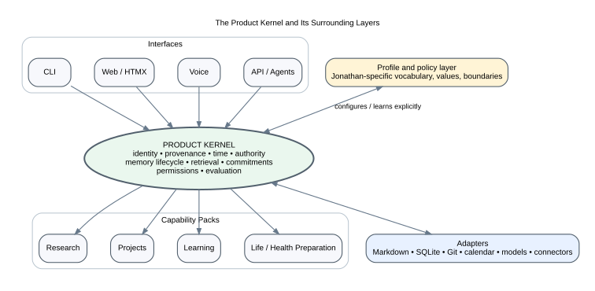

### Universal kernel candidates

- stable identity for agents, artifacts, memory items, and commitments;
- source and activity provenance;
- valid time, recorded time, and lifecycle state;
- authority and perspective;
- privacy classification;
- memory-item and relation contracts;
- retrieval and context contracts;
- proposal, permission, and audit contracts;
- evaluation cases and run evidence;
- import/export and migration conventions;
- adapter interfaces;
- schema and policy versioning.

### Likely profile-specific material

- vocabulary and aliases;
- life areas and project types;
- source-authority priorities;
- privacy defaults;
- initiative preferences;
- preferred interaction style;
- personal values and constraints;
- preservation and forgetting policies;
- notification budgets;
- models of what “productive,” “important,” or “transformative” means.

### Capability-pack material

- research workflow;
- project management;
- learning and practice;
- writing and creative work;
- health preparation;
- household operations;
- media reflection;
- relationship/contact context;
- software engineering;
- organizational/team memory.

The kernel should not contain Jonathan’s categories as universal product ontology.

## 8. Three product scales

### 8.1 Project Brain

A bounded memory and continuity system for one finite or long-lived project.

**Primary jobs:** resumption, decisions, context, dependencies, handoff, research, experiments, change propagation.

**Advantages:** clear boundary, limited privacy scope, easier evaluation, portable artifact, plausible first reusable product.

**Risks:** may become another project wiki; difficult cross-project learning; identity and personal preferences remain external.

### 8.2 Personal Brain

A longitudinal system across projects, life areas, learning, preferences, experiences, and personal operations.

**Primary jobs:** cross-domain continuity, prospective memory, identity/perspective over time, portfolio sensemaking, personalized collaboration.

**Advantages:** highest potential augmentation value and continuity.

**Risks:** privacy, psychological over-modeling, maintenance, context collapse, rigid identity, unclear authority boundaries.

### 8.3 Shared or Team Brain

A multi-perspective system for a team, household, organization, or collaboration.

**Primary jobs:** shared decisions, handoffs, rationale, conflicting viewpoints, responsibilities, institutional memory.

**Advantages:** high coordination value; clearer economic product.

**Risks:** access control, consent, speaker grounding, disputed authority, surveillance, deletion rights, concurrent editing, organizational politics.

These scales should share contracts where possible, but they are not merely deployment sizes. They have different social and epistemic requirements.

## 9. Product wedges

Several focused wedges could validate the kernel without requiring the entire vision.

### Wedge A — Project Re-entry and Handoff

Input: project artifacts and recent activity.  
Output: cited re-entry capsule, changes while away, next action, handoff packet.  
Kernel tested: identity, time, provenance, retrieval, context, commitments, evaluation.

### Wedge B — Decision and Rationale Explorer

Input: decisions, evidence, alternatives, corrections.  
Output: current decision, history, conflicts, reconsideration triggers, impact.  
Kernel tested: epistemic objects, authority, bitemporality, argumentation, propagation.

### Wedge C — Research Memory Laboratory

Input: papers, notes, experiments, questions, interpretations.  
Output: evidence maps, competing hypotheses, purpose-bound syntheses, research gaps.  
Kernel tested: source monitoring, perspectives, synthesis, consolidation, citation verification.

### Wedge D — Knowledge Assurance Observatory

Input: Markdown/Git corpus.  
Output: integrity, staleness, identity, propagation, conflict, recovery status.  
Kernel tested: parsing, lineage, derived projections, diagnostics, evaluation.

The proof of concept suggests all four. Product discovery should determine which one produces the strongest recurring value and best platform learning.

## 10. Quality-attribute scenarios

A product architecture becomes concrete when quality attributes are expressed as scenarios.

### Reliability

After a failed derived-store rebuild, the prior valid index remains available, canonical sources remain unchanged, and the failure can be diagnosed from a manifest.

### Temporal correctness

When an experiment result is corrected, a current query returns the corrected result, an as-known-then query returns the earlier belief, and the system shows when and why the correction was recorded.

### Perspective preservation

When Jonathan and a collaborator interpret the same event differently, both stances remain attributable; a factual answer does not silently merge the perspectives.

### Reversibility

When one project’s task state is migrated to SQLite, it can be exported and semantically reimported into an empty system, and authority can return to Markdown without losing history.

### Privacy

When a context pack is sent to a remote model, it contains only sources permitted for that destination, records the disclosure manifest, and excludes secrets and unrelated sensitive sections.

### Low friction

When stopping work, recording a useful transition takes under a minute and improves later resumption enough to justify the closeout cost.

### Explainability

When the system suppresses an old item from a default view, Jonathan can see why, reveal it, and change the policy.

### Adaptability

When a model provider changes, canonical memory and evaluation cases remain usable, and the new model can be benchmarked without data migration.

## 11. Product principles

1. **Continuity before completeness.** Preserve what is needed to resume and reason; do not capture everything.
2. **Plural cognition, strict boundaries.** Represent perspectives and simulations freely; enforce grounding for factual claims and actions.
3. **Originals remain reachable.** Structured or compressed representations link back to source.
4. **Purpose precedes compression.** A lossy synthesis declares what it is for.
5. **Commitments are not beliefs.** Decisions, plans, and requirements have authority and status, not truth scores.
6. **One writer per information type.** Projections and exports do not become co-equal authorities.
7. **Models propose; policies authorize.** Model confidence is not permission.
8. **Use generates evidence.** Features mature through real workflows, not only architecture reasoning.
9. **Maintenance is part of usability.** The product must feel lighter than the information it replaces.
10. **The user can leave.** Export, restore, delete, and provider replacement are product capabilities.

## 12. Transformative outcomes

A mature system might feel transformative when Jonathan can:

- resume any important active project after a month in less than five minutes;
- ask why the system believes something and receive a comprehensible evidence and change history;
- move between AI models without reconstructing project context;
- preserve a complex line of thought without prematurely forcing it into settled claims;
- notice recurring constraints across work and personal projects without manually rereading journals;
- safely explore multiple future scenarios while keeping them distinct from current reality;
- allow the system to prepare useful work without fearing silent external action;
- remove or purge sensitive information with a truthful report of residual copies;
- understand how the system’s model of him changed and correct it;
- spend less time maintaining the system than the coordination effort it saves.

## 13. Product hypotheses to test

1. Re-entry is the most valuable recurring wedge.
2. A plural cognitive object model reduces false factualization without making capture too complex.
3. Purpose-bound context packs outperform full-history prompting on correctness and coordination cost.
4. Narrative originals plus structured projections outperform either pure prose or total atomization.
5. Explicit transition state is more useful than broad conversation history for resumption.
6. A small authority/time/provenance kernel generalizes across project, research, and learning domains.
7. Consolidation improves retrieval only when it preserves exceptions and source lineage.
8. Users value a visible design rationale and correction path enough to tolerate some additional structure.
9. Shadow-mode proactivity can reveal useful rules without creating surveillance or notification fatigue.
10. A project-brain product can teach the kernel enough to later support a personal brain.

## 14. Product questions that remain open

- Is Big Brain Time fundamentally a personal tool, a framework, a developer platform, or a product for broader users?
- Should other users edit Markdown directly, or should Markdown become an export/internal format?
- How much epistemic structure can ordinary users understand and maintain?
- Which parts of a personal profile may be inferred, and which require explicit declaration?
- Can a reusable kernel stay small, or does every domain require specialized semantics?
- What is the right economic or distribution model for a local-first product?
- How much model independence is worth the adapter and evaluation burden?
- At what point does multi-user collaboration require a different product rather than an extension?

These questions belong in the design studio, not in premature implementation commitments.


---

# 03 — System Landscape and Architecture

## 1. Architectural stance

The supplied blueprint proposes a local-first modular monolith with ports and adapters, Markdown/Git narrative authority, a rebuildable SQLite read model, selected operational write models, and strict separation between evidence and control. That remains the strongest baseline architecture for the design studio.

The important change in this package is to distinguish **the product kernel** from **the current implementation modules**. The architecture should be organized around stable responsibilities and contracts, not around the order in which prototypes were built.

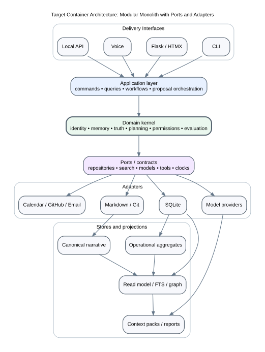

## 2. Architectural goals

The architecture must allow Big Brain Time to be:

- useful with or without generative synthesis;
- local and inspectable by default;
- source-grounded and temporally aware;
- able to preserve multiple perspectives;
- recoverable and exportable;
- incrementally migratable;
- model-provider independent;
- safe under untrusted retrieved content;
- testable beneath the interface layer;
- extensible across project, research, learning, and other capability packs;
- simple enough for one person to operate;
- capable of honest deletion and lifecycle reporting;
- measurable as part of a joint cognitive system.

## 3. System context

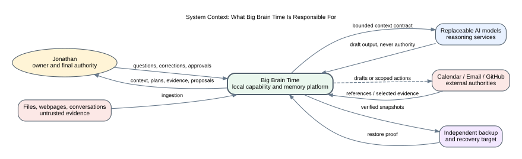

### Jonathan

Jonathan is the owner, primary user, primary source of values and personal authority, and final approver of consequential changes. The system may learn explicit preferences and interaction patterns, but it does not silently become the authority on Jonathan’s identity.

### Big Brain Time

Big Brain Time owns the local product contracts, memory lifecycle, derived context, selected operational state, policies, evaluation artifacts, and user-facing continuity workflows.

### AI models

Models are replaceable reasoning and language services. Their outputs are proposals or derived artifacts unless explicitly accepted. Models do not own canonical memory, permissions, or action policy.

### External authorities

Calendars, email providers, GitHub, health portals, financial systems, and organizational tools remain authoritative for their own records unless a bounded migration decision says otherwise.

### Evidence sources

Files, web pages, email, conversations, connector results, and model outputs enter as evidence with source, time, privacy, and trust boundaries. They cannot issue runtime instructions.

### Recovery systems

Independent backups and restore procedures are part of the product architecture, not merely operations documentation.

## 4. Architectural layers

### 4.1 Interfaces

- CLI
- Flask/HTMX web workbench
- local API
- voice
- future agent or protocol adapters

Interfaces translate user interaction into application queries, commands, and proposals. They do not decide truth, authority, permission, or lifecycle.

### 4.2 Application layer

The application layer coordinates use cases:

- `CaptureArtifact`
- `BuildReentryPack`
- `ExplainCurrentState`
- `CompileContext`
- `ProposeSynthesis`
- `RecordDecision`
- `AnalyzePropagation`
- `RequestPurge`
- `EvaluateCapability`

It manages workflows and transactions but delegates domain rules to the kernel.

### 4.3 Domain kernel

The kernel contains stable concepts and policies:

- agents and perspectives;
- source artifacts and activities;
- memory items and assertions;
- valid time, recorded time, lifecycle state;
- authority rules;
- commitments and transitions;
- context contracts;
- proposal and permission rules;
- evaluation cases and maturity states.

The kernel should not import Flask, SQLAlchemy, GitHub, or model-provider types.

### 4.4 Ports

Ports express what the kernel needs without choosing implementation:

- artifact repository;
- operational repository;
- search index;
- graph/relationship query;
- model inference;
- clock and identity generation;
- policy store;
- audit writer;
- backup and export;
- connector/action executor.

### 4.5 Adapters

Adapters implement ports for Markdown, Git, SQLite, FTS5, embeddings, local or remote models, calendar, GitHub, email, filesystem, and other connectors.

### 4.6 Canonical authorities

Canonical authority is declared per information type. There is no single universal store.

### 4.7 Derived representations

Indexes, graph candidates, summaries, context packs, embeddings, dashboards, and compiled views are rebuildable or invalidatable. They carry manifests and lineage but are not sole authority for factual claims.

## 5. Authority and trust planes

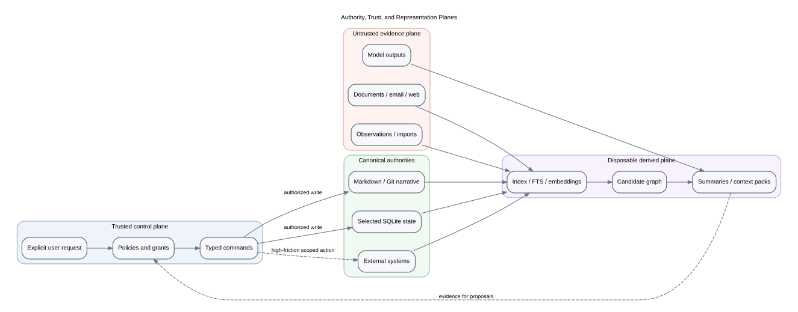

Three questions must be answered independently:

1. **Where is this information stored?**
2. **Which representation is authoritative for this information type?**
3. **May this content influence control or action?**

A Markdown decision record may be authoritative evidence and still be unable to authorize a tool. A model output may be useful derived text but have no authority. A calendar event may be externally authoritative but represented locally only by a reference.

### Suggested representation classes

| Class | Meaning | Examples |
|---|---|---|
| Canonical narrative | Human-readable durable meaning | decisions, research notes, journal, rationale |
| Canonical operational | Transactional current state | selected tasks, transitions, permission grants |
| External authority | Another system owns current record | calendar, email, GitHub issue, health result |
| Derived projection | Rebuildable query structure | FTS, section table, entity candidates, embeddings |
| Compiled artifact | Purpose-specific, invalidatable output | context pack, briefing, handoff, synthesis |
| Ephemeral staging | Temporary proposal material | extraction candidates, review cards, draft relations |
| Audit evidence | Durable record of process and change | approvals, hashes, results, incidents |

## 6. One authority per information type

The source blueprint’s one-writer rule is crucial, but authority may be more granular than an entire document or database.

A project might be split as follows:

| Field or meaning | Authority |
|---|---|
| outcome and rationale | Markdown narrative |
| current operational status | SQLite aggregate after migration |
| external due date | calendar or work system |
| recent code state | GitHub repository |
| generated re-entry capsule | compiled artifact |
| AI interpretation of risk | proposal with source lineage |

This is safer than saying “the project is in SQLite” or “the project is in Markdown.”

### Authority migration contract

Any migration must state:

1. exact fields and invariants moving;
2. prior authority;
3. new authority;
4. transition period and synchronization mechanism;
5. export and rollback format;
6. conflict detection;
7. cutover evidence;
8. end date for temporary dual representation;
9. how hand-edited old representations are rejected or imported;
10. how the decision can be reversed.

## 7. Shared foundations

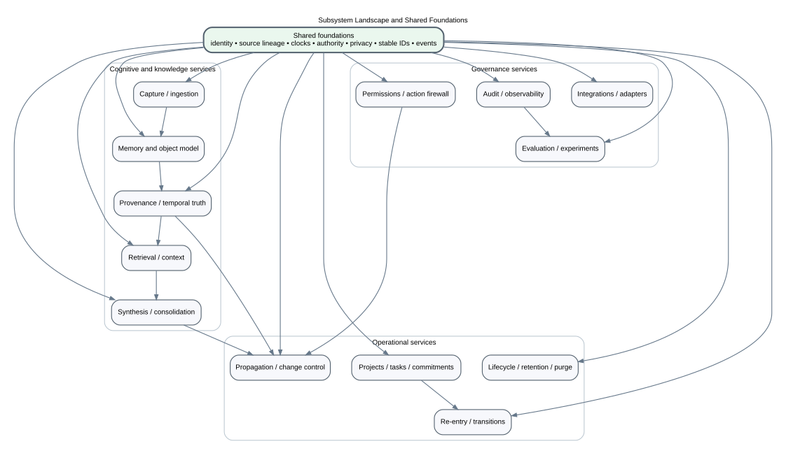

The following foundations should be implemented once and reused.

### Identity

Stable identifiers for agents, artifacts, memory items, claims, commitments, transitions, proposals, activities, and evaluation runs. IDs must survive rebuilds and not encode mutable status.

### Time

At minimum:

- event/experience time;
- source publication or occurrence time;
- valid-from and valid-to;
- recorded-at;
- build/generated-at;
- review-at;
- expiration/invalidation;
- timezone and original local representation where meaningful.

### Provenance

Who or what created, observed, reported, inferred, transformed, accepted, or executed an item; what inputs and software versions were involved; and how the output derives from source.

### Authority

Domain- and scope-specific source precedence, explicit decisions, perspective holders, and resolution behaviors such as choose, show both, abstain, or require review.

### Privacy

Classification, minimum-necessary disclosure, model destination, retention, redaction, and connector boundaries.

### Lifecycle

Draft, active, superseded, disputed, retracted, archived, suppressed, redacted, purged, expired, and invalidated are not interchangeable.

### Evaluation

Every significant behavior can be connected to fixtures, run evidence, baselines, user corrections, and maturity state.

## 8. Command, query, proposal, event

These four application concepts should remain distinct.

### Query

Requests information without changing canonical state.

Examples: `ExplainCurrentDecision`, `SearchEvidence`, `BuildPreviewContext`, `ListPurgeImpact`.

### Command

Requests a defined state change with validated intent and authority.

Examples: `RecordTransition`, `AcceptMemoryItem`, `SupersedeDecision`, `ArchiveProject`.

### Proposal

A reviewable possible set of commands, usually created by a human or model from evidence.

Examples: a patch set, a proposed relation, a synthesis draft, a reminder plan.

### Event

Records that an accepted command or external occurrence happened.

Examples: `TransitionRecorded`, `DecisionSuperseded`, `ProposalRejected`, `IndexRebuilt`.

The system does not require full event sourcing. Events are useful for projection, audit, and evaluation, while current aggregates may still be stored directly.

## 9. Core data flows

### Trusted answer

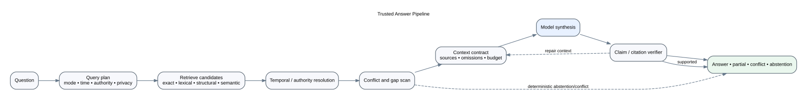

A trusted answer is not a single model call. It is a pipeline with inspectable intermediate artifacts:

1. interpret query and mode;
2. determine time, authority, and privacy policy;
3. retrieve candidates;
4. expand structure within a budget;
5. resolve temporal and authority applicability;
6. expose conflicts and gaps;
7. compile a context contract;
8. generate prose or structured output;
9. verify material claims against included evidence;
10. answer, qualify, disclose conflict, or abstain.

### Proposed change

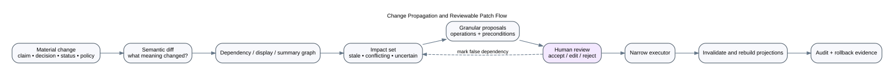

A meaningful change is represented semantically before being rendered as file or database operations. This prevents the implementation representation from hiding the intent.

### Authorized action

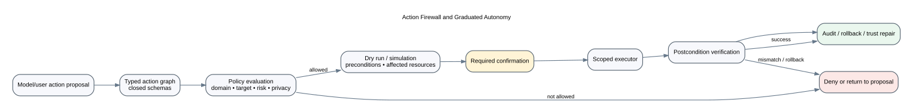

A model or user may propose an action graph. A deterministic policy engine evaluates risk, scope, privacy, preconditions, and confirmation. Only narrow executors perform effects.

### Memory lifecycle

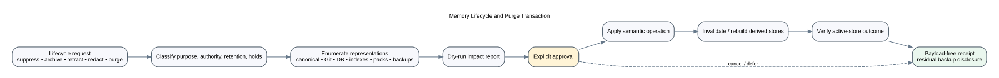

Visibility changes and destructive deletion use different workflows. Purge must enumerate all controlled representations and report residual backup retention honestly.

## 10. Architectural alternatives

The design studio should preserve at least four plausible macro-architectures.

### Option A — Markdown-centric knowledge compiler

**Description:** Markdown/Git remains canonical for nearly everything; SQLite and AI are derived tools.

**Strengths:** maximum readability, portability, simple recovery, Git review.

**Weaknesses:** transactional operations, identity, concurrency, and structured lifecycle become awkward; parsing rules can become an implicit database schema.

**Best fit:** knowledge assurance, research, project context, single technical user.

### Option B — Split-authority modular monolith

**Description:** narrative and rationale remain Markdown; selected operational aggregates and policies are SQLite-canonical; external systems remain authoritative for their domains.

**Strengths:** matches representation to use, supports transactions, preserves narrative.

**Weaknesses:** authority matrix and export discipline become essential; users can be confused about where to edit.

**Best fit:** likely near-term target for Jonathan’s personal platform.

### Option C — Event-log-centered local platform

**Description:** durable semantic events and object records are canonical; Markdown becomes a projection/export for narrative views.

**Strengths:** strong temporal history, propagation, audit, multiple interfaces.

**Weaknesses:** high implementation and migration cost, loss of direct hand editability, complex deletion and compaction.

**Best fit:** only if operational breadth and multi-interface needs clearly exceed Markdown-centric approaches.

### Option D — Federated project brains

**Description:** each project or capability pack has a bounded local memory package; a portfolio layer indexes and compiles across packages.

**Strengths:** portable, privacy-scoped, reusable, easier productization and deletion.

**Weaknesses:** cross-project identity and learning are harder; duplicated kernel metadata; global personal continuity becomes a federation problem.

**Best fit:** promising productization path and useful comparison to one monolithic personal brain.

No option should be selected globally before scenario and quality-attribute analysis.

## 11. Deployment envelopes

### Envelope 1 — Single trusted workstation

- one writer;
- localhost interfaces;
- private Git remote;
- independent encrypted backup;
- local SQLite;
- explicit context export to remote models.

This remains the simplest and safest studio baseline.

### Envelope 2 — Multiple personal devices, single active writer

- capture inboxes from multiple devices;
- one authoritative processing node;
- explicit lease or ownership transfer;
- no live copied SQLite database;
- synchronization evidence and conflict reporting.

### Envelope 3 — Private multi-device replication

Requires measured need, identity and conflict semantics, encrypted transport, schema migration coordination, and recovery testing. CRDTs or append-log replication are options, not defaults.

### Envelope 4 — Multiple people

Requires consent, role-based and item-level access, speaker-grounded perspectives, deletion rights, organizational authority, and social conflict governance. This is a distinct product architecture.

## 12. Architecture fitness functions

Instead of relying only on review, the architecture should have executable or inspectable fitness functions:

- delete and rebuild derived stores without semantic loss;
- identical source revision produces stable semantic identities;
- every material generated claim has source lineage;
- every authority migration has one active writer;
- every context pack names purpose, time, privacy, sources, omissions, and version;
- every action proposal has scoped targets and preconditions;
- every destructive lifecycle operation enumerates replicas;
- no untrusted evidence can create a grant or execute a tool;
- a provider change does not make canonical memory unreadable;
- a feature can be disabled without corrupting the kernel;
- weekly maintenance remains under the accepted budget.

## 13. Architecture review questions

1. Which domain concepts are genuinely stable enough for the kernel?
2. Which current modules are experiments rather than permanent services?
3. Which quality attributes dominate the next product wedge?
4. Where does a narrative need to remain whole?
5. Which authority boundaries are understandable to a non-developer?
6. What is the smallest useful deployment envelope?
7. What fails when AI synthesis is unavailable?
8. What fails when the read model is stale or absent?
9. What can be exported and understood ten years later?
10. How does the system tell Jonathan that its own architecture claim is stale?


---

# 04 — Subsystem Atlas

## 1. How to use the atlas

The atlas describes Big Brain Time as a set of cooperating responsibilities rather than a list of current Python packages. Each subsystem card includes:

- purpose;
- primary jobs;
- inputs and outputs;
- authority and lifecycle;
- deterministic versus model-driven behavior;
- major friction and failure modes;
- key design questions;
- smallest useful probe;
- likely reusable product role.

The boundaries are proposals. A studio exercise may merge, split, or remove them.


---

## 2. Capture and Ingestion

### Purpose

Accept low-friction raw material while preserving its original form, source, time, privacy, and context. Convert only useful portions into reviewable structured candidates.

### Primary jobs

- capture text, voice, conversations, files, links, events, and external records;
- preserve a source artifact before transformation;
- classify privacy and processing urgency;
- detect exact duplicates and known source identities;
- extract candidate episodes, assertions, decisions, questions, tasks, and entities;
- propose canonical destinations or leave material in an inbox;
- avoid turning every capture into permanent structure.

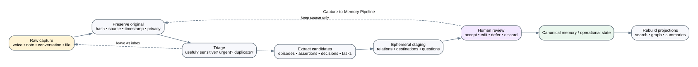

### Inputs

Raw text, audio transcription, Markdown, documents, email, webpages, connector records, application events.

### Outputs

Source artifact, capture event, extraction candidates, staging packet, discard/archive recommendation.

### Authority

The preserved source is authoritative for what was captured. Extracted objects are derived until reviewed or structurally trusted.

### Deterministic work

Hashing, source identity, timestamping, privacy policy, file parsing, exact duplicate detection, allowed destination checks.

### Model work

Candidate extraction, topic suggestions, ambiguity detection, suggested questions, semantic duplicate proposals.

### Major frictions

- capture becomes a backlog rather than usable memory;
- smart routing creates surprising destinations;
- voice produces ambiguous or sensitive noise;
- extraction loses tone and context;
- repeated captures create false authority through frequency;
- classification questions interrupt the moment of capture.

### Design questions

1. What is the minimum metadata required at capture time?
2. When is preserving the original enough?
3. Should a capture be processed synchronously, later, or only when retrieved?
4. Which sources can create trusted structured records automatically?
5. How should one capture contain multiple object types?
6. What is the expiration policy for unprocessed inbox material?

### Smallest probe

Collect twenty real captures through the current flow. For each, record capture time, processing time, eventual use, incorrect routing, sensitive content, and whether structure added value. Compare immediate extraction with delayed processing.

### Reusable role

Universal kernel service, but interaction and extraction policies belong in profiles and capability packs.

---

## 3. Memory and Cognitive Object Model

### Purpose

Represent useful mental and informational objects without forcing all of them into one factual claim taxonomy.

### Primary jobs

- preserve episodes and narratives;
- represent truth-apt assertions where needed;
- represent preferences, values, goals, plans, decisions, questions, and simulations distinctly;
- associate stances and perspectives with holders and time periods;
- preserve authentic wording and structured addressability together;
- support lifecycle, relation, retrieval, and evaluation.

### Proposed core object

```yaml
memory_item:
  id: M-...
  kind: episode | assertion | narrative | preference | value |
        goal | plan | decision | question | simulation | procedure
  content: ...
  source_artifact: ...
  created_or_experienced_at: ...
  recorded_at: ...
  privacy: ...
  lifecycle: ...
```

Optional attached structures include stance, proposition, commitment, and relations.

### Authority

Object kind does not determine authority. A remembered episode can be authentically Jonathan’s memory without establishing every external detail as fact. A decision can be binding without being empirically true.

### Deterministic work

Schema validation, identity, lifecycle, required fields by kind, source linkage, permission checks.

### Model work

Suggested kind, stance, proposition, relations, ambiguity, narrative summary—always reviewable.

### Major frictions

- too little structure makes reasoning and retrieval weak;
- too much structure turns journaling into database administration;
- flat enums mix content type, source, confidence, and status;
- the model may psychologize or rigidly profile the user;
- structured extraction may appear more certain than source prose.

### Design questions

1. Which object kinds are universal?
2. Can object kind be inferred later rather than required at capture?
3. When does an assertion need proposition-level structure?
4. How should emotion and first-person experience be represented?
5. How do “Jonathan then” and “Jonathan now” coexist?
6. Which inferences about identity may never become durable without explicit acceptance?

### Smallest probe

Select ten real items: a fact, observation, interpretation, preference, value, decision, plan, memory, question, and imagined scenario. Model them using the current claim system and the plural object proposal. Compare ambiguity, retrieval, editing burden, and user comfort.

### Reusable role

Core kernel. This is the most consequential ontology decision and should remain deliberately small.

---

## 4. Provenance, Time, Perspective, and Resolution

### Purpose

Explain where information came from, when it applied, when it was known, who held it, and how the system’s position changed.

### Primary jobs

- track agents, source artifacts, and transformation activities;
- distinguish valid time, recorded time, observed time, generated time, and review time;
- represent source mode: perceived, measured, remembered, reported, inferred, generated, imagined;
- preserve perspective holders and stances;
- link corrections, supersession, support, attack, qualification, derivation, and dependency;
- answer current and as-of questions;
- expose unresolved conflict and authority policy.

### Inputs

Memory items, source artifacts, external records, accepted relations, correction events, authority rules.

### Outputs

Applicable-state result, alternatives, conflict set, evidence explanation, as-of history, observability gaps.

### Authority

The resolver does not create truth. It applies declared scope, time, source, and decision policies and reports the result.

### Deterministic work

Interval logic, explicit relation traversal, authority-rule application, retraction filtering, cycle detection, output state selection where policy is complete.

### Model work

Candidate proposition normalization, relation suggestions, scope questions, evidence relevance proposals.

### Major frictions

- timestamps are missing or ambiguous in ordinary notes;
- “latest” is not always most authoritative;
- different perspectives may be legitimate rather than contradictory;
- a remembered event can change during reconsolidation;
- detailed provenance can become visually overwhelming;
- silently swallowed parse failures create false confidence.

### Design questions

1. What is the minimum temporal model for ordinary users?
2. Which relations are canonical versus derived?
3. How is uncertain or approximate time represented?
4. Can source and perspective be shown progressively rather than always inline?
5. What authority policies are values or commitments rather than objective rules?
6. How are conflicts between policy and source handled?

### Smallest probe

Create five temporal cases from actual Big Brain Time history: correction, changing plan, historical preference, external authority update, and two legitimate perspectives. Manually produce current, as-known-then, and perspective-specific answers.

### Reusable role

Core kernel, with domain-specific authority policies supplied by profiles and capability packs.

---

## 5. Retrieval and Search

### Purpose

Find the evidence, objects, and relationships needed for a particular question—not merely similar text.

### Primary jobs

- exact ID, path, title, and alias lookup;
- lexical search with metadata and source filters;
- temporal, authority, privacy, and lifecycle filtering;
- bounded link and relationship expansion;
- optional semantic retrieval and reranking;
- local versus global query routing;
- explanation of why results were selected or rejected;
- negative retrieval and abstention support.

### Inputs

Query plan, read model, indexes, authority rules, source artifacts, lifecycle and privacy state.

### Outputs

Ranked evidence candidates, retrieval explanations, coverage gaps, conflict candidates, manifest.

### Authority

Retrieval returns candidates. It never decides that a claim is true, contradictory, superseding, or safe to act upon.

### Deterministic work

Exact lookup, FTS, filters, budgets, stable result contracts, graph caps, manifest generation.

### Model work

Query decomposition, paraphrase expansion, semantic reranking, global map/reduce synthesis—benchmarked and optional.

### Major frictions

- similarity retrieves related but non-answering text;
- current and historical evidence are mixed;
- semantic retrieval collapses negation or scope;
- graph expansion produces noise;
- hidden suppression removes important old evidence;
- a full-context answer looks confident even when evidence is missed.

### Design questions

1. What query families matter in real use?
2. Which hard failures remain after exact + FTS + metadata + links?
3. How should retrieval explain itself without overwhelming the user?
4. What is the right global-sensemaking baseline?
5. When should a query retrieve a narrative container as well as an atomic record?
6. What counts as enough evidence to stop searching?

### Smallest probe

Build a living set of thirty real questions. Compare exact/FTS, FTS+metadata, FTS+links, and hybrid retrieval. Record evidence recall, noise, latency, privacy, and correction burden.

### Reusable role

Core service with pluggable retrieval strategies and domain-specific query planners.

---

## 6. Context Compiler

### Purpose

Compile an inspectable, purpose-specific evidence package for a human, model, workflow, or handoff.

### Primary jobs

- declare purpose, audience, query, time, authority, privacy, and token budget;
- select and order evidence;
- include conflicts, unknowns, and omissions;
- preserve lineage and content hashes;
- externalize overflow to referenced appendices;
- invalidate after material source changes;
- render provider-neutral Markdown and machine-readable manifest.

### Inputs

Retrieval results, project/area configuration, privacy policy, time/authority resolution, context template.

### Outputs

Context manifest, human-readable body, evidence index, exclusions, staleness status.

### Authority

A context pack is a compiled view, never the sole authority for factual content.

### Deterministic work

Contract validation, source selection policy, token accounting, deduplication, manifests, expiration, rendering order.

### Model work

Compression, ordering suggestions, connective prose, task-specific explanation—only where loss is declared and lineage retained.

### Major frictions

- a fixed project priority list ignores the actual question;
- whole documents consume budget and hide relevant spans;
- omission reports are technically present but not useful;
- stale packs are reused because they look complete;
- generated summaries cite themselves rather than primary evidence;
- handoff packets can contain hardcoded status claims.

### Design questions

1. What purposes deserve distinct context contracts?
2. How are protected information units defined per purpose?
3. What should be extractive versus abstractive?
4. How does a recipient verify the pack quickly?
5. Which pack sections are universal versus capability-specific?
6. How should a pack represent a disagreement that cannot fit within budget?

### Smallest probe

Take one real project and build three packs: re-entry, architecture review, and external-model handoff. Use the same source corpus and compare what each must preserve and omit.

### Reusable role

Core kernel contract plus capability-specific compilers.

---

## 7. Synthesis and Consolidation

### Purpose

Create smaller or more general representations that improve future reasoning while preserving source lineage, exceptions, alternatives, and known loss.

### Primary jobs

- exact deduplication and normalization;
- cluster episodes and assertions by declared purpose;
- preserve conflicts and minority perspectives;
- produce extractive digests, abstractive summaries, thematic reflections, and proposed heuristics as distinct artifact types;
- test retained information and question-answer capability;
- invalidate or revise derived syntheses when sources change;
- promote only reviewed generalizations.

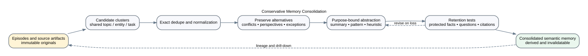

### Inputs

Source artifacts, memory items, relations, retrieval logs, task or question family, protected-content contract.

### Outputs

Derived synthesis artifact, lineage DAG, omission report, retention score, new hypothesis candidates, stale conditions.

### Authority

Syntheses are derived by default. A new interpretation or generalization is a proposal, not verified evidence.

### Deterministic work

Exact duplicates, manifests, source hashing, invalidation, protected-value tests, idempotent writes.

### Model work

Semantic clustering, abstraction, themes, candidate generalizations, counterexamples, compression.

### Major frictions

- compression creates false coherence;
- summaries grow into a second canonical corpus;
- repeated synthesis duplicates content;
- patterns become identity claims;
- one purpose’s summary is reused for another;
- exceptions disappear because they are rare;
- source changes do not invalidate parents.

### Design questions

1. Which synthesis artifact types are needed?
2. What makes a topic “ready” for consolidation?
3. What information is protected for each purpose?
4. How are minority views represented compactly?
5. Should consolidation occur on a schedule, at retrieval, or by explicit request?
6. When may a derived reflection become a canonical decision or heuristic?

### Smallest probe

Select one topic with ten to twenty heterogeneous sources. Produce an extractive digest, abstractive summary, and reflection. Test each against five future questions and a list of protected facts, disagreements, and exceptions.

### Reusable role

Core contracts and evaluation; algorithms and prompts remain replaceable adapters.

---

## 8. Projects, Commitments, and Planning

### Purpose

Represent what the user or system has committed to doing, why, under what constraints, and with what current state—without turning Big Brain Time into a brittle universal task manager.

### Primary jobs

- project outcomes and definitions of done;
- goals, decisions, plans, tasks, dependencies, and blockers;
- status and readiness;
- temporal constraints and review triggers;
- recurrence references and calendar boundaries;
- rationale and reconsideration conditions;
- portfolio views and prioritization explanations.

### Inputs

Accepted decisions, user commitments, external dates, project narratives, transitions, review policies.

### Outputs

Current operational state, next-action candidates, dependency graph, planning views, exports, external drafts.

### Authority

Selected operational fields may become SQLite-canonical after a bounded migration. Narrative rationale and external events may remain elsewhere.

### Deterministic work

State transitions, constraints, dependencies, recurrence calculations, export, audit.

### Model work

Task decomposition, prioritization alternatives, blocker interpretation, plan proposals, negotiation prompts.

### Major frictions

- duplicate task systems;
- excessive status maintenance;
- model-generated tasks that create work rather than progress;
- plans treated as facts;
- priorities inferred from incomplete values;
- external dates copied locally and become stale.

### Design questions

1. Which operational aggregate provides enough value to justify migration?
2. What is the difference between goal, project, commitment, plan, task, and reminder?
3. Which professional tasks should remain external references?
4. How should the system challenge priorities without taking control?
5. What planning state is essential for re-entry?
6. How are abandoned or intentionally paused commitments represented?

### Smallest probe

Choose one project for two real review cycles. Compare the current Markdown workflow with a minimal structured aggregate containing only outcome, status, milestone, next action, blockers, and transition.

### Reusable role

Capability pack built on kernel commitments, time, identity, and policy.

---

## 9. Re-entry and Continuity

### Purpose

Make interrupted or dormant work resumable with minimal cognitive startup cost.

### Primary jobs

- record stop point, restart cue, next micro-action, and resumption trigger;
- detect stale or missing transitions;
- gather changes since last meaningful access;
- compile current decisions, blockers, dependencies, and conflicts;
- distinguish project state from conversation history;
- measure resumption performance.

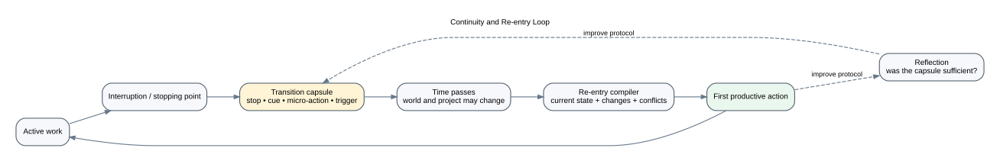

### Inputs

Project state, transition records, recent changes, decisions, tasks, external events, journal/retro references.

### Outputs

Re-entry capsule, stale-transition warning, first-action proposal, resumption measurement.

### Authority

The recorded transition is authoritative for where the user intended to stop. The compiled capsule is derived and may need correction if the world changed.

### Deterministic work

Required-field validation, material-change detection, change window, source selection, expiration.

### Model work

Concise phrasing, comparison of changes, open-loop summary, candidate next action when none exists.

### Major frictions

- closeout ceremony costs more than resumption benefit;
- a capsule records activity but not the unresolved mental model;
- restart cue points to stale lines or missing files;
- a micro-action is easy but not strategically correct;
- automated briefings become repetitive.

### Design questions

1. Which fields actually predict successful resumption?
2. What counts as a material project change?
3. Should the system generate a capsule continuously or only at transition?
4. How does re-entry work for conceptual research rather than executable tasks?
5. What is the right balance between narrative and structured fields?
6. How is elapsed-time change distinguished from forgotten context?

### Smallest probe

Alternate manual and system-assisted transition records across six interruptions. Measure closeout time, resumption time, rereads, wrong first actions, and subjective burden.

### Reusable role

Strong candidate for the first reusable project-brain capability.

---

## 10. Propagation and Change Control

### Purpose

Identify what a material change affects and prepare safe, understandable updates without silently rewriting history.

### Primary jobs

- represent explicit and inferred dependencies;
- detect semantic differences, not merely textual diffs;
- find stale views, summaries, plans, questions, and actions;
- prioritize impacts by severity and confidence;
- prepare granular proposals with preconditions;
- accept, edit, reject, or mark false dependencies;
- invalidate and rebuild derived artifacts;
- preserve audit and rollback evidence.

### Inputs

Accepted change, dependency graph, source links, displays, summaries, indexes, policy and authority rules.

### Outputs

Impact report, proposal bundle, unresolved questions, invalidation events, audit evidence.

### Authority

Explicit human-authored dependencies may be canonical. Inferred edges remain derived until accepted.

### Deterministic work

Exact links, typed references, manifest dependencies, precondition hashes, affected-store invalidation.

### Model work

Semantic dependency suggestions, impact explanations, proposed wording, missing-link detection.

### Major frictions

- graph false positives create review fatigue;
- hidden dependencies remain undetected;
- a wording edit is mistaken for a semantic change;
- derived summaries are updated but source decisions are not;
- broad patch acceptance hides granular meaning changes.

### Design questions

1. Which dependency types are worth maintaining?
2. How is propagation recall evaluated when the full dependency set is unknown?
3. What changes can be auto-invalidated versus human-updated?
4. Can the system distinguish “displayed in” from “semantically depends on”?
5. How are external dependencies represented?
6. What is the maximum reasonable proposal size?

### Smallest probe

Create ten seeded material changes across real documents and manually define expected impacts. Compare explicit links, textual references, typed IDs, and model suggestions.

### Reusable role

Core change-control service with domain-specific dependency rules.

---

## 11. Memory Lifecycle, Forgetting, and Deletion

### Purpose

Control visibility, relevance, retention, correction, redaction, and destruction without confusing them.

### Primary jobs

- suppress low-relevance items reversibly;
- archive inactive material;
- supersede or retract endorsed assertions;
- redact protected payload while retaining lawful structure;
- purge selected meaning across controlled representations;
- expire ephemeral staging and context packs;
- apply preservation classes and legal/ethical holds;
- disclose residual backup retention.

### Inputs

Lifecycle request, item identity, retention policy, dependency graph, backups, authority and privacy rules.

### Outputs

Impact plan, approval requirement, updated lifecycle state, projection rebuild, deletion receipt, residual-copy report.

### Authority

Only an authorized lifecycle operation changes or destroys canonical material. Low retrieval rank is never deletion authority.

### Deterministic work

Policy classification, representation enumeration, deletion transactions, projection invalidation, receipt and verification.

### Model work

Candidate archive/suppression suggestions, preservation-value questions, semantic replica discovery—never autonomous purge.

### Major frictions

- append-only rules conflict with privacy and user control;
- Git and backups retain historical copies;
- summaries and model prompts contain derived fragments;
- suppression hides vital old context;
- deletion receipts accidentally preserve sensitive payload;
- users expect universal erasure that cannot be guaranteed.

### Design questions

1. Which retention classes apply to each domain?
2. What must be deleted versus merely hidden or retracted?
3. How should Git history and backup expiration be handled?
4. Can per-domain encryption make cryptographic erase practical?
5. What derived outputs must be searched during purge?
6. What proof of deletion is honest and useful?

### Smallest probe

Choose three synthetic items: ordinary obsolete note, retracted belief, and highly sensitive accidental capture. Walk each through suppress, archive, retract, redact, and purge impact plans.

### Reusable role

Core kernel and governance service. Essential before broad personal or multi-user deployment.

---

## 12. Permissions and Action Firewall

### Purpose

Allow increasingly useful initiative without allowing evidence, model confidence, or broad credentials to become authority.

### Primary jobs

- define domain/action/target/time/privacy grants;
- classify risk and reversibility;
- validate typed action graphs;
- require previews and confirmations;
- enforce preconditions, scope, and maximum affected items;
- execute through narrow adapters;
- verify postconditions;
- provide kill switch, safe mode, rollback, and trust repair.

### Inputs

User request, proposal, grants, resource state, privacy class, tool schema, evidence manifest.

### Outputs

Allow/deny decision, required confirmation, executed result, verification, audit and rollback status.

### Authority

Only the control plane creates grants. Retrieved content and model output cannot modify policy.

### Deterministic work

All authorization, target validation, risk ceiling, confirmation mode, path and recipient checks, action execution boundary.

### Model work

Propose and explain actions; never decide its own permission.

### Major frictions

- confirmation fatigue leads to blind approval;
- grants are too broad or hard to understand;
- monitoring feels more invasive than one-time action;
- model output smuggles unapproved arguments;
- rollback exists technically but cannot undo external consequences.

### Design questions

1. Can Jonathan predict policy outcomes?
2. What permission concepts are understandable in daily use?
3. Which low-risk actions actually save enough effort?
4. How are model/data destinations part of permission?
5. What changes require per-action confirmation forever?
6. How should “negotiate” initiative be bounded for goals and identity?

### Smallest probe

Create twenty action scenarios and ask Jonathan to predict allow, deny, or confirm. Redesign policy language until expected and actual outcomes align.

### Reusable role

Universal governance kernel, with domain-specific grants and executors.

---

## 13. Evaluation, Experiments, Audit, and Observability

### Purpose

Determine whether the system is correct, useful, safe, understandable, and worth maintaining; preserve enough evidence to repair failures and improve design.

### Primary jobs

- maintain regression cases and seeded defects;
- capture baselines and live workflow measures;
- record model, prompt, context, policy, and software versions;
- distinguish prototype, tested, benchmarked, piloted, trusted, and authorized;
- track human corrections, burden, trust, and task outcomes;
- convert incidents into tests;
- preserve causal audit without sensitive payload excess;
- support keep/simplify/remove decisions.

### Inputs

Test fixtures, run manifests, user feedback, action events, incidents, metrics, retrospectives.

### Outputs

Scorecards, benchmark reports, maturity evidence, incident records, design decisions, deprecation recommendations.

### Authority

Evaluation evidence supports decisions but does not replace human value judgments. Metrics must remain interpretable and revisable.

### Deterministic work

Fixture execution, integrity checks, metrics, version binding, hash verification, audit-chain validation.

### Model work

Rubric assistance, failure clustering, qualitative synthesis, candidate regression cases—reviewed and calibrated.

### Major frictions

- seeded benchmarks are overfit;
- model judges agree with model errors;
- instrumentation creates privacy or maintenance burden;
- test count becomes a proxy for product maturity;
- audit logs are technically complete but unusable;
- success metrics optimize behavior users do not value.

### Design questions

1. What baseline is cheap enough to sustain?
2. Which incidents should become regression cases?
3. How is joint-system benefit measured without constant self-tracking?
4. Which maturity claims expire after code/model/data changes?
5. What audit detail is needed for trust repair?
6. What is the removal threshold for a feature?

### Smallest probe

For one capability, create a complete evidence packet: baseline, deterministic tests, benchmark, two-week pilot, corrections, burden, and a keep/revise/remove decision.

### Reusable role

Universal kernel and design-process infrastructure.

---

## 14. Integrations, Interfaces, and Runtime

### Purpose

Connect the kernel to storage, external systems, models, and user interaction without letting an adapter become the architecture.

### Primary jobs

- Markdown/Git persistence and export;
- SQLite operational and read models;
- search and embedding adapters;
- model routing and privacy policy;
- calendar, GitHub, email, drive, and file connectors;
- CLI, web, voice, and API delivery;
- configuration, secrets, local runtime, and health checks;
- provider replacement and compatibility tests.

### Authority

Adapters inherit authority from the information type and policy. A connector does not become authoritative merely because it can write.

### Deterministic work

Serialization, validation, migrations, retries, idempotency, authentication boundaries, connector scopes.

### Model work

Provider-specific inference only; no canonical state hidden in provider memory.

### Major frictions

- Flask routes accumulate domain logic;
- model provider features create lock-in;
- local-first becomes “local server requiring constant care”;
- connectors import more data than needed;
- multi-device convenience undermines single-writer assumptions;
- voice creates a parallel state machine.

### Design questions

1. Which interface is needed to evaluate each workflow?
2. What contracts must remain provider-neutral?
3. When is remote access worth its security boundary?
4. Which connector data should be indexed versus referenced on demand?
5. How does the app remain useful when a provider or network is down?
6. What is the supportable deployment story for another user?

### Smallest probe

Implement one use case through application services, CLI, and a thin web page. Confirm equivalent behavior and no domain logic in interface code.

### Reusable role

Adapters and product surfaces around the kernel; deliberately replaceable.

---

## 15. Cross-subsystem friction map

| Interaction | Typical failure |
|---|---|
| Capture → memory model | extraction turns ambiguity into certainty |
| Memory model → provenance | object kind and source mode are conflated |
| Provenance → retrieval | authority/time policy is applied after ranking instead of before |
| Retrieval → context | token budget hides necessary conflict or scope |
| Context → synthesis | summary becomes authority or loses exceptions |
| Synthesis → planning | interpretation creates tasks without an accepted decision |
| Planning → re-entry | current status exists but restart cognition is missing |
| Change → propagation | dependency graph is noisy or incomplete |
| Propagation → action | proposal scope exceeds what the user understood |
| Lifecycle → audit | deletion process retains the sensitive payload in logs |
| Evaluation → design | metrics reward feature behavior rather than capability value |
| Integrations → privacy | convenient connector imports exceed minimum necessary evidence |

These seams should receive more design attention than isolated module internals.

## 16. Atlas exercise

For each subsystem, mark:

- `must exist in kernel`;
- `capability pack`;
- `adapter`;
- `derived experiment`;
- `external authority`;
- `not yet justified`.

Then identify the **three seams** whose failure would most damage trust. Those seams should define the first architecture probes after the design phase.


---

# 05 — Cognitive and Memory Model

## 1. Design objective

A system intended to function as a secondary human brain must represent more than retrievable factual statements. It must support experience, source, perspective, meaning, preference, imagination, commitment, procedural skill, future intention, and revision.

The goal is not to simulate the biological brain literally. It is to borrow distinctions that help the product avoid known failure modes:

- treating memories as recordings;
- confusing imagined, inferred, reported, and perceived content;
- forcing subjective meaning into factual truth categories;
- allowing repeated or recent content to become authority;
- losing episodic detail while extracting patterns;
- turning a temporary self-description into a permanent identity model;
- confusing belief with desire or intention;
- treating disagreement as a database error rather than a perspective or argument structure.

## 2. Research foundations and design implications

### 2.1 Autobiographical memory is constructed in relation to the self and current goals

Conway and Pleydell-Pearce’s self-memory system describes autobiographical memories as transitory constructions shaped by an autobiographical knowledge base and the current goals of a working self. This suggests that a retrieved memory is not simply a fixed file returned unchanged; the cue, current purpose, and self-context influence what becomes salient.

**Design implication:** Big Brain Time should preserve source artifacts and historical records while treating each retrieval or narrative reconstruction as a purpose- and perspective-bearing activity. A generated “memory” should not overwrite the evidence from which it was constructed.

Reference: [Conway & Pleydell-Pearce, 2000](https://pubmed.ncbi.nlm.nih.gov/10789197/).

### 2.2 Source monitoring is a distinct cognitive problem

Source-monitoring research examines how people attribute information to perception, memory, inference, imagination, or another source—and how these attributions can fail.

**Design implication:** provenance should distinguish source mode, not merely store a URL. The system should be able to say:

- Jonathan directly observed this;
- Jonathan remembers this but the original record is absent;
- a colleague reported this;
- a model inferred this;
- this appeared in a simulation;
- this summary was generated from specified sources.

Reference: [Johnson, Hashtroudi, & Lindsay, 1993](https://pubmed.ncbi.nlm.nih.gov/8346328/).

### 2.3 Episodic memory supports future simulation

Research on the constructive episodic simulation hypothesis connects remembering past events with imagining possible future events.

**Design implication:** a secondary brain should support prospective and counterfactual memory objects, not only historical retrieval. It should be able to compose scenarios from prior episodes while marking them explicitly as non-actual.

Reference: Schacter, Addis, and Buckner, “Remembering the past to imagine the future” and related constructive episodic simulation work.

### 2.4 Fast episodic learning and slower semantic integration have different jobs

Complementary Learning Systems theory distinguishes rapid learning of individual episodes from slower integration that extracts shared structure while reducing catastrophic interference.

**Design implication:** capture and consolidation should have different speeds and authority. One new episode can be stored immediately; it should not instantly rewrite a durable generalization about Jonathan, a project, or a domain.

Reference: [McClelland, McNaughton, & O’Reilly, 1995](https://pubmed.ncbi.nlm.nih.gov/7624455/).

### 2.5 Cognition can be distributed across people and artifacts

Distributed cognition and augmentation traditions emphasize that capability can belong to an organized system of people, representations, tools, and processes rather than to an isolated brain or computer.

**Design implication:** diagrams, checklists, context packs, decision records, prompts, and external tools are not merely storage. Their format and propagation affect the cognitive performance of the whole arrangement.

References include Hutchins’ *Cognition in the Wild*, Engelbart’s *Augmenting Human Intellect*, and Licklider’s *Man-Computer Symbiosis*.

### 2.6 Belief revision and multiple assumption environments are useful computational analogies

Truth Maintenance Systems preserve reasons for beliefs and revise dependent conclusions when assumptions change. Assumption-Based TMS work supports multiple mutually inconsistent assumption sets without forcing one global state.

**Design implication:** Big Brain Time can represent alternative design worlds, hypotheses, or plans as environments:

```text
Environment: local single-writer system
assumptions: one primary workstation, no concurrent edits
implications: SQLite is practical; CRDT is unnecessary

Environment: collaborative project brain
assumptions: multiple offline writers, shared ownership
implications: conflict and replication semantics become core
```

This is more expressive than labeling one environment `FACT` and the other `UNKNOWN`.

References: Doyle’s Truth Maintenance System work and [de Kleer’s Assumption-Based TMS](https://www.sciencedirect.com/science/article/abs/pii/0004370286900809).

### 2.7 Beliefs, desires, and intentions should not be collapsed

BDI agent architectures separate informational state, motivational state, and committed action.

**Design implication:** Big Brain Time should distinguish:

- **belief/assertion:** how the world is represented;
- **desire/value/goal:** what is wanted or preferred;
- **intention/commitment:** what has been selected for action;
- **plan:** a proposed means;
- **decision:** an authority-bearing choice.

Reference: [Rao & Georgeff, 1995](https://aaai.org/papers/icmas95-042-bdi-agents-from-theory-to-practice/).

### 2.8 Arguments and attacks are different from claim labels

Formal argumentation represents arguments and attack relations and can yield more than one acceptable position depending on semantics.

**Design implication:** disagreement may require an argument graph: premises, conclusions, objections, undercutting evidence, assumptions, and accepted-under-policy status. A `CONTRADICTS` edge between two sentences is often insufficient.

Reference: Dung, “On the Acceptability of Arguments and Its Fundamental Role in Nonmonotonic Reasoning, Logic Programming and n-Person Games” (1995).

### 2.9 Current agent-memory research is informative but immature

Recent work explores consolidation, forgetting, reconsolidation, knowledge graphs, multi-cue retrieval, dynamic organization, and memory safety. These papers are useful sources of mechanisms and test ideas, but they should not be treated as settled product architecture.

Examples:

- [Human-Inspired Memory Architecture for LLM Agents, 2026](https://www.microsoft.com/en-us/research/publication/human-inspired-memory-architecture-for-llm-agents/)
- [MemoryAgentBench, 2025](https://arxiv.org/abs/2507.05257)
- [MemEvoBench, 2026](https://arxiv.org/abs/2604.15774)
- [RHELM, 2026](https://www.microsoft.com/en-us/research/publication/beyond-static-dialogues-benchmarking-realistic-heterogeneous-and-evolving-long-term-memory/)

**Design implication:** evaluate retrieval, test-time learning, long-range understanding, selective forgetting, multi-source evolution, and adversarial memory contamination separately.

## 3. A plural cognitive object model

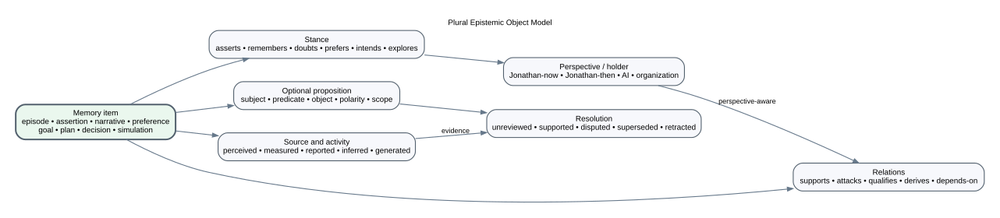

The current claim taxonomies are trying to answer several questions with one label. A more durable model separates dimensions.

### 3.1 Memory item kind

What sort of thing is preserved?

- episode;
- assertion;
- narrative;
- interpretation;
- preference;
- value;
- goal;
- question;
- hypothesis;
- decision;
- plan;
- commitment;
- procedure;
- simulation;
- artifact reference.

### 3.2 Source mode

How did the content enter the system?

- perceived;
- measured;
- remembered;
- reported;
- imported;
- inferred;
- generated;
- imagined;
- accepted from a decision process.

### 3.3 Stance

How does an agent relate to the content?

- asserts;
- remembers;
- reports;
- accepts;
- doubts;
- denies;
- suspects;
- entertains;
- prefers;
- values;
- wants;
- fears;
- intends;
- explores.

### 3.4 Perspective holder

Whose stance is represented?

- Jonathan now;
- Jonathan at an earlier time;
- a collaborator;
- an organization;
- an external authority;
- a particular AI model/run;
- a simulated persona or scenario.

### 3.5 Proposition

Only truth-apt or logically comparable items need a normalized proposition:

```yaml
subject: retrieval_pipeline
predicate: default_method
object: fts5
polarity: positive
scope:
  project: big-brain-time
  component: search
  environment: local
  population: null
```

A preference or narrative may have no useful proposition until a query requires one.

### 3.6 Epistemic resolution

What is the system’s current relationship to the proposition?

- unclassified;
- unreviewed;
- supported;
- insufficient;
- disputed;
- contradicted;
- superseded;
- retracted;
- historical;
- unresolved.

This is not the same as object kind or confidence.

### 3.7 Authority and applicability

- who is entitled to decide or report in the domain;
- when and where the item applies;
- whether the authority binds action, evidence, or only perspective;
- what rule selected or preserved alternatives.

## 4. Proposed minimal structures

The following is a conceptual model, not an immediate schema mandate.

```yaml
memory_item:
  id: M-204
  kind: episode
  content: "During the retrieval test, negation cases were easier to find with FTS5."
  source_artifact: run://retrieval/e17
  experienced_at: 2026-07-26T14:30:00-05:00
  recorded_at: 2026-07-26T15:05:00-05:00
  privacy: private
  lifecycle: active

stance:
  holder: agent.jonathan
  toward: M-204
  mode: interprets
  content: "Lexical retrieval may need to remain primary for contradiction work."
  valid_from: 2026-07-26

assertion:
  memory_item: M-204
  proposition:
    subject: contradiction_retrieval
    predicate: comparative_performance
    object: fts5_better_on_seeded_negation_cases
  resolution: supported_in_bounded_experiment
  evidence:
    - run://retrieval/e17

commitment:
  id: K-19
  kind: decision
  content: "Keep FTS5 as the default baseline pending broader evaluation."
  authority: agent.jonathan
  status: active
  reconsider_if:
    - hybrid retrieval improves hard-case recall by the declared threshold
```

The episode, interpretation, assertion, and decision are related but not identical.

## 5. Memory families for product design

### 5.1 Episodic memory

Specific events and experiences situated in time and context.

**Examples:** a meeting, failed deployment, conversation, discovery, emotional response, experiment run.

**Product behavior:** preserve source and context; retrieve by cues; support reflection and future simulation; avoid immediate generalization.

### 5.2 Semantic memory

General concepts, definitions, patterns, and durable knowledge abstracted across episodes or sources.

**Examples:** how a system works, a learned heuristic, stable project architecture, a domain concept.

**Product behavior:** consolidate slowly; retain lineage and exceptions; invalidate after source change; distinguish accepted knowledge from proposed reflection.

### 5.3 Procedural memory

How to perform a task or coordinate a workflow.

**Examples:** restore procedure, release checklist, research workflow, how Jonathan likes to close a project session.

**Product behavior:** version procedures; connect to demonstrations and outcomes; retrieve at action time; treat repeated success as evidence but not infallibility.

### 5.4 Prospective memory

Remembering to perform an intended action when a time, event, context, or state occurs.

**Examples:** review a decision after a benchmark, prepare for a meeting, resume a project when a dependency clears.

**Product behavior:** connect commitments to triggers; preserve why the trigger matters; avoid notification overload; distinguish reminders from calendar authority.

### 5.5 Working context

The temporary, bounded state needed for the current task.

**Examples:** context pack, re-entry capsule, active files, open reasoning lane.

**Product behavior:** compile purpose-specific views; expire after material change; do not treat active context as durable memory automatically.

### 5.6 Social and perspective memory

Who said, believed, preferred, promised, or understood what—and for which audience.

**Examples:** a partner’s preference, a team decision, an AI auditor’s concern, Jonathan’s earlier position.

**Product behavior:** retain speaker and audience; enforce consent and privacy; do not merge viewpoints into an artificial consensus.

### 5.7 Metacognitive memory

Knowledge about how Jonathan and the system work together.

**Examples:** which explanation formats help, which alerts are intrusive, which closeout fields improve resumption, which tasks are repeatedly reconstructed.

**Product behavior:** human-reviewable, evidence-linked, time-bound, and easy to correct; never an opaque personality dossier.

## 6. Memory layers

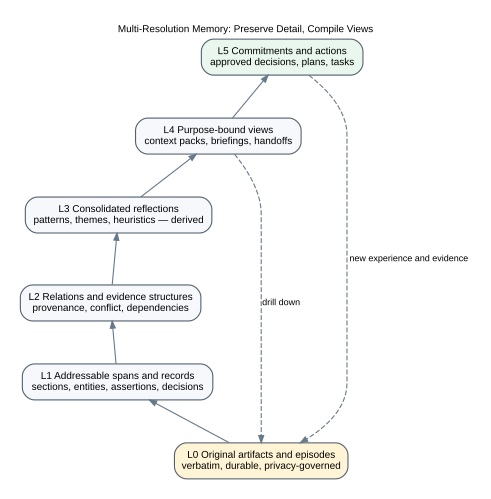

### L0 — Original artifacts and episodes

Verbatim source, durable within retention policy.

### L1 — Addressable spans and records

Sections, entities, assertions, decisions, tasks, transition fields.

### L2 — Evidence and relationship structures

Sources, provenance, support/attack, dependencies, scope, temporal relations.

### L3 — Consolidated reflections

Patterns, themes, heuristics, conceptual models. Derived and invalidatable.

### L4 — Purpose-bound views

Context packs, briefings, handoffs, re-entry capsules, decision exhibits.

### L5 — Commitments and actions

Accepted decisions, active plans, tasks, permissions, and executed outcomes.

Information flows both upward and downward. A decision creates new experience; a view must allow drill-down; a new episode may challenge a reflection without deleting it immediately.

## 7. Query modes and cognitive policy

A brain-like system should not use one universal “truth mode.”

### Factual mode

Purpose: determine a world-state assertion.  
Policy: strict source, scope, time, authority, conflict disclosure, and abstention.

### Memory mode

Purpose: reconstruct what was experienced or remembered.  
Policy: preserve first-person source, distinguish memory from external verification, show later reconstruction where relevant.

### Perspective mode

Purpose: understand how different agents interpreted or valued something.  
Policy: retain holders and audience; do not force one winner.

### Exploration mode

Purpose: consider hypotheses or design alternatives.  
Policy: maintain assumption environments, evidence for/against, and uncertainty.

### Decision mode

Purpose: select a commitment under evidence, values, and constraints.  
Policy: make values, alternatives, authority, and reconsideration triggers explicit.

### Simulation mode

Purpose: explore a possible future or counterfactual.  
Policy: mark assumptions and non-actual status; allow creative composition; exclude from factual retrieval unless explicitly requested.

### Narrative mode

Purpose: preserve meaning, voice, and temporal self-understanding.  
Policy: minimal structural intrusion; source and privacy remain, but not every sentence requires classification.

## 8. The self model

A personal cognitive system inevitably contains a model of its user. The design must prevent that model from becoming rigid or invasive.

### Permitted categories

- explicit preferences;
- accepted values and constraints;
- declared goals;
- interaction settings;
- observed workflow patterns with evidence;
- temporary hypotheses marked as such;
- time-bounded past preferences;
- user-corrected descriptions.

### Prohibited or high-friction categories

- unreviewed psychological diagnoses;
- permanent identity claims inferred from a small sample;
- hidden persuasion profiles;
- sensitive inferences retained without purpose;
- claims that a temporary mood reflects a stable trait;
- model-generated “insights” that influence recommendations without disclosure;
- identity conclusions that cannot be inspected, corrected, or deleted.

### Proposed self-model contract

Every durable personal inference should include:

```yaml
statement: ...
source_examples: [...]
created_by: ...
created_at: ...
validity: temporary | review_date | open-ended
status: proposed | accepted | rejected | superseded
uses_allowed: [...]
uses_prohibited: [...]
confidence_or_uncertainty: ...
reconsider_if: ...
```

## 9. Memory evolution and contamination

Persistent memory creates a longitudinal attack and error surface. Repetition, biased feedback, noisy tools, or generated summaries can gradually reshape later behavior.

MemEvoBench and related emerging research call attention to “memory misevolution”: long-run drift from contaminated updates.

Big Brain Time should test:

- a false assertion repeated in many captures;
- one generated summary citing another generated summary;
- a scope-limited observation generalized globally;
- a model preference becoming attributed to Jonathan;
- a temporary project rule persisting after its environment changes;
- an adversarial source accumulating links and retrieval frequency;
- a social majority overwriting a minority or historical perspective.

Frequency, recency, and graph centrality must not become authority by accident.

## 10. Worked examples

### Example A — Subjective experience

> “The meeting felt unproductive.”

- kind: episode or observation of subjective experience;
- source mode: experienced;
- holder: Jonathan;
- stance: reports/feels;
- externally factual conclusion: none implied;
- possible interpretation: meeting lacked a decision structure;
- possible action: test an agenda template;

The feeling is real as an experience. The explanation remains an interpretation or hypothesis.

### Example B — Changing preference

> “I prefer CLI tools.”

Store as a time-bounded preference, not a universal fact. Later evidence might show a preference for CLI during debugging and visual workbench during review. The narrower pattern qualifies the earlier generalization.

### Example C — Decision versus observation

Decision: “FTS5 is the default retrieval baseline.”  
Observation: “Hybrid retrieval improved three low-overlap cases.”

The observation does not automatically contradict or supersede the decision. It may support a reconsideration trigger or a domain-specific hybrid policy.

### Example D — Future simulation

> “Suppose Big Brain Time becomes a shared project brain for a nonprofit team.”

Create a simulation environment with assumptions, stakeholders, access rules, and predicted tensions. Do not let simulated participants or policies surface in current personal-system answers.

### Example E — Reconstructed autobiographical memory

Jonathan remembers choosing a design because of privacy. A contemporaneous ADR says the primary rationale was reversibility. Preserve the remembered narrative and the record; do not silently “correct” the personal memory. A perspective answer can explain the difference.

## 11. Design hypotheses

1. Separating kind, source mode, stance, perspective, and resolution will reduce false factualization.
2. Most captures do not need full proposition normalization at ingestion.
3. Narrative originals plus derived structured objects provide a better maintenance/value balance than either pure prose or total atomization.
4. Explicit simulation environments will increase creative planning without contaminating current-state memory.
5. Slow, reviewed self-model updates will improve personalization more safely than continuous opaque profile inference.
6. Argument structures will be useful for architecture and research decisions but excessive for ordinary facts.
7. A small set of cognitive modes will be easier to understand than dozens of inline epistemic markers.

## 12. Open research and design questions

- How should retrieval of autobiographical material change with current purpose without rewriting the source?
- What is the minimum useful perspective model for a single user and multiple AI collaborators?
- Can source mode be captured reliably without interrupting ordinary capture?
- Which object kinds need stable schemas, and which should remain extensible tags?
- How should reconsolidation be represented when a memory changes after retrieval?
- What distinctions are understandable to non-expert users?
- Which parts of procedural memory should be inferred from repeated actions versus explicitly authored?
- How does the system preserve skill and judgment rather than encourage excessive cognitive offloading?
- How are consent and deletion handled when memory concerns other people?
- When should the system intentionally surface a past self rather than current interpretation?


---

# 06 — Synthesis, Consolidation, Compression, and Forgetting

## 1. Core problem

As Big Brain Time grows, it cannot present every source artifact in every context. It needs smaller representations, but compression is never neutral. It changes what is easy to see, what appears important, which disagreements survive, and which future questions can still be answered.

The design goal is not maximum compression. It is:

> Reduce coordination and retrieval cost while preserving the information, alternatives, source access, and uncertainty needed for a declared future purpose.

## 2. There is no universally safe summary

The Information Bottleneck method formalizes compression relative to a relevance variable: preserve the information in one signal that matters for another objective while discarding other detail.

For Big Brain Time, the practical translation is:

> A lossy synthesis must name the question family, task, decision, audience, or capability it is optimized to support.

A project re-entry capsule, legal audit, research synthesis, emotional reflection, handoff packet, and executive brief have different protected information.

Reference: [Tishby, Pereira, & Bialek, “The Information Bottleneck Method”](https://arxiv.org/abs/physics/0004057).

## 3. Synthesis is a family of operations

The current prototype uses “synthesis” for a generated knowledge note. The product should distinguish several operations because their authority and loss differ.

| Operation | What it does | Loss risk | Default status |
|---|---|---:|---|
| Index | Makes source addressable | none semantically | derived projection |
| Exact deduplication | Collapses identical payloads while retaining locations | low | automatic with manifest |
| Normalization | Standardizes dates, names, propositions, formats | low–medium | derived/reviewable |
| Extractive digest | Selects source excerpts | omission | compiled view |
| Abstractive summary | Rephrases and combines | omission + distortion | derived, cited |
| Comparative synthesis | Organizes agreements, conflicts, scopes, and gaps | framing | derived/reviewable |
| Reflection | Proposes meaning or pattern | creates new propositions | hypothesis/proposal |
| Generalization | Forms a rule or semantic memory across episodes | exception loss | proposed, slowly promoted |
| Decision synthesis | Selects a commitment under evidence and values | alternative loss | human-authorized decision |
| Procedure compilation | Converts successful practice into reusable steps | context loss | versioned procedure |
| Context compilation | Builds task-specific working memory | bounded omission | expiring compiled artifact |
| Purge/compaction | Removes representations or payload | destructive | separate lifecycle operation |

Calling all of these “summary” hides important controls.

## 4. Multi-resolution architecture


### L0 — Originals

Verbatim episodes, documents, conversations, records, events, and source artifacts. Protected by retention and privacy policy.

### L1 — Addressable structures

Sections, entities, assertions, decisions, tasks, transition fields, quotes, timestamps.

### L2 — Relations and evidence

Support, attack, qualification, derivation, authority, scope, supersession, dependencies.

### L3 — Consolidated semantic structures

Themes, patterns, conceptual models, heuristics, community summaries. Derived and invalidatable.

### L4 — Purpose-bound contexts

Re-entry packs, briefings, handoffs, research exhibits, decision packets.

### L5 — Commitments and effects

Accepted decisions, plans, tasks, permissions, and actions.

The system should be able to answer from a higher layer and drill down to lower layers. It should never need to discard L0 merely because L3 exists.

## 5. The synthesis contract

Every meaningful lossy artifact should carry a contract.

```yaml
synthesis_id: syn.retrieval-architecture.2026-07-27
artifact_type: comparative_synthesis
purpose: decide_next_retrieval_experiment
audience: Jonathan
query_family: architecture_decision
as_of_valid_time: 2026-07-27T23:59:59-05:00
as_of_recorded_time: 2026-07-27T23:59:59-05:00

source_manifest:
  corpus_revision: ...
  items:
    - source_id: ...
      locator: ...
      content_hash: ...

method:
  stages:
    - exact_dedupe
    - extractive_evidence_units
    - conflict_preserving_abstraction
  model: ...
  template_version: ...

protected_content:
  - numerical_results
  - dates_and_effective_periods
  - decisions_and_rationale
  - unresolved_conflicts
  - minority_perspectives
  - negative_results
  - reconsideration_triggers

coverage:
  required_units: [...]
  preserved_units: [...]
  omitted_units: [...]
  unresolved_questions: [...]

loss:
  class: lossy
  known_risks:
    - wording_and_tone_reduction
    - omitted_low_relevance_examples

invalidation:
  stale_when_child_changes: true
  expires_at: null
```

The contract makes compression inspectable and testable.

## 6. Conservative consolidation pipeline


### Stage 1 — Declare purpose

No topic is consolidated merely because it has many notes. Name the future question, workflow, or decision.

### Stage 2 — Freeze source set

Record source IDs, versions, time boundaries, and privacy. A moving source set produces unstable evaluation.

### Stage 3 — Extract information units

Identify facts, observations, interpretations, alternatives, examples, decisions, exceptions, and open questions. Preserve source locators.

### Stage 4 — Exact and near-duplicate analysis

Exact deduplication may be automatic. Near-duplicate equivalence remains reviewable when scope, time, or perspective differs.

### Stage 5 — Conflict and exception preservation

Before abstraction, explicitly collect:

- incompatible applicable assertions;
- different perspectives;
- scope limitations;
- counterexamples;
- negative results;
- unresolved authority;
- temporal changes.

### Stage 6 — Produce artifact variants

Create one or more of:

- extractive digest;
- comparative table;
- abstractive summary;
- pattern proposal;
- decision exhibit.

Do not mix them invisibly.

### Stage 7 — Test retention

Ask whether protected units and representative future questions survive.

### Stage 8 — Human review and promotion

A reflection or generalization becomes durable only after acceptance. The source synthesis remains derived even when a resulting decision becomes canonical.

### Stage 9 — Invalidate and reconsolidate

When material children change, mark the artifact stale. Do not silently mutate it under the same identity.

## 7. When is consolidation appropriate?

A readiness score should be an explanation, not a magic number.

### Positive signals

- the same understanding is reconstructed repeatedly;
- multiple independent sources converge;
- source diversity and session diversity exist;
- retrieval repeatedly returns redundant evidence;
- a real decision or workflow needs a smaller representation;
- the material has become relatively stable;
- a defined regression set can test the result;
- maintenance cost of the raw set exceeds synthesis cost;
- users need a common vocabulary or model;
- the synthesis can preserve meaningful disagreements.

### Negative signals

- material is still rapidly evolving;
- only one episode or source exists;
- the topic is primarily narrative or emotionally contextual;
- the abstraction would create a sensitive personal inference;
- there is no declared future use;
- contradictions are not understood;
- the source set is already concise;
- generated summaries are the main sources;
- the system cannot evaluate information loss;
- the result would become a second canonical authority.

### Proposed readiness explanation

```text
Ready because:
- 14 candidate items from 5 sources and 4 sessions
- the same retrieval architecture explanation was reconstructed 6 times
- one architecture decision is pending
- source set has been stable for 10 days

Not fully ready because:
- one benchmark result is unreplicated
- the privacy implications of local embeddings remain unresolved
```

## 8. Protected information

Protected information depends on purpose, but certain categories deserve strong defaults.

### Usually protect

- exact names, dates, quantities, and units;
- active decisions and rationale;
- status and effective period;
- exceptions and counterexamples;
- unresolved conflicts;
- negative or null results;
- minority perspectives;
- safety and privacy constraints;
- source authority and uncertainty;
- next action and blocking condition;
- reconsideration triggers;
- content marked “do not summarize” or “preserve voice.”

### Often compressible

- repeated background;
- equivalent examples after at least one remains;
- boilerplate;
- low-value process chatter;
- redundant navigation language;
- formatting differences;
- generated connective prose;
- superseded operational detail when the purpose is current action—provided history remains reachable.

## 9. Synthesis evaluation

A good synthesis should be evaluated by retained capability, not aesthetic coherence.

### Structural checks

- deterministic manifest;
- valid source locators;
- no self-citation loops;
- idempotent rebuild;
- stale-child detection;
- privacy compliance;
- output type clearly declared.

### Information-unit checks

- protected unit recall;
- numerical/date/name preservation;
- conflict and minority-view retention;
- exception retention;
- unsupported generalization count;
- source-level citation correctness;
- omission disclosure.

### Task checks

- answers declared future questions;
- reduces context or retrieval cost;
- improves decision or re-entry time;
- does not increase corrections;
- supports drill-down;
- remains understandable after a time gap.

### Human checks

- authentic meaning preserved;
- confidence calibrated;
- result feels lighter than raw sources;
- omissions are acceptable;
- maintenance is justified;
- user can predict when it is stale.

## 10. Consolidation timing

Several timing strategies should remain open.

### Explicit request

Safest and easiest to understand. May miss recurring opportunities.

### Threshold notification

The system notices a possible cluster and asks whether synthesis would help. Requires good precision.

### Periodic “sleep” cycle

A scheduled process proposes deduplication, clusters, conflicts, and reflection candidates. Emerging agent-memory research explores sleep-like consolidation, but Big Brain Time should initially run this as a non-canonical report.

### Retrieval-time compilation

Create a temporary synthesis only when a question requires it. Reduces stored summaries but may be slower and less stable.

### Event-triggered invalidation

Material changes mark affected syntheses stale; regeneration remains explicit or scheduled.

A likely hybrid is: explicit or retrieval-time synthesis, with periodic candidate discovery and deterministic invalidation.

## 11. Forgetting is not deletion

Managed-forgetting research emphasizes reducing prominence and controlling retrieval rather than erasing all history. Big Brain Time should separate visibility from preservation.

### Memory buoyancy

A ranking or view signal based on current relevance, project membership, access, open dependencies, review dates, and explicit pinning.

**Rule:** buoyancy affects default visibility, never truth or retention by itself.

### Preservation value

A separate policy reflecting historical, legal, emotional, safety, explanatory, or recovery importance.

An old item can have low buoyancy and high preservation value.

## 12. Lifecycle vocabulary

| Operation | Meaning | Reversible? | Payload retained? |
|---|---|---:|---:|
| Hide/filter | Exclude from one view | yes | yes |
| Suppress | Lower default retrieval/notification | yes | yes |
| Archive | Remove from active operation | yes | yes |
| Expire | Artifact no longer valid for reuse | regenerate | yes or policy-dependent |
| Supersede | Prefer a later applicable item | yes conceptually | yes |
| Retract | Withdraw endorsement | yes with history | yes |
| Redact | Remove protected payload but retain structure | partly | no for redacted portion |
| Delete representation | Remove one file/cache/row | depends | may exist elsewhere |
| Purge semantic item | Remove controlled canonical and derived copies | generally no | no in controlled active stores |
| Crypto-erase | Destroy access by destroying encryption key | generally no | ciphertext may remain |
| Unlearn | Remove influence from a trained model | difficult/uncertain | separate problem |

These terms should become product verbs, not implementation details.

## 13. Append-oriented correction versus purge

The current locked ADR says claims are never deleted or mutated. That is appropriate for ordinary epistemic correction but too absolute for privacy and user control.

Proposed revised law:

> Meaningful epistemic correction is append-oriented and never silently destroys history. Authorized redaction or purge is a separate, explicit, scope-limited lifecycle operation with impact enumeration and honest residual-copy reporting.

Use append-oriented correction for:

- corrected research results;
- superseded decisions;
- changing project state;
- historical beliefs and preferences;
- audit explanations.

Use purge or redaction for:

- accidentally captured secrets;
- highly sensitive personal material the owner chooses to remove;
- inappropriate third-party information;
- unlawful retention;
- harmful unreviewed psychographic inferences;
- corrupted generated artifacts with no historical value;
- expired ephemeral content under policy.

## 14. Purge transaction


### 1. Request

Specify item, semantic scope, reason, and desired operation.

### 2. Classify

Determine authority, legal/ethical hold, privacy class, and whether suppression, retraction, redaction, or purge is appropriate.

### 3. Enumerate representations

Search:

- canonical Markdown and attachments;
- Git working history and remote references;
- operational SQLite;
- read models and FTS;
- embeddings and graph projections;
- context packs, summaries, briefings, and handoffs;
- staging and temporary files;
- patch snapshots and undo logs;
- audit payloads;
- backups;
- external model disclosures or connector caches.

### 4. Dry run

Show what will be removed, invalidated, retained, or left in expiring backups.

### 5. Approve

Destructive scope requires explicit, fresh approval. Retrieved evidence cannot authorize it.

### 6. Apply

Redact or purge canonical payload, then remove or invalidate derived copies.

### 7. Rebuild

Rebuild read models and summaries from remaining sources.

### 8. Verify

Search active stores for identifiers, hashes, and known fragments. Verification is evidence, not proof of universal erasure.

### 9. Receipt

Record who authorized the operation, scope, time, policy, and residual retention—without retaining the sensitive payload.

## 15. Git and backup realities

Deleting a working-tree file does not erase Git history or every clone. Sensitive-data removal may require history rewriting, remote coordination, and invalidating prior references. Backups may retain encrypted copies until expiration.

The product should never claim immediate universal deletion unless the storage and key architecture actually supports it.

Possible long-term mechanisms include:

- retention-aware backup manifests;
- domain-segmented encrypted archives;
- per-domain or per-item encryption keys for selected high-risk material;
- scheduled backup expiry and verification;
- external-disclosure logs;
- explicit “active stores clear; backup residual until date” reports.

## 16. Example synthesis contracts

### Re-entry synthesis

**Purpose:** restart a project.  
**Protect:** current milestone, recent decision, blocker, stop point, first action, changes while away.  
**May omit:** old completed tasks, broad background, superseded detail.  
**Must disclose:** stale transition and unresolved status conflicts.

### Research synthesis

**Purpose:** choose the next experiment.  
**Protect:** source quality, methods, effect boundaries, negative results, disagreements, assumptions, open gaps.  
**May omit:** repeated introductions and secondary descriptions.  
**Must not:** convert a preprint result into a universal architecture rule.

### Personal reflection

**Purpose:** understand a recurring experience.  
**Protect:** authentic voice, episode diversity, exceptions, emotional context, time.  
**May omit:** logistical repetition.  
**Must not:** create a stable personality fact without review.

### Handoff

**Purpose:** another model begins the correct work quickly.  
**Protect:** objective, current revision, verified state, open obligations, permitted paths, commands, stop conditions.  
**May omit:** transcript history and redundant rationale.  
**Must disclose:** staleness and unverified status.

## 17. Research hypotheses and experiments

1. Purpose-specific protected-unit contracts will reduce information-loss errors more than generic “summarize carefully” prompts.
2. Extractive-plus-comparative synthesis will be more trustworthy than immediate abstractive narrative for disputed topics.
3. Retrieval-time syntheses will reduce stale-cache maintenance for infrequently used topics.
4. A periodic non-canonical consolidation report will identify valuable deduplication without creating unwanted permanent summaries.
5. Separate buoyancy and preservation scores will reduce clutter without hiding critical history.
6. Explicit purge impact reports will be more understandable and trustworthy than a generic delete button.
7. Idempotence and stale-child tests will catch more practical synthesis defects than model-quality scores alone.

## 18. Open questions

- What future question set is sufficient to evaluate a synthesis?
- How can protected information be selected without requiring extensive manual annotation?
- When should a thematic reflection be stored versus generated on demand?
- How should reconsolidation preserve earlier interpretations?
- What retention policy should apply to model prompts and outputs?
- Can semantic fragments be reliably found across summaries during purge?
- How should backup encryption be segmented without making recovery too complex?
- Which personal memories have intrinsic preservation value even when never retrieved?
- When is forgetting beneficial for learning or creativity rather than merely reducing clutter?
- How does a shared system negotiate one person’s deletion request against another person’s legitimate record?


---

# 07 — Design Tensions and Option Spaces

## 1. Why preserve tensions

Big Brain Time’s most consequential choices are not simple feature decisions. They are tensions among desirable qualities. Choosing one side too early can create an architecture that works beautifully for one interpretation of the product and poorly for another.

This document uses **Questions–Options–Criteria (QOC)** to keep design spaces visible. QOC represents:

- **Question:** the design issue;
- **Options:** plausible responses;
- **Criteria:** values and evidence used to compare options;
- **Assessment:** how each option supports or conflicts with criteria.

The original QOC work argues that design rationale should be constructed alongside the artifact so that later redesign and reuse can understand not only what was selected but what alternatives existed.

Reference: [MacLean, Young, Bellotti, & Moran, 1991](https://www.tandfonline.com/doi/abs/10.1080/07370024.1991.9667168).

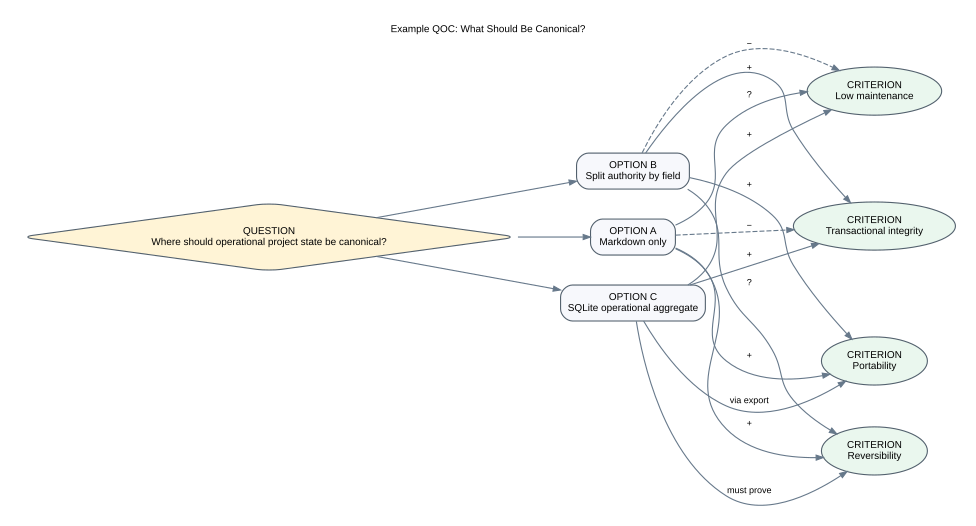

The goal is not to produce a diagram for every minor choice. Use QOC where a decision is poorly understood, value-laden, difficult to reverse, or likely to recur.

## 2. Tension 1 — Truth discipline versus cognitive plurality

### Question

How strict should Big Brain Time be about classifying and verifying stored material?

### Options

**A. Universal epistemic claim system**  
Every durable statement receives a claim type and resolution status.

**B. Free-form memory with factual checks only at answer time**  
Store authentic material with source and time; extract claims when needed.

**C. Plural object model with mode-specific gates**  
Represent episodes, narratives, preferences, goals, plans, decisions, assertions, and simulations separately; apply strict adjudication only to truth-apt answers and actions.

### Criteria

- factual reliability;
- capture friction;
- preservation of voice and meaning;
- ability to represent perspective;
- maintainability;
- explainability;
- migration from current markers.

### Current assessment

Option A supports assurance but risks over-classification and ontology drift. Option B preserves authenticity but weakens proactive contradiction and temporal reasoning. Option C best matches the larger product thesis but requires a carefully bounded kernel.

### Proposed direction

Prototype C while preserving current source text. Do not migrate every old marker until real examples establish the model.

### Discriminating probe

Model ten heterogeneous real items with A, B, and C; compare ambiguity, capture effort, query quality, and user comfort.

---

## 3. Tension 2 — Narrative wholeness versus atomic addressability

### Question

Should knowledge be decomposed into small semantic units or preserved as documents and narratives?

### Options

- **A. Document-first:** structure is mostly metadata and headings.
- **B. Atom-first:** all meaningful content becomes claims/entities/relations.
- **C. Narrative originals with derived addressable projections.**

### Criteria

- authentic context;
- exact retrieval;
- temporal and relation queries;
- maintenance cost;
- deletion behavior;
- model independence;
- ability to reconstruct meaning.

### Current assessment

Total atomization loses framing, ambiguity, and voice. Pure document storage makes propagation and precise reasoning difficult. Option C is the strongest baseline: originals remain authoritative; structured projections are selectively created and always link back.

### Risk

Option C can quietly become dual authority if structured edits and prose edits both change the same meaning.

### Discriminating probe

Choose one complex design conversation. Preserve the transcript, create a narrative summary, and extract atomic objects. Test future questions using each representation alone and in combination.

---

## 4. Tension 3 — Markdown authority versus SQLite authority

### Question

Where should durable state be canonical?

### Options

- **A. Markdown/Git for all durable state.**
- **B. Split authority by information type or field.**
- **C. SQLite/event records as primary; Markdown as export.**
- **D. Federated project packages, each with their own local authority contract.**

### Criteria

- portability;
- transactional integrity;
- hand editability;
- schema enforcement;
- temporal history;
- backup and recovery;
- multi-interface behavior;
- maintenance;
- product usability for non-developers.

### Current assessment

The source blueprint already recommends A as the starting point and B as a likely evolution. The design studio should also evaluate D because project brains may be more reusable and deletable than one monolithic personal corpus.

### Design rule

Do not decide by storage technology. Decide per capability scenario and exact semantic fields.

### Discriminating probe

Run one project aggregate under A and a separate copy under B for two review cycles. Measure edits, drift, export, recovery, and understanding.

---

## 5. Tension 4 — Append-oriented history versus the right to erase

### Question

Should meaningful records ever be deleted?

### Options

- **A. Absolute immutability:** corrections only append.
- **B. Mutable current state with version history.**
- **C. Append-oriented correction plus explicit redaction/purge lifecycle.**
- **D. Retention-limited memory by default.**

### Criteria

- temporal explanation;
- privacy and consent;
- user control;
- legal/ethical deletion;
- audit integrity;
- backup complexity;
- trust.

### Current assessment

C is the most defensible. Ordinary correction preserves history; destructive operations remain separate, explicit, scoped, and honestly limited by backup realities.

### Discriminating probe

Walk one correction, one obsolete task, one sensitive accidental capture, and one third-party record through all four policies.

---

## 6. Tension 5 — Frictionless capture versus usable memory

### Question

How much processing should occur at capture time?

### Options

- **A. Zero-friction append to inbox.**
- **B. Required structured intake.**
- **C. Preserve immediately, process later through suggestions.**
- **D. Process only when retrieval reveals value.**

### Criteria

- capture completion;
- sensitive-data risk;
- backlog growth;
- capture-to-use conversion;
- source quality;
- interruption cost;
- classification accuracy.

### Current assessment

A and B represent familiar failure modes: forgotten inboxes and burdensome forms. A C/D hybrid is promising: preserve a safe minimum, triage cheaply, and invest in structure only when a future use or repeated pattern justifies it.

### Discriminating probe

Collect twenty captures under immediate structured processing and twenty under delayed/on-demand processing.

---

## 7. Tension 6 — Complete context versus bounded context

### Question

How much information should be supplied to a human or model?

### Options

- **A. Full history or handbook.**
- **B. Top-ranked excerpts only.**
- **C. Purpose-bound context contract with evidence, conflicts, omissions, and appendices.**
- **D. Interactive retrieval where the model requests more evidence.**

### Criteria

- evidence recall;
- distractor resistance;
- token and latency cost;
- conflict preservation;
- auditability;
- recipient startup time;
- privacy minimization.

### Current assessment

C is the current architectural center. D may improve difficult workflows but introduces iterative tool and policy complexity. A remains useful as a global audit baseline, not normal memory.

### Discriminating probe

Compare C and D on ten questions where relevant evidence is distributed or weakly lexical.

---

## 8. Tension 7 — Stored summaries versus synthesis on demand

### Question

Should consolidated summaries be durable artifacts?

### Options

- **A. Store summaries at every hierarchy level.**
- **B. Generate all synthesis at query time.**
- **C. Store only high-use or expensive syntheses with invalidation.**
- **D. Store structured information units, generate prose on demand.**

### Criteria

- freshness;
- latency;
- maintenance;
- reproducibility;
- user editing;
- provider dependence;
- ability to compare changing interpretations.

### Current assessment

C and D deserve comparison. Durable prose is useful when it embodies accepted human understanding or is repeatedly used. Generated orientation text should usually be reconstructible.

### Discriminating probe

Track one topic for a month under stored and on-demand synthesis. Measure stale artifacts, repeated generation cost, corrections, and reuse.

---

## 9. Tension 8 — Deterministic systems versus model judgment

### Question

Where should generative or probabilistic reasoning enter the pipeline?

### Options

- **A. Model-first orchestration.**
- **B. Deterministic parsing/retrieval/policy, model only for synthesis.**
- **C. Models propose at every stage; deterministic components validate and constrain.**
- **D. Multiple models deliberate and vote.**

### Criteria

- adaptability;
- factual and action safety;
- maintenance;
- explainability;
- error localization;
- performance;
- provider independence.

### Current assessment

C best fits the ambition if “propose” remains literal. B is a strong baseline and safe fallback. D may improve critique but can multiply cost and shared biases; it must be benchmarked against a single well-prompted model plus deterministic checks.

### Discriminating probe

Use the same ambiguous reconciliation cases with B, C, and D. Compare false resolutions, review time, and explanation quality.

---

## 10. Tension 9 — Local-first simplicity versus multi-device convenience

### Question

How should Big Brain Time operate across devices?

### Options

- **A. One trusted workstation.**
- **B. Multiple capture devices, one processing/writer node.**
- **C. Replicated append log or database.**
- **D. Cloud-hosted canonical service.**

### Criteria

- privacy;
- availability;
- concurrent editing;
- recovery;
- setup and support burden;
- mobile value;
- product distribution.

### Current assessment

B may provide most practical value without committing to concurrent writes. Instrument actual device conflicts before selecting C. D is a different trust and business model.

### Discriminating probe

Run a three-month multi-device need log: capture urgency, offline use, concurrent edits, conflicts, and missed opportunities.

---

## 11. Tension 10 — Personalization versus identity rigidity

### Question

How should the system learn about the user?

### Options

- **A. Explicit settings only.**
- **B. Continuous inferred profile.**
- **C. Evidence-backed, reviewable, time-bounded personal hypotheses.**
- **D. Context-specific profiles with no global synthesis.**

### Criteria

- usefulness;
- privacy;
- correction;
- adaptation;
- user comfort;
- cross-context transfer;
- risk of stereotyping or manipulation.

### Current assessment

C with some D is the preferred direction. Global inferences should be rare; context-specific behavior may be safer and more accurate.

### Discriminating probe

Take ten proposed personalization claims. Ask whether Jonathan recognizes them, wants them stored, and permits each intended use.

---

## 12. Tension 11 — Proactivity versus nonintrusion

### Question

When should the system initiate?

### Options

- **A. Respond only when asked.**
- **B. Batch suggestions in review or re-entry.**
- **C. Triggered notifications with budgets and quiet hours.**
- **D. Continuous adaptive monitoring and negotiation.**

### Criteria

- timeliness;
- interruption cost;
- useful-suggestion rate;
- privacy;
- predictability;
- missed commitments;
- trust.

### Current assessment

Start with B and shadow-mode C. D requires mature consent, policy, and evaluation and may never be appropriate for some domains.

### Discriminating probe

Generate candidate alerts silently for four weeks; label useful, late, redundant, wrong, intrusive, or already known.

---

## 13. Tension 12 — One personal brain versus federated project brains

### Question

Should Big Brain Time be one longitudinal system or a federation of bounded brains?

### Options

- **A. One personal corpus and kernel instance.**
- **B. Independent project brains with shared tooling.**
- **C. Personal identity/profile layer plus federated project/capability packages.**
- **D. External project systems with only personal context links.**

### Criteria

- cross-project learning;
- privacy separation;
- portability;
- product reuse;
- deletion;
- context boundaries;
- complexity;
- collaboration.

### Current assessment

C is a strong long-term hypothesis. It allows projects to be portable and shareable while a personal layer holds values, preferences, and cross-project continuity. The boundary must prevent private personal context from leaking into shared packages.

### Discriminating probe

Package one project as if another person must use it without access to Jonathan’s private corpus. Record which kernel/profile dependencies appear.

---

## 14. Tension 13 — Universal kernel versus domain-specific semantics

### Question

How much should all capability packs share?

### Options

- **A. Large universal ontology.**
- **B. Minimal common kernel with domain schemas.**
- **C. Unstructured documents plus plugin code.**
- **D. Schema-on-read for every capability.**

### Criteria

- interoperability;
- extensibility;
- maintainability;
- cross-domain queries;
- user understanding;
- plugin isolation;
- migration.

### Current assessment

B is the preferred hypothesis: identity, source, time, authority, privacy, lifecycle, memory items, commitments, proposals, and evaluation are shared; domain meaning remains in capability packs.

### Discriminating probe

Model one research workflow, one project workflow, and one learning workflow. Identify only fields and rules genuinely common to all three.

---

## 15. Tension 14 — Fixed schema versus evolving meaning

### Question

How rigid should the data model be?

### Options

- **A. Strict normalized schema.**
- **B. Flexible JSON payloads and tags.**
- **C. Stable envelope with typed extensible payloads.**
- **D. Narrative-only source with derived schema-on-read.**

### Criteria

- constraints;
- evolvability;
- queryability;
- migrations;
- interoperability;
- preservation of unknown fields;
- developer experience.

### Current assessment

C is likely for canonical structured objects; D remains valuable for narrative source. Strictness belongs at stable boundaries, not every exploratory idea.

### Discriminating probe

Evolve the same sample objects through three requirement changes under A, B, and C; compare migrations, lost meaning, and validation.

---

## 16. Tension 15 — Transparency versus cognitive load

### Question

How much provenance, uncertainty, and policy should the interface show?

### Options

- **A. Always display full evidence and metadata.**
- **B. Show a clean answer with optional details.**
- **C. Progressive disclosure based on risk and conflict.**
- **D. Multiple dedicated views for answer, evidence, and audit.**

### Criteria

- trust calibration;
- usability;
- error detection;
- speed;
- accessibility;
- high-stakes safety;
- learning curve.

### Current assessment

C plus D: concise default output, visible status and key caveats, one-step evidence drill-down, and specialized audit views when needed.

### Discriminating probe

Mock the same answer in all four styles and test comprehension, confidence, time, and correction detection.

---

## 17. Tension 16 — General product versus personal research instrument

### Question

Is the primary goal to optimize Jonathan’s system or to build a reusable product?

### Options

- **A. Personal system only.**
- **B. Build a generic platform immediately.**
- **C. Optimize personal use while extracting stable kernel contracts through deliberate productization probes.**
- **D. Open-source framework for technical users rather than end-user product.**

### Criteria

- learning speed;
- authentic need;
- architecture cleanliness;
- distribution/support;
- generalization evidence;
- time and motivation;
- privacy.

### Current assessment

C preserves the living laboratory while preventing Jonathan-specific assumptions from silently becoming universal. D may be a viable intermediate surface.

### Discriminating probe

Give one bounded project-brain package and setup guide to another technically comfortable user. Observe what they understand, change, and reject.

## 18. How to select a tension for work

Score each tension 1–5 on:

- impact on product identity;
- irreversibility;
- current uncertainty;
- evidence from real friction;
- dependency breadth;
- ease of a discriminating probe;
- safety/privacy significance.

Prioritize high-impact, high-uncertainty tensions with cheap probes. Do not prioritize a tension merely because its technology is interesting.

## 19. QOC worksheet

```text
QUESTION:
Why does it matter now?
What scenario exposes it?

OPTIONS:
A.
B.
C.
Current implementation as an explicit option:

CRITERIA:
- user capability
- reliability
- privacy
- reversibility
- maintenance
- explainability
- adaptability
- cost

EVIDENCE:
Current-system observations:
Research:
Assumptions:

ASSESSMENT:
Which criteria does each option support or challenge?
What evidence is missing?

PROBE:
What is the smallest experiment that can change our preference?

DECISION STATUS:
open | exploring | provisional | accepted | rejected | superseded
```


---

# 08 — Research Agenda and Evidence Map

## 1. Research posture

Research should help Big Brain Time make better design choices, not provide intellectual decoration or justify a preferred architecture after the fact.

For each thread, distinguish:

1. **Phenomenon:** what human, organizational, or technical behavior is being studied?
2. **Finding:** what does the source actually support?
3. **Boundary:** under what conditions was it observed?
4. **Design implication:** what constraint or option does it suggest?
5. **Product hypothesis:** what might be useful in Big Brain Time?
6. **Probe:** what local evidence could confirm or reject that hypothesis?

A primary paper, standard, or official technical source is preferred. Recent preprints are useful for mechanisms and benchmark ideas but receive lower design authority until replicated or locally demonstrated.

## 2. Priority model

Score research questions by:

```text
expected decision impact
× uncertainty reduced
× number of dependent design choices
× safety or privacy significance
÷ research and evaluation cost
```

The first priority is not the most novel topic. It is the question most likely to change a material product choice.

## 3. Research Thread A — Autobiographical memory and the changing self

### Central question

How should a personal system preserve experiences and self-understanding when autobiographical memory is constructive, purpose-sensitive, and connected to current goals?

### Why it matters

A secondary brain can become harmful if it treats past descriptions as immutable identity facts or “corrects” personal memory solely from external records.

### Evidence base

- Conway & Pleydell-Pearce’s self-memory system;
- autobiographical memory and working-self research;
- narrative identity and memory reconsolidation literature;
- source monitoring.

### Design implications to investigate

- retrieve an original artifact and a current reconstruction separately;
- represent “Jonathan then” and “Jonathan now” as perspectives;
- time-bound personal interpretations and preferences;
- retain authentic voice while allowing concise current views;
- show when later knowledge influenced a reconstruction.

### Research questions

1. Which autobiographical structures are useful without becoming invasive?
2. How does cue and current goal change a useful retrieval?
3. How can the system support narrative identity without fixing it?
4. What should be immutable: source artifact, memory claim, or neither?
5. What consent is required when memories include other people?

### Local probe

Select five journal or project episodes that Jonathan now interprets differently. Create source view, historical perspective, current perspective, and factual record view.

### Caution

Human-memory theories are explanatory frameworks, not direct software specifications.

### Starting sources

- [Conway & Pleydell-Pearce, 2000](https://pubmed.ncbi.nlm.nih.gov/10789197/)
- [Johnson, Hashtroudi, & Lindsay, 1993](https://pubmed.ncbi.nlm.nih.gov/8346328/)

---

## 4. Research Thread B — Episodic, semantic, and procedural consolidation

### Central question

How should Big Brain Time learn general patterns from experiences without allowing one event or one generated summary to rewrite durable understanding?

### Why it matters

This is the foundation for synthesis, personalization, learned procedures, and long-term memory growth.

### Evidence base

- Complementary Learning Systems;
- systems consolidation and gist/detail tradeoffs;
- memory reconsolidation;
- emerging agent-memory consolidation research.

### Design implications to investigate

- fast episode storage, slow generalization;
- replay/interleaving across diverse episodes;
- source diversity and exception preservation;
- separate procedural memory from semantic facts;
- review and regression before promoting a heuristic.

### Research questions

1. What triggers consolidation: time, use, diversity, or task need?
2. How are outliers preserved?
3. Should procedures mature through successful executions?
4. When should a generalization decay or be reopened?
5. How is reconsolidation represented without rewriting history?

### Local probe

Take one recurring workflow with six episodes. Build a proposed procedure after episode one and after all six. Compare errors and exceptions.

### Starting sources

- [McClelland, McNaughton, & O’Reilly, 1995](https://pubmed.ncbi.nlm.nih.gov/7624455/)
- [Human-Inspired Memory Architecture for LLM Agents, 2026](https://www.microsoft.com/en-us/research/publication/human-inspired-memory-architecture-for-llm-agents/)

---

## 5. Research Thread C — Source monitoring, provenance, and temporal truth

### Central question

How can the system distinguish what happened, what was perceived, what was remembered, what was reported, what was inferred, and what was generated—across valid and recorded time?

### Why it matters

Most trust failures in a longitudinal AI system are source/time failures before they are language-generation failures.

### Evidence base

- source-monitoring psychology;
- W3C PROV concepts;
- bitemporal database research;
- archival provenance and event sourcing practices.

### Design implications to investigate

- source mode and agent attribution;
- valid time versus recorded time;
- transformation activity and software version;
- current-state selection policies;
- explicit observability gaps;
- provenance display through progressive disclosure.

### Research questions

1. What provenance is useful to users versus only auditors?
2. How is approximate or uncertain time represented?
3. What authority rules should choose, show both, or abstain?
4. How should a generated summary inherit source lineage?
5. How can rebuild metadata avoid changing epistemic time?

### Local probe

Build a five-case temporal/provenance fixture from real repository history and hand-check current, historical, and source-specific answers.

### Starting sources

- [W3C PROV Overview](https://www.w3.org/TR/prov-overview/)
- Snodgrass, *Developing Time-Oriented Database Applications in SQL*
- existing Big Brain Time bibliography R09, R33, R34.

---

## 6. Research Thread D — Belief revision, assumption environments, and argumentation

### Central question

How should Big Brain Time preserve alternatives, revise dependent conclusions, and explain disagreement without pretending that every conflict has one immediate winner?

### Why it matters

Architecture, research, personal interpretation, and group decisions frequently contain assumptions and competing arguments rather than isolated factual claims.

### Evidence base

- Truth Maintenance Systems;
- Assumption-Based TMS;
- nonmonotonic reasoning;
- Dung-style argumentation;
- design rationale and QOC.

### Design implications to investigate

- assumption environments for scenarios and architecture options;
- justifications for derived conclusions;
- argument, premise, conclusion, attack, and undercut relations;
- accepted-under-policy rather than universally true;
- dependency invalidation after assumption change.

### Research questions

1. Which reasoning structures are understandable and maintainable?
2. When is an argument graph worth the cost?
3. How are factual contradiction and value disagreement distinguished?
4. Can QOC and argumentation share a common design-rationale model?
5. How does an AI explain why a conclusion changed after one premise was withdrawn?

### Local probe

Model one contested architecture decision using flat claims, an ATMS-like assumption environment, and QOC/argument structure. Compare explanation and change impact.

### Starting sources

- Doyle, “A Truth Maintenance System”
- [de Kleer, “An Assumption-Based TMS”](https://www.sciencedirect.com/science/article/abs/pii/0004370286900809)
- Dung, 1995
- [MacLean et al., 1991](https://www.tandfonline.com/doi/abs/10.1080/07370024.1991.9667168)

---

## 7. Research Thread E — Long-term agent memory and memory safety

### Central question

Which competencies and failure modes should be used to evaluate a persistent AI memory system?

### Why it matters

Static retrieval accuracy is not enough. A useful memory system must update, understand long-range interactions, forget selectively, apply memory to action, and resist gradual contamination.

### Evidence base

- LongMemEval;
- MemoryAgentBench;
- RHELM;
- MemEvoBench;
- multi-session agent memory and action benchmarks;
- emerging memory architectures.

### Competencies to separate

- accurate retrieval;
- temporal update and supersession;
- test-time learning;
- long-range and multi-session understanding;
- selective forgetting;
- speaker and perspective grounding;
- multi-source aggregation;
- memory-to-action transfer;
- resistance to misleading repetition, noisy tools, and biased feedback.

### Research questions

1. Which benchmark families map to Jonathan’s real use?
2. How should incremental memory updates be evaluated?
3. What safety tests detect memory contamination?
4. Can simple lexical or structured baselines outperform complex memory agents?
5. How should memory repair be triggered by downstream failures?

### Local probe

Create a streaming benchmark of twenty interactions where facts, preferences, decisions, and sources change. Include misleading repetitions and tool noise.

### Starting sources

- [LongMemEval](https://arxiv.org/abs/2410.10813)
- [MemoryAgentBench](https://arxiv.org/abs/2507.05257)
- [MemEvoBench](https://arxiv.org/abs/2604.15774)
- [RHELM](https://www.microsoft.com/en-us/research/publication/beyond-static-dialogues-benchmarking-realistic-heterogeneous-and-evolving-long-term-memory/)

### Caution

These benchmarks are new and often preprint-stage. Use them to broaden evaluation, not to select an architecture by leaderboard.

---

## 8. Research Thread F — Purpose-bound compression and information loss

### Central question

How can the system reduce information while preserving the capability needed for a declared task?

### Why it matters

Synthesis and context compression are central to scale, but they can create false coherence, hidden omissions, and stale authority.

### Evidence base

- Information Bottleneck;
- summarization content-unit and pyramid evaluation;
- hierarchical retrieval such as RAPTOR and GraphRAG;
- cognitive gist/detail research;
- memory consolidation.

### Design implications to investigate

- relevance variable or purpose contract;
- protected information units;
- extractive before abstractive stages;
- alternative and conflict preservation;
- source lineage and invalidation;
- task-performance evaluation after compression.

### Research questions

1. How are protected units selected cheaply?
2. Which summary levels should be stored?
3. What loss should be shown to users?
4. How can summary parents be invalidated after child change?
5. Can a summary be evaluated by future question performance?

### Local probe

Use one source set to produce re-entry, decision, research, and public-sharing syntheses. Compare protected units and omissions.

### Starting sources

- [Tishby et al., 2000](https://arxiv.org/abs/physics/0004057)
- Nenkova & Passonneau, Pyramid Method
- RAPTOR and GraphRAG research in the existing bibliography.

---

## 9. Research Thread G — Retrieval, local/global sensemaking, and context construction

### Central question

What retrieval architecture works for exact, temporal, multi-hop, global, and low-overlap questions at different corpus sizes?

### Why it matters

A long context window is not a reliable substitute for memory. Retrieval failure can produce confident synthesis failure.

### Evidence base

- Lost in the Middle;
- RULER;
- NoLiMa;
- LongMemEval;
- RAG and RAG evaluation;
- GraphRAG/global query research;
- FTS5 official behavior.

### Research questions

1. Which query taxonomy best matches use?
2. What is the tuned lexical/metadata/link baseline?
3. Which low-overlap cases justify embeddings?
4. How should global synthesis be evaluated?
5. When should narrative parent context be retrieved?
6. What retrieval explanations help correction?

### Local probe

Maintain an evolving real-question set and benchmark exact/FTS, metadata, links, embeddings, and hierarchy at 100, 1,000, and simulated 10,000 documents.

### Starting sources

Use R04, R11–R16, R31–R32 in the supplied bibliography.

---

## 10. Research Thread H — Prospective memory, interruption, and cognitive offloading

### Central question

How can Big Brain Time help remember and resume intentions without weakening judgment, skill, or attention?

### Why it matters

Re-entry is the product’s strongest practical wedge, and prospective memory connects stored context to future action.

### Evidence base

- attention residue and ready-to-resume plans;
- implementation intentions and prospective closure;
- cognitive offloading;
- interruption and notification research;
- personal information management.

### Research questions

1. Which transition fields produce actual resumption gains?
2. What closeout cost is acceptable?
3. When should a reminder be time-, event-, state-, or context-triggered?
4. Which knowledge should remain internal to preserve learning and judgment?
5. How does the system distinguish useful preparation from interruption?

### Local probe

Run a within-person interrupted-work study comparing no capsule, manual capsule, and system-assisted capsule.

### Starting sources

Use R23–R26 in the supplied bibliography.

---

## 11. Research Thread I — Distributed cognition and longitudinal co-adaptation

### Central question

How does the whole human–AI-artifact system change over time, and which representations improve or damage coordination?

### Why it matters

A local metric such as answer accuracy can improve while overall maintenance, verification, or dependence worsens.

### Evidence base

- Licklider and Engelbart augmentation;
- distributed cognition;
- joint cognitive systems;
- human–AI interaction guidelines;
- longitudinal HCI and co-adaptation research.

### Research questions

1. What work moves from Jonathan to the system, and what new coordination work appears?
2. Which skills should the system reinforce rather than replace?
3. How does trust calibrate after errors?
4. Which artifacts become shared mental-model anchors?
5. How can adaptation remain explicit and reversible?

### Local probe

Track one workflow for eight weeks: time, corrections, repeated explanation, maintenance, reliance, satisfaction, and what Jonathan stops remembering internally.

### Starting sources

Use R20–R22 and R28–R30 in the supplied bibliography.

---

## 12. Research Thread J — Managed forgetting, lifecycle, and privacy-preserving deletion

### Central question

How should visibility, retention, retraction, redaction, purge, backup expiry, and model influence differ?

### Why it matters

A system intended to remember for years must also support user control and prevent old or sensitive material from exerting unwanted influence.

### Evidence base

- managed forgetting and memory buoyancy;
- records retention and archival practice;
- secure deletion and media sanitization;
- Git history removal;
- machine unlearning as a distinct future issue.

### Research questions

1. What preservation-value model is understandable?
2. How is vital old context protected from suppression?
3. What can be honestly guaranteed about backups?
4. Can sensitive domains use segmented encryption?
5. How are derived summaries and prompts included in purge?
6. When does a retracted item remain discoverable?

### Local probe

Build lifecycle impact plans for synthetic ordinary, historical, sensitive, and shared records.

### Starting sources

Use R27/R27B in the supplied bibliography, NIST media-sanitization guidance, and GitHub’s sensitive-data removal documentation.

---

## 13. Research Thread K — Mixed initiative, action safety, and human control

### Central question

How can the system move from retrieval to suggestion, preparation, monitoring, negotiation, and limited action without becoming unsafe or intrusive?

### Why it matters

Proactivity is a major source of potential value and a major threat to agency, privacy, attention, and trust.

### Evidence base

- mixed-initiative interaction;
- levels of automation;
- human–AI interaction guidelines;
- indirect prompt injection;
- least privilege and capability security;
- NIST/OWASP agent risk guidance.

### Research questions

1. How should initiative vary by domain and cognitive stage?
2. What actions are genuinely reversible?
3. Can users predict permission outcomes?
4. How should alert budgets and quiet modes work?
5. What does trust repair require after an action error?
6. How are evidence and control separated end to end?

### Local probe

Run two read-only monitors in shadow mode and twenty permission-comprehension scenarios before enabling any new action.

### Starting sources

Use R17–R22, R35, and the supplied safety document.

---

## 14. Research Thread L — Product architecture and design rationale

### Central question

What process best supports a complex, long-lived design whose requirements emerge through use?

### Why it matters

The project can fail through endless platform work, rapid code accumulation, or undocumented alternatives even when individual modules are technically sound.

### Evidence base

- Design Science Research Methodology;
- Spiral Model’s risk-driven iteration;
- QOC design rationale;
- Architecture Tradeoff Analysis Method;
- evolutionary and strangler migration;
- architecture fitness functions.

### Design implications to investigate

- design questions before feature tasks;
- risk-driven probes;
- quality-attribute scenarios;
- explicit alternatives and criteria;
- evidence gates and stop rules;
- architecture decisions as scoped, revisable contracts;
- removal and simplification as normal outcomes.

### Local probe

Take one subsystem decision through the full design-studio method and compare it with the previous rapid milestone process.

### Starting sources

- [Peffers et al., 2007](https://www.jmis-web.org/articles/765)
- [Boehm, 1988](https://ieeexplore.ieee.org/document/59)
- [MacLean et al., 1991](https://www.tandfonline.com/doi/abs/10.1080/07370024.1991.9667168)
- [SEI ATAM](https://www.sei.cmu.edu/library/the-architecture-tradeoff-analysis-method/)

---

## 15. Research Thread M — Multi-party and shared memory

### Central question

What changes when memory belongs to a project, team, household, or organization rather than one person?

### Why it matters

Productization toward shared brains introduces speaker grounding, audience sensitivity, access, consent, authority, and social conflict—not merely more users.

### Evidence base

- transactive memory systems;
- organizational memory;
- common ground and shared mental models;
- distributed cognition;
- emerging multi-party agent-memory benchmarks such as GroupMemBench.

### Research questions

1. Who owns a shared memory item?
2. How are private and shared perspectives separated?
3. Who may correct, retract, or delete?
4. How does the system represent disagreement without organizational coercion?
5. What context may be shared with an AI on behalf of a group?
6. How are audience-specific terms and prior knowledge preserved?

### Local probe

Package one real project for another collaborator. Include separate personal, shared, and externally authoritative layers.

### Caution

Multi-user support is a social-governance redesign, not a database scaling feature.

## 16. Suggested research sequence

### Tier 1 — Directly shapes the next architecture

1. plural cognitive object model;
2. purpose-bound synthesis and information-loss evaluation;
3. stable provenance/time/source identity;
4. design method and quality-attribute scenarios;
5. lifecycle and purge semantics.

### Tier 2 — Shapes the next product wedge

6. re-entry and prospective memory;
7. project brain versus personal brain;
8. real-query retrieval benchmark;
9. personalization and self-model governance;
10. shared foundations across capability packs.

### Tier 3 — Contingent or longer horizon

11. multi-device replication;
12. multi-party shared memory;
13. advanced agent-memory architectures;
14. procedural-memory learning;
15. broad proactive negotiation;
16. machine unlearning.

## 17. Research brief template

```text
RESEARCH QUESTION:
Decision(s) it can change:
Current assumption:

SOURCE SET:
Primary research:
Standards/official documentation:
Current-system evidence:
Contrary evidence:

SUPPORTED FINDINGS:
1.
2.

BOUNDARIES AND UNCERTAINTY:

DESIGN IMPLICATIONS:

OPTIONS STILL OPEN:

LOCAL PROBE:

RECONSIDER WHEN:
```

## 18. Evidence-quality reminders

- A cognitive analogy does not prove a software mechanism will help.
- A benchmark result does not establish long-term user value.
- A preprint result is not a locked architecture decision.
- An official standard can define interoperability without requiring full implementation.
- A model-generated literature synthesis should be checked against primary sources for load-bearing claims.
- A locally successful prototype may be more decision-relevant than a broad average result—but only for the scope actually tested.
- Negative results and failed probes should remain part of the research memory.


---

# 09 — Product Design Method and Governance

## 1. Why a separate method is needed

Big Brain Time combines product discovery, cognitive modeling, information architecture, software architecture, AI evaluation, personal knowledge management, privacy, and experimental self-use. A normal feature backlog is not enough to govern that complexity.

The source roadmap already contains strong delivery principles: acceptance tests before implementation, read-only before write, deterministic before model-driven, inspectable artifacts, evidence gates, and permission-scoped autonomy. The design studio adds methods for preserving alternatives, selecting risks, and learning from real use before hardening the architecture.

The proposed method combines four traditions:

1. **Design Science Research Methodology (DSRM):** identify problem, define objectives, design artifact, demonstrate, evaluate, communicate.
2. **Spiral development:** choose the next cycle according to the most consequential unresolved risk.
3. **Questions–Options–Criteria:** preserve design alternatives and rationale.
4. **Architecture Tradeoff Analysis:** evaluate candidate architectures through quality-attribute scenarios, risks, sensitivity points, and tradeoffs.

References:

- [Peffers et al., 2007](https://www.jmis-web.org/articles/765)
- [Boehm, 1988](https://ieeexplore.ieee.org/document/59)
- [MacLean et al., 1991](https://www.tandfonline.com/doi/abs/10.1080/07370024.1991.9667168)
- [SEI Architecture Tradeoff Analysis Method](https://www.sei.cmu.edu/library/the-architecture-tradeoff-analysis-method/)

## 2. Four backlogs, not one

The current project history demonstrates how quickly implementation tasks can dominate. The design phase should maintain four connected backlogs.

### 2.1 Friction and observation backlog

Raw evidence from real use:

- confusion;
- repeated reconstruction;
- slow re-entry;
- incorrect answer;
- stale view;
- awkward capture;
- excessive maintenance;
- useful surprise;
- privacy discomfort;
- feature not used;
- action not trusted.

An observation is not immediately a requirement.

### 2.2 Design-question backlog

Questions about product meaning, architecture, interaction, or policy.

Example:

> When a user expresses a personal preference, should the system store the exact episode, a generalized preference, or both, and how does that preference expire or change?

### 2.3 Experiment backlog

Probes capable of changing a design preference.

Example:

> Compare episode-only, generalized-preference, and context-specific-preference representations across ten real preference queries.

### 2.4 Implementation backlog

Production or prototype work that executes an accepted design or experiment.

Implementation items should name the question or decision they serve. Orphan implementation tasks are a scope smell.

## 3. The design cycle


### Stage 1 — Observe and preserve

Record what happened before interpreting it.

```yaml
observation_id: OBS-BBT-...
date:
workflow:
context:
what_happened:
expected:
actual:
source_artifacts:
impact:
initial_interpretations: []
```

### Stage 2 — Frame the problem

Define the friction, affected users, capability, and consequence. Separate symptom from cause.

Questions:

- What job was the user trying to perform?
- What evidence shows this is recurring or important?
- Is this a product problem, implementation bug, content issue, or training problem?
- What happens if nothing changes?
- Which assumptions make it a problem?

### Stage 3 — Define objectives and quality scenarios

Turn broad desires into scenarios.

```text
Source: Jonathan returning to a project after 60 days
Stimulus: asks for the fastest trustworthy re-entry
Environment: repository changed in the interval
Artifact: re-entry and context subsystems
Response: compiles current state, changes, conflicts, first action
Measure: under 5 minutes to productive work; no stale decision presented as current
```

Quality scenarios prevent terms such as “robust,” “brain-like,” or “safe” from remaining aesthetic.

### Stage 4 — Research and option mapping

Review current system evidence, relevant research, standards, and comparable designs. Produce at least two credible options and criteria.

Do not ask research to choose values that belong to Jonathan. Research can show likely effects; it cannot decide how much capture friction or privacy risk he accepts.

### Stage 5 — Risk selection

Identify the uncertainty most likely to invalidate the design.

Examples:

- semantic model too complex to maintain;
- synthesis hides exceptions;
- re-entry protocol adds more closure work than it saves;
- split authority confuses editing;
- personalization feels invasive;
- derived graph misses critical propagation;
- multi-device need is too weak to justify replication.

The next probe should address this risk, not implement the most visible screen.

### Stage 6 — Design the smallest discriminating probe

A probe should be:

- small enough to discard;
- realistic enough to expose the risk;
- instrumented enough to compare options;
- bounded in privacy and consequence;
- reversible;
- clear about what result would change the design.

Possible probes:

- paper or HTML mock;
- sample data model with worked examples;
- command-line spike;
- synthetic fixture suite;
- manual concierge workflow;
- alternative context packs;
- shadow-mode monitor;
- throwaway database migration;
- user comprehension test;
- structured retrospective.

### Stage 7 — Demonstrate in context

Run the probe on real or representative work. Do not demonstrate only the happy path.

Include:

- stale source;
- conflicting evidence;
- missing field;
- sensitive item;
- long time gap;
- user correction;
- provider or network outage;
- deletion request;
- unexpected but legitimate workflow.

### Stage 8 — Evaluate the joint system

Measure technical and human effects.

Technical:

- correctness;
- determinism;
- latency;
- recovery;
- security;
- compatibility;
- information loss.

Human/system:

- time to productive action;
- correction and re-explanation;
- maintenance;
- comprehension;
- trust calibration;
- cognitive burden;
- authentic voice;
- interruption cost;
- behavior change.

### Stage 9 — Decide

Possible outcomes:

- accept a bounded design;
- revise and rerun;
- retain multiple options under different scenarios;
- defer with a trigger;
- reject;
- retire the current implementation;
- change the problem framing.

### Stage 10 — Communicate and propagate

Update:

- design rationale;
- accepted requirements;
- architecture diagrams;
- risk register;
- regression cases;
- migration notes;
- implementation backlog;
- current product thesis if necessary;
- Ready-to-Resume state.

## 4. Decision packet

Before a major implementation commitment, create a short packet.

```yaml
decision_id: ADR-BBT-...
title:
status: proposed | provisional | accepted | rejected | superseded
scope:
owner:
date:

problem:
capability_scenario:
current_implementation:

options:
  - id: A
    description:
  - id: B
    description:

criteria:
  - value
  - reliability
  - privacy
  - reversibility
  - maintenance
  - adaptability

research_basis: []
current_system_evidence: []
experiment_evidence: []

choice:
rationale:
tradeoffs:
risks:
non_goals:
migration_effect:
acceptance_or_fitness_functions: []
reconsider_if: []
```

The packet should fit in a few pages. Supporting research and experiment reports can remain separate.

## 5. Decision states

### Open

A question exists; options may not yet be complete.

### Exploring

Research or probes are active. No production commitment.

### Provisional

A bounded direction is preferred for the current scenario, but evidence is limited.

### Accepted

The direction governs implementation in a declared scope.

### Trusted

Sustained use supports reliance in a declared scope.

### Authorized

Policy permits the design to perform a declared effect.

### Rejected

An option is not selected; preserve rationale and reconsideration conditions.

### Superseded

A later decision replaces or narrows an earlier decision while preserving history.

“Locked” should be rare and mean process protection, not immunity from new evidence.

## 6. Architecture review through quality attributes

At major boundaries, run a small ATAM-inspired workshop—even if Jonathan and AI occupy multiple roles.

### Step 1 — Present the business/product drivers

- product wedge;
- primary users;
- transformative outcome;
- non-goals;
- deployment envelope;
- privacy and maintenance budget.

### Step 2 — Present candidate architecture

Use context, container, authority, data-flow, and lifecycle views.

### Step 3 — Build a quality-attribute tree

Example:

```text
Trustworthiness
├── temporal correctness
├── source/citation correctness
├── recoverability
└── predictable action boundary

Usability
├── capture friction
├── time to re-entry
├── correction effort
└── maintenance burden
```

### Step 4 — Prioritize scenarios

Rank by importance and architectural difficulty.

### Step 5 — Analyze approaches

Identify:

- sensitivity points: a parameter or decision strongly affects a quality;
- tradeoff points: one decision affects multiple qualities differently;
- risks: evidence suggests failure;
- non-risks: the approach has adequate evidence;
- unknowns: need a probe.

### Step 6 — Produce next probes

Do not convert every risk into a large implementation task.

## 7. Roles and review modes

A single-person project still benefits from role separation.

### Product owner / lived-experience authority — Jonathan

- determines values, goals, acceptable burden, and personal boundaries;
- supplies real scenarios and corrections;
- approves personal inferences and consequential decisions;
- decides what feels useful or invasive.

### Product/design facilitator — AI collaborator

- organizes questions and alternatives;
- translates research into bounded implications;
- creates diagrams, prototypes, and evaluation plans;
- detects inconsistencies and missing scenarios;
- does not treat its own proposal as acceptance.

### Implementer

- builds the bounded probe or accepted capability;
- reports actual commands, changes, and limitations;
- avoids weakening tests to fit the design.

### Verifier / adversarial reviewer

- checks source claims, test evidence, edge cases, privacy, and overconfidence;
- attempts to falsify the preferred option;
- may be a separate model session, test harness, or deliberate review mode.

### Archivist / change-control role

- ensures rationale, source, decision status, migration, and supersession remain clear.

One person or model can hold multiple roles, but not invisibly in the same reasoning step.

## 8. Documentation architecture

Documents should be organized by responsibility.

### Stable product documents

- product thesis and principles;
- architecture views;
- kernel contracts;
- authority matrix;
- safety and lifecycle policy;
- evaluation/maturity definitions.

### Evolving design documents

- design questions;
- QOC maps;
- research briefs;
- prototypes;
- experiment reports;
- decision proposals.

### Operational documents

- current project state;
- Ready-to-Resume plans;
- active risks;
- current experiments;
- implementation tasks.

### Historical evidence

- prior decisions;
- rejected options;
- experiment results;
- incidents;
- migrations;
- archived prototypes.

Do not use a single combined blueprint as the only editable artifact. A combined document is a compiled reading view.

## 9. Traceability without bureaucracy

Use a lightweight chain:

```text
observation
  -> design question
  -> capability/quality scenario
  -> option space
  -> research and probe
  -> decision
  -> requirement/fitness function
  -> implementation
  -> run evidence and live feedback
```

Not every minor change needs the entire chain. Use it for high-impact, unclear, or hard-to-reverse choices.

## 10. Managing research debt and design debt

### Research debt

A decision depends on an unverified or outdated claim.

Record:

- claim;
- source status;
- decision affected;
- date to revisit;
- acceptable temporary assumption.

### Design debt

A prototype shortcut obscures the intended responsibility or creates a second authority.

Record:

- shortcut;
- current value;
- failure mode;
- trigger for redesign;
- maximum allowed lifetime.

### Documentation debt

The current artifact cannot explain its own status, source, or relationship to implementation.

The response is not automatically more documentation. It may be deletion, consolidation, or a better generated view.

## 11. Cadence

A suggested cadence during the design phase:

### Weekly

- one real-use friction review;
- one active design question;
- no more than one small probe;
- update Ready-to-Resume state;
- note any new trust-destroying failure.

### Every four weeks

- architecture and product-thesis check;
- keep/simplify/remove review;
- research agenda reprioritization;
- measurement burden check;
- documentation navigation test.

### At every accepted decision

- update decision packet;
- identify affected diagrams and contracts;
- create or update evaluation cases;
- state migration and rollback;
- close or supersede the question.

## 12. Implementation restart gate

Resume substantial implementation only when all are true:

1. A concrete capability scenario exists.
2. The user or project value is plausible and observable.
3. The current prototype’s failure or limitation is documented.
4. At least two options were considered.
5. The highest-risk assumption is named.
6. A probe or evidence supports the selected option.
7. Authority, privacy, lifecycle, and recovery are understood for the slice.
8. Acceptance tests or a manual evaluation protocol exist.
9. The change is small enough to reverse.
10. The design packet names what remains deliberately out of scope.

## 13. Method anti-patterns

- using sprint completion as proof of product maturity;
- asking a panel of models to create artificial certainty;
- generating a giant research review without a decision it can change;
- coding the first plausible schema before modeling real examples;
- turning every prototype field into a universal kernel concept;
- using architectural elegance as a substitute for user value;
- documenting only the selected option;
- treating an ADR as permanently locked despite changed assumptions;
- measuring everything and making the system a self-tracking burden;
- allowing the design studio itself to become another unprocessed corpus.

## 14. Design phase definition of done

The design phase can close when Jonathan can answer:

- What is the next product wedge?
- What is the minimum product kernel needed for it?
- Which cognitive objects and memory layers does it require?
- What remains narrative, operational, external, derived, or ephemeral?
- What are the dominant quality attributes and risks?
- What alternatives were rejected or deferred, and why?
- What experiment evidence supports the choice?
- How will success, burden, safety, and reversibility be measured?
- What exact small implementation begins next?


---

# 10 — Generalization and Productization

## 1. The generalization challenge

Big Brain Time is powerful partly because it is grounded in Jonathan’s real corpus, habits, language, projects, and willingness to edit Markdown and inspect technical artifacts. Those conditions cannot be assumed for another user.

Productization should therefore not mean “make Jonathan’s entire system configurable.” It should identify which concepts are universal, which are profile-specific, which are capability-specific, and which are artifacts of the current prototype.

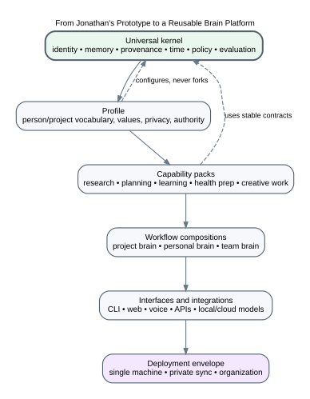

## 2. Product layers

### 2.1 Universal kernel

The kernel should remain small and domain-neutral.

Candidate contracts:

- `Agent`
- `Perspective`
- `SourceArtifact`
- `Activity`
- `MemoryItem`
- `Stance`
- `Assertion`
- `Commitment`
- `Relation`
- `LifecycleState`
- `AuthorityRule`
- `ContextContract`
- `Proposal`
- `PermissionGrant`
- `EvaluationCase`
- `RunEvidence`

Universal infrastructure:

- stable identity;
- time and provenance;
- privacy classification;
- source and model manifests;
- import/export;
- query and command envelopes;
- adapter interfaces;
- audit and evaluation;
- schema and policy versioning.

### 2.2 Profile and policy layer

A profile configures the kernel for a person, project, group, or organization.

It contains:

- vocabulary and aliases;
- life areas and project categories;
- authority priorities;
- privacy defaults;
- retention rules;
- initiative preferences;
- notification budgets;
- interaction and accessibility preferences;
- accepted personal constraints;
- allowed model destinations;
- explicit values relevant to decision support.

A profile is inspectable data, not hidden model weights.

### 2.3 Capability packs

A capability pack combines domain semantics, workflows, views, prompts, evaluation cases, and integrations.

Examples:

- project continuity;
- research and evidence synthesis;
- learning and practice;
- writing and publication;
- software engineering;
- health appointment preparation;
- home operations;
- media reflection;
- team decision memory.

A pack may define its own object payloads and policies while using kernel identity, provenance, time, lifecycle, context, permission, and evaluation contracts.

### 2.4 Workflow compositions

A product experience may combine several packs.

A “project brain” might use:

- project continuity;
- research;
- decisions;
- handoff;
- code/GitHub adapter;
- re-entry evaluation.

A “learning brain” might use:

- source ingestion;
- concept memory;
- practice and procedural memory;
- spaced prospective triggers;
- reflection;
- learning evaluation.

### 2.5 Interfaces and adapters

Interfaces remain thin over the same use cases. Packs should not create separate memory systems for voice, web, or agents.

### 2.6 Deployment envelope

The same product contracts may operate as:

- a local technical-user repository;
- a desktop/local web application;
- a portable project package;
- a private device-synced system;
- an organizational deployment with stricter governance.

Deployment changes security and social assumptions and must be explicit.

## 3. The most plausible reusable products

### Product A — Project Brain Package

A portable, local-first package that preserves project outcome, state, decisions, evidence, research, handoffs, transitions, and evaluation.

**Target user:** individuals or small technical teams managing long-lived complex projects.

**Core promise:** return after a gap or hand off to another person/model without reconstructing the project.

**Why promising:** bounded scope, measurable value, easier privacy and deletion, natural Git integration, directly grounded in the current prototype.

**Minimum capabilities:** source inventory, decision/rationale records, re-entry capsule, context pack, search, change impact, export.

### Product B — Research Memory Workbench

A local evidence and synthesis environment for papers, notes, experiments, competing hypotheses, and research questions.

**Core promise:** preserve evidence and perspective while producing purpose-bound, cited syntheses that can be updated rather than rewritten from scratch.

**Why promising:** strong differentiation from generic note apps; tests epistemic plurality and consolidation.

**Risks:** research source ingestion and citation fidelity; users may prefer established tools; synthesis value must exceed workflow overhead.

### Product C — Knowledge Assurance Layer

A CLI/library/workbench that audits a Markdown or document corpus for identity, links, staleness, temporal conflict, source gaps, and context-pack readiness.

**Core promise:** make an existing knowledge base trustworthy enough for human and AI use.

**Why promising:** narrow, technical, compatible with many existing systems, less invasive than replacing storage.

**Risks:** diagnostic precision and false-warning fatigue; difficult to generalize beyond opinionated conventions.

### Product D — Personal Capability Platform

The full longitudinal personal brain across projects and life domains.

**Core promise:** continuity, personalized context, perspective, planning, and safe initiative across years.

**Why compelling:** largest augmentation potential.

**Why later:** privacy, identity modeling, lifecycle, maintenance, and domain boundaries require substantial evidence.

### Product E — Shared Team Brain

A multi-perspective project and organizational memory.

**Core promise:** preserve rationale, responsibility, disagreement, and handoff across team change.

**Why distinct:** requires consent, social authority, access control, speaker grounding, and organizational governance. It should be treated as a separate product line, not merely multi-user mode.

## 4. Product kernel test

A concept belongs in the universal kernel only if:

1. at least three materially different capability packs need it;
2. its meaning is stable across those packs;
3. implementing it once improves interoperability or safety;
4. the shared contract is simpler than duplicated domain versions;
5. its lifecycle and migration can be versioned;
6. users can understand or safely ignore it;
7. it does not smuggle Jonathan-specific values into all deployments.

Otherwise it belongs in a pack, profile, adapter, or experiment.

## 5. Progressive formalization

Another user should not need to understand the full cognitive ontology before receiving value.

### Stage 0 — Preserve

Import or create a project with files and a simple project page.

### Stage 1 — Orient

Generate inventory, search, source references, and a re-entry capsule.

### Stage 2 — Declare key objects

Add decisions, questions, transitions, and commitments where useful.

### Stage 3 — Add temporal/provenance structure

Introduce current/historical resolution for real changing information.

### Stage 4 — Consolidate and propagate

Add source-grounded syntheses and impact analysis.

### Stage 5 — Prepare and act

Add proposals, policies, and narrowly authorized actions.

The system should remain useful at every stage. This avoids requiring complete ontology adoption before first value.

## 6. Configuration versus customization

### Configuration

Uses stable product concepts:

- choose authority source;
- set privacy class;
- select context template;
- set notification budget;
- enable a capability pack;
- define aliases;
- choose model adapter;
- set retention period.

### Customization

Adds domain-specific concepts or code:

- new memory item payload;
- specialized authority resolver;
- connector;
- lifecycle policy;
- evaluation family;
- domain view;
- typed executor.

Customization should occur through versioned extension points rather than editing core logic.

## 7. Proposed capability-pack contract

```yaml
pack:
  id: capability.project-continuity
  version: 0.1.0
  title: Project Continuity
  requires_kernel: ">=0.3,<0.4"

object_types:
  - project
  - milestone
  - transition
  - project_decision

commands:
  - RecordTransition
  - AcceptProjectDecision

queries:
  - BuildReentryPack
  - ExplainCurrentProjectState

views:
  - project_home
  - reentry
  - decision_history

policies:
  authority: project-authority-v1
  privacy: private-default
  retention: project-history-v1

integrations:
  optional:
    - git
    - github
    - calendar_reference

exports:
  - markdown
  - json

fitness_functions:
  - project_reentry_fixture
  - export_reimport_equivalence
  - stale_transition_detection
```

## 8. Extension architecture

### Stable extension points

- object payload schemas;
- query planners;
- authority policies;
- context compilers;
- views;
- connectors;
- executors;
- evaluation cases;
- import/export adapters;
- privacy and retention policies.

### Forbidden extension behavior

A pack should not:

- bypass kernel permission checks;
- create hidden canonical storage;
- depend on provider memory as sole state;
- override global privacy ceilings;
- mutate another pack’s authority without an explicit command;
- store secrets in normal configuration;
- make unreviewed profile inferences globally active;
- define an incompatible identity or time system.

## 9. Onboarding another user

The product should learn through guided examples rather than a giant settings form.

### Step 1 — Choose bounded outcome

“What is one project or workflow you repeatedly reconstruct?”

### Step 2 — Import minimal sources

Only the current project page, key decisions, active tasks, and recent context—not the entire digital life.

### Step 3 — Establish authority

For each information type, identify current source of truth and what Big Brain Time may do.

### Step 4 — Create baseline questions

Ten real questions the user wants answered.

### Step 5 — Create first transition

Use the project; stop; record a capsule; resume later.

### Step 6 — Review corrections and burden

Adjust vocabulary, context, and workflow.

### Step 7 — Add one capability at a time

No bulk import until value and maintenance are demonstrated.

## 10. Portability contract

A reusable product must allow a user to leave.

Every deployment should export:

- original source artifacts where licensing and privacy permit;
- Markdown narrative;
- normalized JSON objects and relations;
- authority and lifecycle rules;
- context and proposal manifests;
- evaluation cases and run summaries;
- schema versions;
- attachment manifest and hashes;
- human-readable explanation of the export;
- instructions for reconstruction without the original app.

Derived embeddings or model-specific caches need not export if they can be rebuilt.

## 11. Product ethics and social boundaries

### Personal systems

- no hidden psychological profiling;
- explicit data/model destinations;
- user-controlled deletion and retention;
- no silent consequential action;
- preserve authentic voice and historical self-perspective;
- do not turn absence of records into negative judgments.

### Shared systems

- speaker and audience grounding;
- consent for personal material;
- role and item-level access;
- right to challenge or annotate shared memory;
- transparent authority and conflict handling;
- clear ownership and deletion rules;
- no workplace surveillance disguised as productivity memory;
- no model-generated consensus presented as team agreement.

## 12. Business and distribution options

This package does not choose a business model, but architecture consequences should be visible.

### Open-source technical framework

**Fit:** current repository and technical audience.  
**Architecture:** local, extensible, file-friendly.  
**Risk:** support burden and fragmented configurations.

### Paid local desktop application

**Fit:** users wanting privacy and polished workflows.  
**Architecture:** installer, migrations, encrypted local storage, reliable backup, constrained extensions.  
**Risk:** cross-platform packaging and support.

### Hosted service

**Fit:** convenience and collaboration.  
**Architecture:** multi-tenant security, remote canonical storage, data governance, billing, uptime.  
**Risk:** conflicts with local-first trust thesis and greatly increases security obligations.

### Hybrid local core with optional sync/service

**Fit:** preserve local ownership while offering connectors, model routing, or encrypted sync.  
**Architecture:** clear local canonical state, provider-neutral contracts, optional services.  
**Risk:** complex product explanation and conflict semantics.

### Consulting/template methodology

**Fit:** organizations or projects adopting a design approach rather than software.  
**Architecture:** portable project-brain packages, templates, evaluation methods.  
**Risk:** less scalable but may reveal real user needs.

## 13. Generalization experiments

### G1 — Portable project brain

Export one project into a self-contained package. Ask another person/model to resume it using only the package. Record missing private assumptions and unnecessary Jonathan-specific structure.

### G2 — Second-user onboarding

Have another technically comfortable user create a bounded project brain. Observe terminology, capture, authority, and maintenance failures.

### G3 — Capability-pack extraction

Extract re-entry as a pack that uses only declared kernel contracts. Count imports from current app-specific modules; every hidden dependency is a kernel or design smell.

### G4 — No-Markdown interface

Mock onboarding and daily use for a user who never edits Markdown directly. Determine whether readable export can remain without direct-file interaction.

### G5 — Shared project boundary

Split one project into personal context, shared project memory, and external authority. Test accidental disclosure and perspective conflict.

### G6 — Provider replacement

Run the same context and evaluation pack through two model providers or a local model. Measure contract portability and behavior drift.

## 14. Suggested productization sequence

### Phase 1 — Jonathan’s design laboratory

- stabilize kernel concepts through real examples;
- measure re-entry, synthesis, and maintenance;
- preserve proof-of-concept baseline;
- create versioned pack contracts.

### Phase 2 — Portable project brain

- self-contained project package;
- clear authority and exports;
- re-entry and handoff;
- no global personal profile dependency.

### Phase 3 — Research or knowledge-assurance pack

- validate a second distinct capability against the same kernel;
- revise shared contracts based on real reuse.

### Phase 4 — Technical preview for another user

- onboarding, installation, error recovery, documentation, and portability;
- measure setup and maintenance, not only feature usefulness.

### Phase 5 — Choose product form

Use evidence to decide framework, desktop app, hybrid product, or continued personal research system.

### Phase 6 — Personal platform expansion

Only after the kernel has survived at least two capability packs and another user’s workflow.

## 15. Productization decision questions

1. Which current capability would another person seek independently?
2. What requires Jonathan’s tacit knowledge to operate?
3. Which concepts are impossible to explain without the current corpus?
4. What is the smallest installable and recoverable artifact?
5. Does the system create value before importing large amounts of data?
6. Can another user disagree with the ontology and still use the kernel?
7. What support burden does local-first shift to the product?
8. What data or behavior would make a hosted model unacceptable?
9. Which social assumptions change in a shared deployment?
10. Would the product still be worthwhile if it never became a business?


---

# 11 — Experiment Portfolio and Decision Gates

## 1. Portfolio purpose

The experiment portfolio translates the design studio into learnable action. It is not a promise to run every experiment. It provides a menu of small probes ordered by the decisions they can change.

The central rule is:

> Run the cheapest experiment that can invalidate an important assumption before investing in the architecture that assumes it is true.

## 2. Experiment principles

1. Begin with a baseline.
2. Name the decision the experiment can change.
3. Keep the intervention small and reversible.
4. Test the failure mode, not only the happy path.
5. Include maintenance and human correction costs.
6. Preserve raw results and confounders.
7. Predeclare a keep/revise/remove or adopt/defer rule.
8. Do not change multiple major variables at once.
9. Prefer real work when safety permits.
10. Limit concurrent experiments so the system remains usable.

## 3. Maturity gates

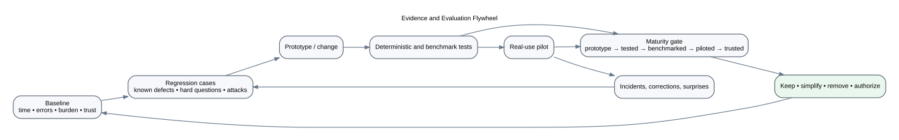

### Gate 0 — Concept

- problem and user capability are stated;
- current evidence and assumptions are visible;
- at least two options exist.

### Gate 1 — Prototype

- inspectable probe exists;
- scope and limitations are explicit;
- no product reliability claim.

### Gate 2 — Tested

- deterministic behavior passes unit/integration/fixture checks;
- recovery and failure behavior are included;
- semantic contract is not merely implied by test count.

### Gate 3 — Benchmarked

- declared evaluation cases and thresholds pass;
- simpler baseline is included;
- model/config/version is recorded;
- hard and negative cases are present.

### Gate 4 — Piloted

- used in real work over a meaningful period;
- corrections, maintenance, and subjective burden are recorded;
- the capability survives more than one ideal scenario.

### Gate 5 — Trusted

- sustained evidence supports reliance in a specific domain and consequence level;
- recovery and trust repair have been demonstrated;
- behavior remains understandable after change.

### Gate 6 — Authorized

- deterministic policy permits an effect in a declared scope;
- user comprehension and rollback are adequate;
- adversarial boundary tests pass.

## 4. Portfolio ordering

### Portfolio A — Semantic integrity first

These experiments address assumptions that affect almost every future subsystem.

### Portfolio B — Product value

These determine whether the strongest wedge actually improves real work.

### Portfolio C — Architecture alternatives

These compare representation and deployment choices.

### Portfolio D — Longer-horizon capability

These explore consolidation, personalization, proactivity, and productization after the kernel is clearer.

No more than three experiments should be active, and only one should materially alter the working prototype at a time.

---

## 5. Experiment E01 — Plural cognitive object model

### Question

Does separating object kind, source mode, stance, perspective, proposition, and resolution improve representation without unacceptable complexity?

### Decision affected

Whether to replace or supplement the current flat epistemic enums.

### Design

Select ten to twenty real examples covering fact, observation, interpretation, memory, preference, goal, plan, decision, question, procedure, and simulation. Represent each using:

- current marker/claim system;
- free-form source-only representation;
- proposed plural model.

### Measures

- ambiguous or forced classifications;
- number of fields required;
- time to capture/review;
- ability to answer factual, perspective, and decision questions;
- user comfort;
- migration complexity.

### Decision rule

Adopt a smaller version of the plural model if it resolves material ambiguities and improves query behavior without making ordinary capture feel like form completion. Otherwise retain source-first storage and add structure at retrieval.

---

## 6. Experiment E02 — Stable identity and temporal rebuild

### Question

Can the read model be rebuilt without changing semantic identities, recorded times, or applicable intervals?

### Decision affected

Whether the current derived projection is safe as a foundation for temporal truth.

### Design

Build the same corpus twice; insert a new earlier claim; rename a file; change importer build time; reimport. Compare semantic records.

### Measures

- stable IDs;
- unchanged recorded/valid times;
- alias behavior;
- logical fingerprint;
- visible diagnostics for collisions;
- round-trip preservation.

### Gate

Zero unexpected semantic differences before temporal answers rely on the projection.

---

## 7. Experiment E03 — Reconciliation invariants

### Question

Does pair adjudication behave correctly under time, scope, authority, argument order, and serialization?

### Decision affected

Whether reconciliation can automatically create relations or only review cards.

### Design

Property and fixture tests for:

- order inversion;
- interval overlap versus different start dates;
- same wording, different scope;
- different wording, equivalent proposition;
- perspective disagreement;
- decision versus observation;
- explicit authorized correction;
- full write/read round trip.

### Gate

Zero false automatic supersessions; all uncertain cases route to review; every semantic field round-trips.

---

## 8. Experiment E04 — Purpose-bound synthesis

### Question

Does a synthesis contract preserve the information needed for a declared task better than a generic summary?

### Decision affected

The synthesis artifact model and evaluation requirements.

### Design

Use one source set to create:

- generic summary;
- re-entry synthesis;
- architecture-decision synthesis;
- research synthesis.

Predefine protected units and five future questions per purpose.

### Measures

- protected-unit recall;
- conflict/exception retention;
- citation correctness;
- future-question performance;
- token reduction;
- human usefulness;
- stale-child detection.

### Decision rule

No generic canonical summary. Adopt purpose contracts if they materially improve retained capability and make omissions understandable.

---

## 9. Experiment E05 — Stored versus on-demand consolidation

### Question

Which syntheses should be stored, and which should be generated when needed?

### Decision affected

Memory hierarchy, invalidation, and maintenance architecture.

### Design

Track one active topic and one infrequent topic for four weeks under:

- stored summary with invalidation;
- on-demand synthesis;
- stored structured units with on-demand prose.

### Measures

- stale artifacts;
- generation latency/cost;
- repeated corrections;
- reuse frequency;
- user editing value;
- provider dependence.

### Decision rule

Store only artifacts whose reuse or accepted human meaning justifies maintenance; otherwise retain structured units and generate views.

---

## 10. Experiment E06 — Ready-to-Resume field ablation

### Question

Which transition fields actually improve resumption?

### Decision affected

The transition aggregate and closeout workflow.

### Design

Across multiple interruptions, compare:

- no transition;
- stop point only;
- four-field current protocol;
- expanded capsule with open loops and mental model;
- system-generated draft reviewed by Jonathan.

### Measures

- closeout time;
- time to first productive action;
- rereads;
- wrong starts;
- correction burden;
- subjective relief or ceremony.

### Decision rule

Keep only fields that contribute to faster or more confident resumption. A shorter field set is a success if it performs as well.

---

## 11. Experiment E07 — Project context versus full history

### Question

Do purpose-bound project packs outperform whole-handbook or broad-history prompting?

### Decision affected

Default context architecture.

### Design

Ten real project questions under:

- full handbook/history;
- current project file only;
- deterministic project context pack;
- interactive evidence requests.

### Measures

- evidence recall;
- factual and temporal correctness;
- conflict disclosure;
- token use;
- startup time;
- follow-up questions;
- privacy exposure.

### Decision rule

Use the smallest method that meets correctness and conflict requirements. Retain full context as an audit baseline, not default.

---

## 12. Experiment E08 — Real-query retrieval ladder

### Question

Which retrieval mechanisms add net value after a tuned lexical/metadata/link baseline?

### Decision affected

Embeddings, reranking, and graph investment.

### Design

Maintain at least thirty real questions across exact, current, historical, conflict, low-overlap, multi-hop, global, and negative cases. Compare:

1. exact + FTS;
2. metadata/time/authority;
3. link expansion;
4. embeddings;
5. fusion/reranker;
6. hierarchy/global map-reduce.

### Measures

Recall, precision, latency, explanation, privacy, rebuild cost, maintenance, and false semantic matches.

### Stop rule

Remove or defer any complex method whose gain is small, unstable, or limited to synthetic cases.

---

## 13. Experiment E09 — Narrative plus projection versus atomization

### Question

Does preserving narrative originals with selective projections outperform document-only and atom-only representations?

### Decision affected

Core storage and object extraction strategy.

### Design

Use three complex artifacts: design conversation, personal reflection, and research note. Create document-only, atom-only, and combined representations.

### Measures

- future question coverage;
- authentic meaning;
- edit effort;
- propagation;
- deletion impact;
- user preference;
- schema maintenance.

### Decision rule

Adopt combined representation only for object types whose structured reuse is demonstrated.

---

## 14. Experiment E10 — Lifecycle comprehension and purge impact

### Question

Can users distinguish suppress, archive, supersede, retract, redact, delete, and purge, and does the system enumerate consequences accurately?

### Decision affected

Lifecycle vocabulary, UI, retention, and backup architecture.

### Design

Create synthetic cases and ask Jonathan to choose desired outcomes. Generate dry-run reports across Markdown, Git, DB, indexes, summaries, snapshots, audit, and backups.

### Measures

- user-policy agreement;
- missed representations;
- residual disclosure comprehension;
- accidental over-deletion or under-deletion;
- report burden.

### Gate

No destructive implementation until the semantic verbs and dry-run scope are predictable.

---

## 15. Experiment E11 — Personal inference review

### Question

Which inferred preferences or patterns are useful, acceptable to store, and safe to apply?

### Decision affected

Self-model and personalization policy.

### Design

Generate ten evidence-backed candidate inferences from real use. For each, show examples, uncertainty, intended uses, expiration, and correction controls.

### Measures

- recognition and acceptance;
- discomfort;
- desired retention;
- permitted uses;
- changes after one month;
- recommendation improvement.

### Stop rule

No durable inference class with low acceptance, high discomfort, or unclear utility. Never store sensitive psychological inferences by default.

---

## 16. Experiment E12 — Shadow-mode proactivity

### Question

Which proactive suggestions are useful enough to surface?

### Decision affected

Monitoring, interruption, and initiative policy.

### Design

Run two or three read-only monitors silently for four weeks: stale transitions, broken links, review due, or changed external reference. Present one digest for labeling.

### Measures

- useful, late, redundant, wrong, intrusive, already-known;
- action taken;
- preferred delivery time;
- false-warning rate;
- review burden.

### Decision rule

Only rules with sustained utility and acceptable nuisance leave shadow mode; default to batching.

---

## 17. Experiment E13 — Permission comprehension

### Question

Can Jonathan predict what Big Brain Time may do before it acts?

### Decision affected

Permission vocabulary and action firewall.

### Design

Twenty scenarios across read, suggest, prepare, local write, delete, calendar draft, email draft/send, health, code, and monitoring. Compare expected and policy result.

### Measures

- agreement;
- explanation time;
- overbroad grants;
- confirmation fatigue;
- target/path comprehension.

### Gate

At least 90% comprehension on enabled action types; confusing rules are redesigned, not explained away.

---

## 18. Experiment E14 — Portable project brain

### Question

Can a project be understood and resumed outside Jonathan’s full personal corpus?

### Decision affected

Productization around federated project packages.

### Design

Export one project into a package containing sources, decisions, state, context contract, re-entry, evaluation, and manifests. Give it to another model or collaborator with no prior context.

### Measures

- startup questions;
- correct first action;
- missing private assumptions;
- unnecessary personal data;
- package size;
- source verification;
- portability.

### Decision rule

Pursue project-brain productization if bounded packages can support accurate resumption without hidden personal dependencies.

---

## 19. Experiment E15 — Second-user design probe

### Question

Which concepts generalize beyond Jonathan?

### Decision affected

Kernel, profile, capability packs, and interface assumptions.

### Design

A second user creates a small project brain through guided onboarding and uses it for two weeks.

### Measures

- setup time;
- terminology confusion;
- fields ignored or reinvented;
- value achieved;
- maintenance;
- desired integrations;
- privacy concerns;
- export understanding.

### Decision rule

Only promote concepts to universal kernel after they survive materially different use.

---

## 20. Experiment E16 — Audit integrity and usefulness

### Question

Can the audit prove event integrity and support trust repair without storing sensitive excess?

### Decision affected

Audit schema, hashing, locking, retention, and UI.

### Design

- mutate every event field and verify detection;
- simulate concurrent writers;
- redact sensitive payloads;
- reconstruct one failed proposal and one successful action;
- test causal-trace interface versus chronological log.

### Gate

Full canonicalized event payload integrity, unique sequence under concurrency, reconstruction of actor/basis/result, and no forbidden sensitive payload.

---

## 21. Experiment E17 — Handoff evidence compilation

### Question

Can handoff packets be generated entirely from current evidence and support correct action without setup questions?

### Decision affected

Cross-model continuity and handoff compiler.

### Design

Compile packets at multiple revisions; introduce repository changes; compare current/stale behavior; give packets to different models.

### Measures

- time to identify first action;
- setup questions;
- stale-state detection;
- false completion claims;
- evidence resolution;
- token efficiency;
- correct handback.

### Gate

No hardcoded repository-state assertions; every factual status links to current run evidence or is marked unverified.

---

## 22. Experiment E18 — System-without-model fallback

### Question

Which capabilities remain useful and safe when generative models are unavailable?

### Decision affected

Product resilience and kernel boundaries.

### Design

Operate diagnostics, search, re-entry, context browsing, planning, and lifecycle without model synthesis.

### Measures

- task completion;
- degraded interactions;
- missing explanations;
- recovery behavior;
- provider lock-in;
- user acceptance.

### Decision rule

Core memory, retrieval, recovery, permission, and lifecycle functions must not require a specific model. Model-dependent capabilities declare degraded mode.

## 23. Baseline packet

Before the next major probe, record:

- time to resume three projects;
- time to find ten known pieces of evidence;
- current corrections and re-explanations per session;
- weekly maintenance minutes;
- number of unprocessed captures;
- active/stale generated artifacts;
- subjective trust and cognitive burden;
- storage and rebuild size/time;
- current model/provider dependencies;
- current permission and deletion comprehension.

Without a baseline, “improvement” becomes a narrative.

## 24. Experiment selection matrix

| Experiment | Impact | Uncertainty | Cost | Safety relevance | Suggested order |
|---|---:|---:|---:|---:|---:|
| E01 plural model | very high | high | low–medium | high | 1 |
| E02 identity/time rebuild | very high | medium | medium | high | 1 |
| E04 synthesis contract | very high | high | medium | high | 1 |
| E06 re-entry ablation | high | medium | low | medium | 1 |
| E10 lifecycle comprehension | high | high | low | very high | 1 |
| E08 retrieval ladder | high | medium | medium | high | 2 |
| E09 narrative/projection | high | high | medium | medium | 2 |
| E11 personal inference | high | high | low | very high | 2 |
| E14 portable project brain | high | high | medium | medium | 2 |
| E03 reconciliation | medium–high | medium | medium | high | 2 |
| E12 proactivity | medium | high | low but time-based | high | 3 |
| E13 permissions | medium | medium | low | very high | before action |
| E15 second user | very high | high | high | medium | after kernel probe |
| E16 audit | medium | medium | medium | high | before action |
| E17 handoff | high | medium | low–medium | medium | 2 |
| E18 no-model fallback | high | medium | low | high | 2 |

## 25. Portfolio stop rules

Pause the experiment program when:

- instrumentation makes normal use substantially heavier;
- more than three probes are active;
- experiments alter the same subsystem so results cannot be attributed;
- the current proof of concept becomes unstable as a baseline;
- privacy or recovery evidence is missing;
- a probe lacks a decision rule;
- findings are not being turned into decisions or removals;
- the portfolio becomes a substitute for simply using the system.

## 26. Experiment card

Use `templates/EXPERIMENT_CARD.md` for each selected experiment. A complete card should state:

- problem and decision;
- hypothesis and alternatives;
- baseline;
- intervention;
- scenarios and failure cases;
- measures;
- privacy and safety;
- expected duration or sample;
- confounders;
- decision and stop rules;
- results;
- resulting design change;
- regression or follow-up evidence.


---

# 12 — Diagram Atlas

## 1. Purpose

The diagrams are alternate views of the written design, not separate sources of truth. Each rendered SVG has an editable Graphviz `.dot` source in `diagrams/`.

Use them to:

- orient to a subsystem before reading detail;
- compare current and proposed boundaries;
- identify missing arrows, authorities, or lifecycle steps;
- annotate design reviews;
- explain the system to another model or collaborator;
- create a smaller context pack for one architectural question.

Do not infer a contract solely from a box or arrow. The accompanying documents define the intended behavior and open questions.

## 2. Whole-system diagrams

### 2.1 Joint cognitive system


**File:** `diagrams/01_joint_cognitive_system.svg`  
**Editable source:** `diagrams/01_joint_cognitive_system.dot`

Shows capability as an interaction among Jonathan, AI collaborators, shared artifacts, methods/policies, and the world. Use it to resist designing the AI or repository in isolation.

**Questions to ask:**

- Which cognitive work is performed by each component?
- Where does coordination cost appear?
- Which artifact anchors shared understanding?
- What happens when one model or tool is unavailable?

### 2.2 Product kernel


Shows the universal kernel, profile/policy, capability packs, adapters, and interfaces.

**Questions:**

- Which concept is truly universal?
- Is a Jonathan-specific rule leaking into the kernel?
- Can a capability pack be removed without corrupting other packs?
- Does a profile configure behavior or fork architecture?

### 2.3 System context


Shows the responsibilities of Jonathan, Big Brain Time, AI models, external authorities, evidence sources, and recovery systems.

**Questions:**

- Which actor has final authority?
- Which external data should be referenced rather than copied?
- What leaves the local boundary?
- What recovery evidence exists?

### 2.4 Container architecture


Shows delivery interfaces, application orchestration, domain kernel, ports, adapters, and stores.

**Questions:**

- Is business logic leaking into an interface or adapter?
- Can the kernel be tested without Flask, SQLite, or a model?
- Which stores are canonical versus derived?
- What versioned contracts exist at each boundary?

## 3. Authority and subsystem diagrams

### 3.1 Authority and trust planes


Separates trusted control, untrusted evidence, canonical authorities, and disposable derived representations.

**Questions:**

- Can evidence influence action without a policy decision?
- Is a generated artifact being treated as authority?
- Does every write identify the active system of record?
- Can derived state be deleted safely?

### 3.2 Subsystem landscape


Shows cognitive, operational, and governance services over shared foundations.

**Questions:**

- Which subsystem owns each rule?
- Which seams carry the most trust risk?
- Which modules could be capability packs rather than core?
- Which foundation is duplicated today?

## 4. Cognitive and memory flows

### 4.1 Capture-to-memory pipeline


Shows preservation before triage and extraction, ephemeral staging, review, canonical acceptance, and projection rebuild.

**Use for:** voice capture, conversation ingestion, source imports, privacy review.

**Questions:**

- What is captured synchronously?
- What can remain source-only?
- When does extraction become authoritative?
- How does a capture expire or get discarded?

### 4.2 Trusted answer pipeline


Shows query planning, retrieval, temporal/authority resolution, conflict scanning, context contracts, synthesis, and claim verification.

**Questions:**

- Where is abstention selected?
- What intermediate artifact explains a failure?
- Are authority and privacy applied before retrieval expansion?
- Can the user inspect omissions?

### 4.3 Conservative memory consolidation


Shows episodes, clusters, deduplication, alternatives, purpose-bound abstraction, retention tests, and consolidated semantic memory.

**Questions:**

- What purpose justifies consolidation?
- Which exceptions must survive?
- How is the summary invalidated?
- Does the result create new propositions?

### 4.4 Continuity and re-entry loop


Shows work, interruption, transition capsule, elapsed change, re-entry compilation, first action, and protocol reflection.

**Questions:**

- What information exists only in the worker’s head at stop time?
- Which fields predict resumption?
- What changed while away?
- How is a wrong first action detected?

### 4.5 Epistemic object model


Shows memory item, source/activity, stance, perspective, optional proposition, resolution, and relations.

**Questions:**

- Is this object truth-apt?
- Whose stance is represented?
- Is the source perceived, remembered, reported, inferred, or generated?
- Does it need a proposition now, later, or never?

### 4.6 Multi-resolution memory


Shows originals, addressable records, evidence relations, reflections, views, and commitments/actions.

**Questions:**

- At which layer is this artifact authoritative?
- Can a higher-level view drill down?
- What happens when a lower-level source changes?
- Which layer is being deleted or hidden?

## 5. Change, safety, and lifecycle diagrams

### 5.1 Change propagation


Shows semantic diff, dependency graph, impact set, granular proposals, review, execution, projection invalidation, and audit.

**Questions:**

- Does a dependency mean display, derivation, or semantic reliance?
- What can be invalidated automatically?
- What is the maximum proposal scope?
- How is a false dependency corrected?

### 5.2 Action firewall


Shows typed action graphs, deterministic policy, simulation, confirmation, scoped execution, verification, audit, and denial.

**Questions:**

- Can the user predict the outcome?
- Is the action genuinely reversible?
- What precondition makes the proposal stale?
- Which arguments came from untrusted evidence?

### 5.3 Lifecycle and purge


Shows semantic request, policy classification, representation enumeration, dry run, approval, application, rebuild, verification, and receipt.

**Questions:**

- Is the desired outcome suppression, retraction, redaction, or purge?
- Which backups or external disclosures remain?
- Can audit retain process without payload?
- What proof of absence is actually possible?

## 6. Design and productization diagrams

### 6.1 Design spiral


Shows observation, question framing, research, probe, pilot, measurement, decision, and documentation.

**Use for:** choosing the next work, resisting feature-roadmap inertia.

### 6.2 Productization layers


Shows universal kernel, profile, capability packs, workflow compositions, interfaces, and deployment envelope.

**Questions:**

- Does a pack use stable contracts?
- What personal context may enter a shared workflow?
- Which deployment assumptions change safety?
- Can a capability be installed and removed independently?

### 6.3 Evaluation flywheel


Shows baseline, regression cases, prototype, tests, pilot, incidents, maturity gate, and keep/simplify/remove decision.

**Questions:**

- Which evidence supports the current maturity label?
- Has a real incident become a regression case?
- Does the feature improve joint-system outcomes?
- When does evidence expire?

### 6.4 QOC design space


Illustrates a design question, alternative authority models, and criteria.

**Use for:** poorly understood or difficult-to-reverse design questions.

### 6.5 Quality-attribute map


Shows recurring architectural qualities and selected tensions.

**Use for:** architecture reviews and scenario prioritization.

## 7. Diagram review protocol

For a major design review:

1. Start with system context.
2. Mark canonical, external, derived, and ephemeral stores.
3. Follow one user scenario through the relevant data-flow diagram.
4. Follow one failure or deletion scenario in reverse.
5. Mark every model judgment and deterministic policy.
6. Mark every authority transition.
7. Identify where source, time, privacy, or perspective can be lost.
8. Identify the quality attributes affected.
9. Update the `.dot` source and the written contract together.
10. Record unresolved disagreements rather than drawing an artificial consensus arrow.

## 8. Creating additional diagrams

Use the same numbering and include:

- title;
- purpose;
- boundaries;
- legend if colors or line styles carry meaning;
- editable `.dot` source;
- rendered `.svg`;
- reference from the defining document;
- date or version when the diagram represents a changing architecture.

Suggested future diagrams:

- state machine for commitments and plans;
- bitemporal claim examples;
- context-pack schema map;
- shared/team-brain access and perspective boundaries;
- backup and restore topology;
- model-routing and privacy decision tree;
- capability-pack dependency graph;
- multi-device single-writer lease flow;
- self-model review and expiration flow.


---

# 13 — Design Workbook

## How to use this workbook

The workbook is meant to be completed slowly. Copy a section into a dated working note for each session. Use concrete examples from real work. “Unknown” is a useful answer when it becomes a visible question rather than a hidden assumption.

---

# Session 1 — Proof-of-concept inventory

## A. What did the current prototype make possible?

| Capability | Real example | Before BBT | With BBT | Evidence or artifact |
|---|---|---|---|---|
| | | | | |
| | | | | |
| | | | | |

## B. What required repeated correction or maintenance?

| Friction | Frequency | Consequence | Current workaround | Likely cause |
|---|---:|---|---|---|
| | | | | |
| | | | | |
| | | | | |

## C. Keep, question, retire

**Keep and strengthen:**

1.
2.
3.

**Keep as experiments:**

1.
2.
3.

**Redesign:**

1.
2.
3.

**Retire or simplify:**

1.
2.
3.

## D. Maturity claims

For each important capability, mark:

```text
concept | prototype | tested | benchmarked | piloted | trusted | authorized
```

What evidence would be required for the next label?

---

# Session 2 — Product promise

## A. Complete the sentence

> Big Brain Time helps ______________________________ when ______________________________ by ______________________________, while never ______________________________.

## B. Top five jobs

| Job | Trigger situation | Desired progress | Current alternative | Trust-destroying failure |
|---|---|---|---|---|
| 1 | | | | |
| 2 | | | | |
| 3 | | | | |
| 4 | | | | |
| 5 | | | | |

## C. Anti-promises

What should the system explicitly not claim or attempt?

1.
2.
3.
4.
5.

## D. Transformative one-year test

> After one year, Big Brain Time would feel transformative if it reliably ______________________________, while requiring no more than ______________________________ of deliberate maintenance per week, and I trusted it enough to ______________________________.

---

# Session 3 — Capability and quality scenarios

## A. Capability scenario template

```text
User / actor:
Situation:
Trigger:
Current friction:
Desired system response:
Evidence required:
Maximum acceptable time:
Privacy boundary:
What must cause abstention:
Success measure:
Failure that destroys trust:
```

Write five scenarios:

1. Re-entry
2. Current/historical truth
3. Research or synthesis
4. Planning/commitment
5. Lifecycle or action safety

## B. Quality-attribute tree

Create a hierarchy for the three most important qualities.

```text
Quality:
├── Subquality:
│   ├── measurable scenario
│   └── measurable scenario
└── Subquality:
```

## C. Tradeoffs

Which two desirable qualities are in tension for each scenario?

| Scenario | Quality A | Quality B | What changes the balance? |
|---|---|---|---|
| | | | |
| | | | |

---

# Session 4 — System boundaries and authority

## A. External system map

| Information type | Current authority | Why | What BBT stores | What BBT may write | Failure if duplicated |
|---|---|---|---|---|---|
| Calendar | | | | | |
| Email | | | | | |
| GitHub/code | | | | | |
| Professional tasks | | | | | |
| Health records | | | | | |
| Research sources | | | | | |
| Personal projects | | | | | |

## B. Representation class

For each item, select:

```text
canonical narrative | canonical operational | external authority |
derived projection | compiled artifact | ephemeral staging | audit evidence
```

## C. Migration candidate

```text
Information fields to move:
Current authority:
Candidate new authority:
User value:
Dual-write risk:
Export format:
Rollback:
Cutover evidence:
Reconsider if:
```

---

# Session 5 — Cognitive object model

Choose real examples and complete the matrix.

| Example | Item kind | Source mode | Stance | Perspective | Proposition needed? | Resolution/lifecycle |
|---|---|---|---|---|---|---|
| Objective record | | | | | | |
| First-person experience | | | | | | |
| Interpretation | | | | | | |
| Preference | | | | | | |
| Value | | | | | | |
| Decision | | | | | | |
| Plan | | | | | | |
| Procedure | | | | | | |
| Memory with conflicting record | | | | | | |
| Future simulation | | | | | | |

Questions:

1. Which fields felt natural?
2. Which felt artificial?
3. Which distinctions changed retrieval or reasoning?
4. Which could be inferred later?
5. Which personal inferences should never be automatic?

---

# Session 6 — Retrieval and context

## A. Real question set

Write ten questions you actually want to ask.

| Question | Mode | Time boundary | Authority | Expected evidence | Conflict/abstention condition |
|---|---|---|---|---|---|
| | | | | | |
| | | | | | |

Modes:

```text
factual | memory | perspective | exploration | decision | simulation | narrative
```

## B. Context contract

```yaml
purpose:
audience:
query:
as_of_valid_time:
as_of_recorded_time:
authority_policy:
privacy_ceiling:
required_sources:
protected_information:
conflicts_to_show:
allowed_omissions:
token_or_length_budget:
expiration:
```

Create two contracts for the same project: re-entry and architecture review. What changes?

## C. Retrieval ladder

For one difficult question, record results from:

- exact/path lookup;
- FTS;
- metadata/time/authority filters;
- links/relations;
- embeddings;
- global hierarchy.

Which addition changed the result enough to justify its cost?

---

# Session 7 — Synthesis, compression, and forgetting

## A. Synthesis purpose

```text
Source set:
Future task/question:
Audience:
What must survive:
What may be omitted:
What disagreement must remain visible:
What new interpretation may be proposed:
How will the result be tested:
When does it become stale:
```

## B. Compare artifact types

Create from the same sources:

1. extractive digest;
2. comparative synthesis;
3. abstractive summary;
4. reflection/hypothesis;
5. decision exhibit.

Which one is most useful for the declared purpose? Which one is most dangerous if treated as authority?

## C. Lifecycle cases

For each case choose the desired verb and explain why.

| Case | Hide | Suppress | Archive | Supersede | Retract | Redact | Purge |
|---|---:|---:|---:|---:|---:|---:|---:|
| Old completed task | | | | | | | |
| Incorrect research claim | | | | | | | |
| Earlier personal preference | | | | | | | |
| Accidentally captured secret | | | | | | | |
| Sensitive third-party detail | | | | | | | |
| Stale generated context pack | | | | | | | |

## D. Purge impact checklist

- [ ] canonical Markdown
- [ ] Git history/remotes
- [ ] operational database
- [ ] read model and FTS
- [ ] embeddings
- [ ] relation graph
- [ ] summaries/context packs
- [ ] handoffs/briefings
- [ ] staging/temp
- [ ] snapshots/undo
- [ ] audit payloads
- [ ] backups
- [ ] external model disclosures
- [ ] connector caches

---

# Session 8 — Design tension and QOC

Choose two tensions from `07_DESIGN_TENSIONS_AND_OPTION_SPACES.md`.

## QOC 1

```text
QUESTION:
Scenario:
Why now:

OPTION A:
OPTION B:
OPTION C:

CRITERIA:
1.
2.
3.
4.
5.

Evidence for/against each:

Preferred option today:
Confidence:
Missing evidence:
Cheapest discriminating probe:
```

## QOC 2

Repeat.

## Reflection

Did preserving alternatives change the preferred solution? Was the current implementation previously being treated as the only option?

---

# Session 9 — Research agenda

## A. Research-question selection

| Question | Decision impact | Uncertainty | Dependencies | Cost | Safety/privacy | Priority |
|---|---:|---:|---:|---:|---:|---:|
| | | | | | | |
| | | | | | | |
| | | | | | | |

## B. Research brief

```text
RESEARCH QUESTION:
Decision it can change:
Current assumption:

Primary sources:
Standards/official docs:
Current-system evidence:
Contrary evidence:

What the evidence supports:
What it does not support:
Boundary conditions:

Design implications:
Options remaining:
Local probe:
Reconsider date/trigger:
```

## C. Evidence hygiene

- [ ] primary sources for load-bearing claims
- [ ] publication/status recorded
- [ ] result boundary recorded
- [ ] external finding separated from product inference
- [ ] contrary evidence included
- [ ] no benchmark treated as universal product value
- [ ] no cognitive analogy treated as implementation proof

---

# Session 10 — Kernel and productization

## A. Kernel test

For each candidate concept, answer whether at least three different packs need it.

| Concept | Project pack | Research pack | Learning pack | Stable meaning? | Kernel / pack / profile |
|---|---:|---:|---:|---:|---|
| identity | | | | | |
| provenance | | | | | |
| time | | | | | |
| authority | | | | | |
| memory item | | | | | |
| commitment | | | | | |
| context contract | | | | | |
| permissions | | | | | |
| evaluation | | | | | |
| current taxonomy item | | | | | |

## B. Product form comparison

| Product | Primary user | Core job | Minimum capability | Biggest risk | Evidence needed |
|---|---|---|---|---|---|
| Project brain | | | | | |
| Research workbench | | | | | |
| Assurance layer | | | | | |
| Personal platform | | | | | |
| Team brain | | | | | |

## C. Portable project package

What must be included so another person or model can use a project without private personal context?

What should be excluded?

Which hidden assumptions are currently in Jonathan’s head or global corpus?

---

# Session 11 — Experiment design

Use `templates/EXPERIMENT_CARD.md`.

Minimum fields:

```text
Experiment ID:
Decision affected:
Hypothesis:
Alternatives:
Baseline:
Probe:
Failure cases:
Measures:
Privacy/safety:
Decision rule:
Stop rule:
Raw evidence location:
```

## Pre-mortem

Imagine the experiment produced a convincing but misleading result. How might that happen?

- novelty effect;
- handpicked examples;
- model/version dependence;
- measurement changed behavior;
- too-short pilot;
- preferred option received better tuning;
- user already knew expected answer;
- maintenance cost omitted;
- negative cases absent;
- data leakage from benchmark into design.

## Post-experiment decision

- [ ] adopt bounded design
- [ ] revise and rerun
- [ ] preserve multiple options
- [ ] defer with trigger
- [ ] reject
- [ ] retire current implementation
- [ ] reframe problem

---

# Session 12 — Architecture synthesis

## A. One-page product architecture

```text
PRODUCT WEDGE:
PRIMARY USER:
TRANSFORMATIVE OUTCOME:

KERNEL CAPABILITIES:

PROFILE/POLICY:

CAPABILITY PACKS:

CANONICAL AUTHORITIES:

DERIVED REPRESENTATIONS:

EXTERNAL AUTHORITIES:

DOMINANT QUALITY ATTRIBUTES:

TOP RISKS:

EVIDENCE SUPPORTING THIS ARCHITECTURE:

OPEN ALTERNATIVES:

NEXT SMALLEST BUILD:
```

## B. Implementation restart gate

- [ ] concrete capability scenario
- [ ] real value/friction evidence
- [ ] current prototype limitation documented
- [ ] at least two options considered
- [ ] highest-risk assumption named
- [ ] research/probe supports choice
- [ ] authority and lifecycle understood
- [ ] privacy and recovery understood
- [ ] tests or evaluation protocol exist
- [ ] slice is reversible
- [ ] out-of-scope is explicit

## C. Ready-to-Resume plan

**Stop point:**  
**Restart cue:**  
**Next micro-action:**  
**Resumption trigger:**

---

# Ongoing friction log

| ID | Date | Workflow | Observation | Consequence | Source artifact | Design question created? |
|---|---|---|---|---|---|---|
| | | | | | | |

# Ongoing design-question register

| ID | Question | Status | Impact | Current options | Next evidence | Decision link |
|---|---|---|---:|---|---|---|
| | | | | | | |

# Ongoing experiment register

| ID | Decision | Status | Baseline | Probe | Result | Next action |
|---|---|---|---|---|---|---|
| | | | | | | |

# Ongoing simplification register

| Structure/feature | Why it exists | Evidence of use | Maintenance cost | Keep / simplify / remove |
|---|---|---|---|---|
| | | | | |


---

# 14 — Glossary

## A

**Abstention** — A deliberate system result stating that available evidence or policy does not support the requested conclusion or action.

**Activity** — A provenance-producing process such as capture, import, extraction, synthesis, decision, migration, or execution.

**Adapter** — Replaceable implementation connecting a core port to a technology or external system, such as Markdown, SQLite, a model provider, GitHub, or calendar.

**Agent** — A person, AI model, script, organization, or external system that creates, reports, transforms, decides, or executes something.

**Append-oriented correction** — Preserving earlier meaningful state while adding a correction, retraction, or supersession relation rather than silently overwriting history.

**Argument** — A structured reason for a conclusion, often containing premises, assumptions, inference, objections, and attacks.

**Artifact** — A durable or temporary representation such as a file, source record, context pack, decision, diagram, summary, or proposal.

**Assumption environment** — A set of assumptions under which particular conclusions or designs apply; multiple incompatible environments may coexist.

**Authority** — The declared right or precedence to report, decide, or govern an information type within a domain and time scope.

**Authorized** — A maturity state in which policy permits a capability to perform a defined action in a defined scope.

## B

**Baseline** — A measured state before an intervention, used to determine whether the system improved.

**Benchmarked** — A maturity state in which a declared evaluation suite meets its threshold for a specified version and scope.

**Belief** — An informational stance about how the world is represented; distinct from desire, intention, plan, or decision.

**Bitemporal** — Representing both when something applies in the modeled world and when the system learned or recorded it.

**Buoyancy** — A reversible relevance or visibility signal; it affects ranking but does not determine truth or retention.

## C

**Canonical authority** — The active source of truth for a specific information type or field.

**Capability** — A reliable outcome the joint system can achieve, such as accurate re-entry, source-grounded explanation, or safe propagation.

**Capability pack** — A domain or workflow extension using kernel contracts, such as project continuity, research, learning, or health preparation.

**Capture-to-use conversion** — The proportion of captured material that later supports a decision, project, view, reminder, or meaningful retrieval.

**Claim** — A truth-apt assertion; in this package, only one kind of memory object rather than the universal storage unit.

**Command** — A typed request to change state after validation and authorization.

**Commitment** — An accepted goal, decision, intention, plan, task, or obligation that governs action; not simply a factual belief.

**Compiled artifact** — A purpose-specific derived output such as a context pack, briefing, handoff, or synthesis, usually with a manifest and invalidation rule.

**Concept** — A maturity state in which an idea and rationale exist but feasibility or value is not yet demonstrated.

**Consolidation** — A process that creates more general, compact, or reusable memory from multiple source items while preserving lineage and testing loss.

**Context contract** — A declaration of purpose, audience, time, authority, privacy, source set, omissions, protected information, and budget for a context pack.

**Context pack** — A bounded, inspectable evidence package compiled for a particular task, human, model, or handoff.

**Control plane** — Trusted requests, policies, tool schemas, grants, and commands that may govern runtime behavior.

**Correction** — A later item or relation that changes the system’s epistemic position toward an earlier assertion.

**Current truth** — The result of a query applying time, scope, authority, supersession, conflict, and evidence policy; not simply the newest text.

## D

**Decision** — An authority-bearing choice that governs action or architecture. It may be informed by facts and values but is not itself an empirical fact.

**Derived projection** — Rebuildable structure such as an index, graph candidate, embedding, section table, or summary.

**Design question** — An unresolved issue about product, cognition, interaction, architecture, or policy that should be explored before implementation commitment.

**Design rationale** — The questions, options, criteria, evidence, tradeoffs, and reasons surrounding a design choice.

**Design studio** — The temporary mode in which Big Brain Time emphasizes research, option mapping, probes, and evidence-backed product design over rapid feature implementation.

**Deterministic** — Producing the same logical result from the same declared inputs and versions, apart from explicitly excluded metadata.

**Distributed cognition** — The view that cognitive performance can arise from an organized system of people, representations, tools, and environment.

**Domain** — A bounded area such as projects, research, health preparation, code, calendar, or personal preferences, often with its own authority and policy.

## E

**Engram maturation** — A biological-memory concept used by emerging agent-memory research to describe memories becoming more stable; an analogy, not a required software mechanism.

**Ephemeral staging** — Temporary, non-canonical candidates awaiting review, promotion, or expiry.

**Epistemic class** — A label describing the nature or status of a claim; this package recommends separating it from object kind, source mode, stance, and logical relation.

**Epistemic plurality** — The ability to represent multiple perspectives, hypotheses, memories, narratives, and assumption environments without forcing premature factual resolution.

**Evaluation case** — A versioned question or task with expected evidence, forbidden claims, time/authority conditions, rubric, and abstention behavior.

**Evidence** — Source material that may support, contradict, qualify, or originate a claim; evidence is not runtime instruction.

**Evidence plane** — Retrieved or imported content treated as untrusted data even when it is authoritative evidence.

**Experiment** — A bounded intervention designed to change a material design decision through evidence.

**External authority** — A system outside Big Brain Time that remains authoritative for its own records, such as a calendar, email service, GitHub, or health portal.

## F

**Factual mode** — A query mode applying strict evidence, source, time, scope, conflict, and abstention policy.

**Fitness function** — An automated or repeatable check that continuously tests an architectural property such as deterministic rebuild, source lineage, or permission boundaries.

**Friction record** — A preserved observation of difficulty, confusion, repeated work, error, or unexpected value in a real workflow.

## G

**Generalization** — A proposed rule or pattern formed across multiple examples; it creates a new proposition and must preserve exceptions and evidence.

**Global sensemaking** — Reasoning across a corpus or portfolio to identify themes, patterns, contradictions, or systemic relationships rather than retrieving one local fact.

**Grant** — A structured authorization scoped by domain, action, target, privacy, time, consequence, and confirmation mode.

## H

**Handoff packet** — A revision-bound context and execution artifact enabling another model or person to begin the correct work with evidence and stop conditions.

**Historical state** — What was valid, believed, decided, or recorded at an earlier time.

**Human authority** — The principle that values, personal identity, consequential commitments, and permissions remain governed by the appropriate human, not model confidence.

## I

**Identity** — A stable reference for an agent, artifact, memory item, record, commitment, or activity that survives rebuilds and does not encode mutable status.

**Information unit** — A fact, observation, decision, exception, perspective, or other content element used to evaluate what a synthesis preserves.

**Initiative level** — The allowed degree of system proactivity: retrieve, suggest, prepare, act, monitor, or negotiate.

**Intention** — A selected commitment toward future action, distinct from a desire or belief.

**Invalidation** — Marking a derived artifact stale because a source, policy, model, or dependency materially changed.

## J

**Joint cognitive system** — Jonathan, AI, artifacts, methods, language, tools, and environment considered as one organized capability system.

## K

**Kernel** — The minimal stable product contracts reused across capability packs, profiles, adapters, and interfaces.

**Knowledge assurance** — Diagnostics and policies that make integrity, identity, time, conflict, source, recovery, and propagation failures visible.

## L

**Lifecycle state** — An item’s current retention and use status, such as draft, active, superseded, retracted, archived, suppressed, redacted, purged, expired, or invalidated.

**Local-first** — An architecture prioritizing local ownership, offline capability, privacy, longevity, and user control; not merely a web app running on localhost.

**Local question** — A query about a bounded fact, record, decision, project, or source.

## M

**Manifest** — A machine-readable record of inputs, versions, sources, hashes, policies, exclusions, and outputs for a compiled or rebuilt artifact.

**Memory item** — The general preserved cognitive/informational object: episode, assertion, narrative, preference, value, goal, plan, decision, question, simulation, procedure, or reference.

**Memory misevolution** — Gradual harmful behavior from contaminated, biased, noisy, or misleading persistent memory updates.

**Memory mode** — A query mode focused on what was experienced or remembered, with source distinctions rather than automatic external factualization.

**Memory layer** — A resolution level such as original artifacts, addressable records, relations, reflections, context views, or commitments.

**Model independence** — Keeping canonical memory, context contracts, evaluation cases, and proposals usable across model providers.

**Modular monolith** — One deployable application with explicit internal module boundaries and ports/adapters, avoiding unnecessary distributed-system complexity.

## N

**Narrative mode** — A mode prioritizing authentic voice, meaning, and temporal self-understanding with minimal forced classification.

**Nonmonotonic reasoning** — Reasoning in which new information may invalidate prior conclusions without implying the prior reasoning was irrational at the time.

## O

**Object kind** — The category of a memory item, such as episode, preference, plan, decision, or simulation.

**Observability gap** — Material missing evidence, state, timestamp, or signal that prevents a trustworthy conclusion.

**Operational aggregate** — A transactional group of structured state and invariants, such as a project/task or transition aggregate.

**Original artifact** — The preserved source before extraction, normalization, summarization, or other transformation.

## P

**Pack** — Either a context artifact or capability extension; the surrounding term should disambiguate `context pack` from `capability pack`.

**Perspective** — The agent, time-specific self, organization, or simulated holder from whose standpoint a stance or narrative is represented.

**Perspective mode** — A query mode that presents who believed, interpreted, preferred, or intended what without forcing one winner.

**Piloted** — A maturity state in which a capability has been used in real work with feedback and burden recorded.

**Port** — A stable interface the kernel uses to request storage, search, model, time, audit, or action behavior from adapters.

**Preservation value** — A retention priority based on historical, safety, explanatory, legal, emotional, or recovery importance; separate from current relevance.

**Procedure** — A versioned method for performing a task, supported by demonstrations and outcomes rather than treated as universally correct.

**Product wedge** — A focused recurring job through which the broader kernel can deliver and demonstrate value.

**Profile** — Inspectable user/project/group configuration containing vocabulary, authority, privacy, retention, initiative, and accepted preferences.

**Projection** — A derived representation built from canonical or external sources for query, display, or analysis.

**Proposal** — A reviewable possible change or action that has not yet been authorized or applied.

**Proposition** — A normalized truth-apt structure, typically subject, predicate, object, polarity, and scope.

**Prospective memory** — Remembering to carry out an intention when a future time, event, state, or context occurs.

**Prototype** — An inspectable artifact demonstrating feasibility without a broad reliability or value claim.

**Provenance** — Information about source, agent, activity, derivation, version, and responsibility.

**Purge** — An explicit destructive lifecycle operation intended to remove a semantic item and controlled replicas, with residual limitations disclosed.

## Q

**QOC** — Questions–Options–Criteria, a design-rationale notation for mapping design issues, alternatives, and evaluation criteria.

**Quality-attribute scenario** — A concrete stimulus, environment, affected artifact, expected response, and measurable outcome for a quality such as reliability or privacy.

**Query** — A read-only request for information or a compiled view.

**Query mode** — The cognitive/epistemic policy for a question: factual, memory, perspective, exploration, decision, simulation, or narrative.

## R

**Read model** — A query-optimized derived representation, such as SQLite sections, FTS, links, or relations, safe to rebuild from authority.

**Reconsideration trigger** — A condition under which a decision, procedure, preference, or architecture should be reviewed.

**Re-entry capsule** — A compact project continuity artifact including stop point, restart cue, next micro-action, resumption trigger, and relevant changed state.

**Redact** — Remove protected payload while retaining permissible structural or process information.

**Relation** — A connection such as supports, attacks, qualifies, derives-from, depends-on, supersedes, or conflicts-with.

**Resolution** — The current system stance toward a truth-apt assertion: supported, insufficient, disputed, superseded, retracted, historical, or unresolved.

**Retract** — Withdraw endorsement of an item while preserving that it existed and why the position changed.

**Retrieval** — Selecting candidate evidence or objects for a query; retrieval alone does not establish truth or contradiction.

**Review mode** — A deliberate role or process distinct from implementation, intended to challenge assumptions and verify evidence.

**Risk tier** — A classification of potential consequence and required controls for an action or data use.

## S

**Scenario environment** — A declared set of assumptions for a simulation, architecture option, or counterfactual world.

**Semantic diff** — A comparison of meaning, state, scope, time, or relations rather than only changed text lines.

**Simulation mode** — A query or memory mode for possible futures and counterfactuals, explicitly separated from actual current state.

**Source artifact** — A file, conversation, record, event, email, webpage, or other preserved evidence source.

**Source mode** — How content was obtained: perceived, measured, remembered, reported, imported, inferred, generated, imagined, or accepted.

**Stance** — How an agent relates to content: asserts, remembers, doubts, prefers, intends, explores, and so on.

**Structured projection** — Selected semantic records derived from narrative sources for query or reasoning.

**Suppress** — Reversibly reduce default visibility, ranking, or notification without deleting the item.

**Supersede** — Prefer a later or more applicable item while retaining the earlier item and relationship.

**Synthesis** — A family of operations creating a smaller, comparative, generalized, or task-specific representation from sources.

**Synthesis contract** — The declared purpose, source set, protected content, method, omissions, loss class, and invalidation for a synthesis.

## T

**Tested** — A maturity state in which deterministic tests pass for a declared semantic and technical scope.

**Temporal resolver** — A component applying valid time, recorded time, supersession, retraction, scope, and authority to determine applicable states.

**Transition** — A structured record supporting interruption and later resumption.

**Trusted** — A maturity state supported by sustained use, correctness, recovery, and safety evidence in a declared scope.

**Trust repair** — The process of locating an error, showing its basis, accepting correction, preserving the incident, changing behavior, and recalibrating confidence.

## U

**Untrusted evidence** — Content that may be authoritative for a factual domain but is never allowed to issue runtime instructions merely because it was retrieved.

## V

**Valid time** — The period during which a claim or state is intended to apply in the modeled world.

**View** — A task-oriented representation assembled from canonical and derived information; it does not become a second source of truth.

## W

**Working context** — Temporary bounded information compiled for the current task, analogous to active working memory but stored as an inspectable artifact.

**Working self** — In autobiographical memory theory, current goals and self-processes that shape memory construction; used here as a design concept, not a literal software module.

## X–Z

**Zero false automatic supersessions** — A conservative reconciliation goal: uncertain changes route to review rather than silently replacing prior claims.


---

# Sources and Traceability

## 1. Scope and research cutoff

**Package prepared:** 2026-07-27  
**Current-repository review:** static inspection of `admiralorbiter/bigbraintime` on 2026-07-27  
**External research review:** sources available through 2026-07-27

This package distinguishes four evidence layers:

1. **Current repository evidence** — live files, implementation, project history, and repository-reported tests.
2. **Supplied source package** — the uploaded Big Brain Time blueprint, charter, ADRs, roadmap, risk register, bibliography, and worksheets.
3. **External research and standards** — primary research, standards, and official technical documentation.
4. **New design proposals** — interpretations and recommendations introduced by the design studio.

The package does not claim that external research proves the proposed product architecture. Research is used to reveal distinctions, constraints, likely failure modes, and experiment designs.

## 2. Evidence labels used in the documents

- **`[CURRENT]`** — observed in the current repository or current project documentation.
- **`[SOURCE]`** — directly supported by the supplied Big Brain Time materials.
- **`[RESEARCH]`** — supported by external primary research, standards, or official documentation.
- **`[PROPOSAL]`** — a design recommendation introduced in the studio.
- **`[QUESTION]`** — unresolved.
- **`[EXPERIMENT]`** — proposed local evidence collection.
- **`[INFERENCE]`** — reasoned combination of evidence and design judgment.

A clear proposal is still a proposal.

## 3. Preserved supplied source package

Exact copies of the uploaded materials are preserved under `reference/source-blueprint/`.

Some uploaded filenames differ from the title inside the file. The table records both.

| Uploaded filename | Internal title / role |
|---|---|
| `00_EXECUTIVE_BLUEPRINT.md` | Repository audit and planning transcript; original problem evidence and research questions |
| `00_SPRINT_0_CHARTER.md` | Sprint 0 Program Charter, scope boundaries, initial defect fixtures |
| `01_RESEARCH_SYNTHESIS(1).md` | `00 — Executive Blueprint`; north star, capability tests, horizons, architecture laws |
| `02_TARGET_ARCHITECTURE.md` | `01 — Research Synthesis and Design Implications` |
| `03_DOMAIN_AND_DATA_MODEL(1).md` | `02 — Target Architecture` |
| `04_RETRIEVAL_CONTEXT_AND_MEMORY.md` | `03 — Domain and Data Model` |
| `05_SAFETY_PERMISSIONS_AND_THREAT_MODEL.md` | `04 — Retrieval, Context, and Long-Term Memory` |
| `06_ROADMAP_MILESTONES_AND_SPRINTS(1).md` | `05 — Safety, Permissions, and Threat Model` |
| `07_EVALUATION_AND_EXPERIMENTS.md` | `06 — Roadmap, Milestones, Tasks, and Sprints` |
| `08_ARCHITECTURE_DECISION_PROPOSALS.md` | `07 — Evaluation and Experiments` |
| `09_RESEARCH_BIBLIOGRAPHY(1).md` | `08 — Architecture Decision Proposals` |
| `10_DISCOVERY_AND_REQUIREMENTS_WORKSHEET(1).md` | `09 — Research Bibliography and Evidence Map` |
| `11_RISK_REGISTER(1).md` | `10 — Discovery and Requirements Worksheet` |
| `ARCHITECTURE_DECISION_RECORDS.md` | Locked ADRs for epistemic, retrieval, watcher, audit, handoff, and reconciliation design |
| `ARTIFACT_MANIFEST(1).md` | `11 — Risk Register` |
| `BIG_BRAIN_TIME_SYSTEM_BLUEPRINT(1).md` | Artifact Manifest for the earlier package |
| `README(3).md` | Product Backlog — 24 sprints / 120 tasks |

Because of these filename/title mismatches, this studio normally cites the internal document title and section rather than assuming the filename number is semantically correct.

## 4. Load-bearing source-derived ideas

The following ideas came from the supplied package and are preserved rather than silently replaced:

### Product and mission

- accurate resumption without rereading the corpus;
- contradiction and propagation detection;
- local-first, source-grounded, temporal capability platform;
- the “knowledge compiler” framing;
- joint human–AI capability rather than feature count.

### Architecture

- local-first modular monolith;
- ports and adapters;
- Markdown/Git narrative authority;
- disposable SQLite read model;
- selected operational SQLite aggregates only after gates;
- external systems remain authoritative in their domains;
- interfaces share domain services;
- evidence/control plane separation;
- deterministic behavior before model synthesis;
- one active writer per information type.

### Memory and retrieval

- explicit provenance and valid/recorded time;
- context-pack manifests;
- local versus global query strategies;
- contradiction disclosure and abstention;
- memory summaries as derived caches;
- managed forgetting as visibility control;
- Ready-to-Resume transitions.

### Safety and governance

- graduated initiative;
- permission and risk tiers;
- read → propose → review → write;
- human control of consequential action;
- recovery, export, and rollback as acceptance criteria;
- shadow mode before proactive behavior;
- model independence.

### Evaluation

- capability and coordination measures;
- baseline before optimization;
- explicit stop rules;
- prototype/tested/benchmarked/piloted/trusted/authorized distinctions;
- keep/simplify/remove decisions.

## 5. Current repository review basis

The design studio’s `01_CURRENT_PRODUCT_AND_PROOF_OF_CONCEPT.md` also draws on a static review of the current repository, including:

- `README.md` and project state;
- `AGENTS.md`;
- current CLI and module structure;
- synthesis harvester/engine;
- reconciliation models, candidate retrieval, adjudicator, graph, and tests;
- patch applicator and undo;
- audit schema/writer;
- handoff compiler;
- SQLite importer and models;
- context compiler;
- recent commit history.

Important limitation: the studio did not independently execute the repository test suite. Repository-reported test counts are therefore treated as implementation claims that should be bound to run artifacts in a future self-audit.

## 6. Traceability from studio documents

| Studio document | Primary supplied basis | Additional research/proposal introduced |
|---|---|---|
| `00_DESIGN_STUDIO_CHARTER.md` | source roadmap rules, evaluation gates, risk register | DSRM, Spiral, QOC, ATAM; design-mode governance |
| `01_CURRENT_PRODUCT_AND_PROOF_OF_CONCEPT.md` | source blueprint and live repo | conservative maturity map and freeze strategy |
| `02_PRODUCT_THESIS_AND_CAPABILITY_MODEL.md` | executive blueprint, jobs and horizons | product kernel, project/personal/shared scales |
| `03_SYSTEM_LANDSCAPE_AND_ARCHITECTURE.md` | target architecture, authority matrix, safety | federated project-brain alternative and fitness functions |
| `04_SUBSYSTEM_ATLAS.md` | all architecture and domain documents | responsibility cards, subsystem probes, seam map |
| `05_COGNITIVE_AND_MEMORY_MODEL.md` | epistemic markers, temporal truth, joint system | plural object model, source mode, stance, perspective, cognitive modes |
| `06_SYNTHESIS_CONSOLIDATION_AND_FORGETTING.md` | context contracts, summaries-as-caches, managed forgetting | information-bottleneck framing, synthesis contract, purge transaction |
| `07_DESIGN_TENSIONS_AND_OPTION_SPACES.md` | ADRs, risks, architecture alternatives | QOC option maps and additional macro alternatives |
| `08_RESEARCH_AGENDA_AND_EVIDENCE_MAP.md` | supplied bibliography and research gaps | 2025–2026 memory benchmarks and prioritized local probes |
| `09_PRODUCT_DESIGN_METHOD_AND_GOVERNANCE.md` | roadmap gates and evaluation process | four backlogs, risk-driven studio workflow, decision packets |
| `10_GENERALIZATION_AND_PRODUCTIZATION.md` | capability-platform horizon | kernel/profile/pack productization model |
| `11_EXPERIMENT_PORTFOLIO_AND_DECISION_GATES.md` | existing ten experiments and scorecard | semantic-foundation and productization experiments |
| `12_DIAGRAM_ATLAS.md` | supplied Mermaid diagrams | rendered cross-level architecture and cognitive diagrams |
| `13_DESIGN_WORKBOOK.md` | discovery worksheet and roadmap | paced studio exercises |
| `14_GLOSSARY.md` | existing terminology | reconciled vocabulary for plural cognition and product design |

## 7. Foundational external research and standards

### Human memory, cognition, and augmentation

| Source | Status | Design use |
|---|---|---|
| Conway, M. A., & Pleydell-Pearce, C. W. (2000). *The construction of autobiographical memories in the self-memory system*. | Peer-reviewed | Memories as constructed in relation to autobiographical knowledge and current goals; supports perspective/purpose-aware retrieval. |
| Johnson, M. K., Hashtroudi, S., & Lindsay, D. S. (1993). *Source monitoring*. | Peer-reviewed review | Distinguishes perceived, remembered, imagined, and reported sources; motivates source mode. |
| McClelland, J. L., McNaughton, B. L., & O’Reilly, R. C. (1995). *Why there are complementary learning systems in the hippocampus and neocortex*. | Peer-reviewed | Fast episodic capture versus slower semantic integration. |
| Schacter, D. L., Addis, D. R., & Buckner, R. L. (2007). Constructive episodic simulation work. | Peer-reviewed | Memory supports future simulation; motivates explicit scenario objects. |
| Risko, E. F., & Gilbert, S. J. (2016). *Cognitive Offloading*. | Peer-reviewed review | External tools can redistribute cognitive work; motivates measuring skill and dependence. |
| Licklider (1960), Engelbart (1962), Hutchins (1995). | Foundational | Human–computer symbiosis, augmentation, and distributed cognition. |
| Leroy & Glomb (2018); Masicampo & Baumeister (2011). | Peer-reviewed | Ready-to-resume and prospective closure. |
| Jilek et al. (2019; 2026). Managed forgetting. | Peer-reviewed/book chapter | Buoyancy, reversible suppression, preservation value. |

### Formal knowledge, belief revision, and action

| Source | Status | Design use |
|---|---|---|
| Doyle, J. (1979). *A Truth Maintenance System*. | Peer-reviewed/classic | Preserve justifications and revise dependent conclusions. |
| de Kleer, J. (1986). *An Assumption-Based TMS*. | Peer-reviewed | Multiple inconsistent assumption environments and alternatives. |
| Dung, P. M. (1995). Argumentation framework. | Peer-reviewed | Arguments, attacks, and multiple acceptable positions. |
| Rao, A. S., & Georgeff, M. P. (1995). *BDI Agents: From Theory to Practice*. | Conference paper | Separate beliefs, desires, and intentions. |
| Tishby, N., Pereira, F. C., & Bialek, W. (2000). *The Information Bottleneck Method*. | Primary paper/preprint | Compression is relative to a relevance objective. |
| W3C PROV Overview / PROV-DM. | W3C standard | Agents, entities, activities, derivation, attribution. |
| Snodgrass (1999). Temporal database applications. | Foundational book | Valid time, transaction/recorded time, bitemporal queries. |
| RFC 5545 iCalendar. | IETF standard | Recurrence and exception semantics. |

### Product, architecture, and design method

| Source | Status | Design use |
|---|---|---|
| Kleppmann et al. (2019). *Local-First Software*. | Peer-reviewed/conference essay | Ownership, offline capability, longevity, privacy, multi-device ideals. |
| Fowler. *Strangler Fig Application* and *Patterns of Legacy Displacement*. | Practitioner primary source | Incremental migration and seams rather than big-bang rewrite. |
| Peffers et al. (2007). DSRM. | Peer-reviewed | Problem → objective → artifact → demonstration → evaluation → communication. |
| Boehm (1988). Spiral Model. | Peer-reviewed/classic | Risk-driven iteration. |
| MacLean et al. (1991). QOC. | Peer-reviewed | Questions, options, criteria, and preserved design rationale. |
| Kazman et al. (1998). ATAM. | SEI technical report | Quality-attribute scenarios and architecture tradeoffs. |
| Flask application factory documentation. | Official documentation | Thin, testable interfaces and modular app construction. |
| SQLite FTS5, backup API, `VACUUM INTO`, STRICT tables. | Official documentation | Local search, recovery, and constrained data model. |

### Retrieval, context, and safety

| Source | Status | Design use |
|---|---|---|
| Lost in the Middle | Peer-reviewed/preprint lineage | Long context position effects. |
| RULER | Research benchmark | Effective context under multi-hop/aggregation. |
| NoLiMa | Research benchmark | Low lexical overlap and semantic bridging. |
| LongMemEval | Research benchmark | Multi-session extraction, temporal updates, abstention. |
| GraphRAG research and documentation | Research/official project | Separate local retrieval from global sensemaking. |
| RAGAS and ARES | Research frameworks | Separate context, faithfulness, and answer relevance. |
| Greshake et al. (2023). Indirect prompt injection. | Primary security research | Evidence/control separation and least privilege. |
| NIST AI 600-1 | Official guidance | Lifecycle AI risk management. |
| OWASP prompt-injection and agent-security guidance | Official community guidance | Privilege, output validation, monitoring, and human approval. |

## 8. Emerging 2025–2026 agent-memory evidence

These sources are recent and should be treated as **research directions and benchmark ideas**, not settled architecture laws.

| Source | Date/status | Main relevance |
|---|---|---|
| [MemoryAgentBench](https://arxiv.org/abs/2507.05257) | 2025 preprint | Evaluates accurate retrieval, test-time learning, long-range understanding, and selective forgetting; current systems do not master all. |
| [Human-Inspired Memory Architecture for LLM Agents](https://www.microsoft.com/en-us/research/publication/human-inspired-memory-architecture-for-llm-agents/) | May 2026 preprint/MSR | Consolidation, interference-based forgetting, maturation, reconsolidation, graphs, multi-cue retrieval; useful mechanisms and tradeoff curves. |
| [MemEvoBench](https://arxiv.org/abs/2604.15774) | April 2026 preprint | Long-horizon memory safety under adversarial injection, noisy tools, and biased feedback. |
| [RHELM](https://www.microsoft.com/en-us/research/publication/beyond-static-dialogues-benchmarking-realistic-heterogeneous-and-evolving-long-term-memory/) | May 2026 preprint/MSR | Heterogeneous, evolving, multi-source memory and contextual reasoning. |
| GroupMemBench | May 2026 preprint/MSR | Speaker-grounded memory, multi-party beliefs, and audience-sensitive language. |
| A-MEM | 2025 preprint | Dynamic note linking and memory evolution inspired by Zettelkasten. |
| Recent memory-to-action and interdependent-session benchmarks | 2026 emerging | Evaluate whether stored memory supports coherent tool use and continued tasks, not only recall. |

### Local use of emerging evidence

- expand evaluation families;
- create adversarial memory-update tests;
- compare simple and complex memory systems;
- test streaming and multi-source change;
- avoid static “memory retrieval accuracy” as the only score;
- do not import biologically named mechanisms without a local design question.

## 9. Research gaps that remain genuinely open for Big Brain Time

1. Low-maintenance plural epistemic modeling for ordinary personal use.
2. Purpose-specific synthesis evaluation without extensive manual annotation.
3. Longitudinal field evidence for one person and AI co-adapting over years.
4. Personal-memory deletion across Git, summaries, prompts, and backups.
5. Speaker- and audience-grounded memory in a shared project brain.
6. Measurement of cognitive offloading that preserves learning and judgment.
7. User-legible authority and temporal policies.
8. Nonintrusive proactive negotiation of priorities.
9. Portable local-first productization for nontechnical users.
10. How to distinguish valuable semantic consolidation from invasive profiling.

## 10. Claim promotion rules

A research-derived idea may become an accepted Big Brain Time decision only when:

- the source claim is accurately represented;
- relevant boundaries and contrary evidence are recorded;
- the product inference is explicit;
- a current capability scenario requires the decision;
- at least one alternative is considered;
- local evidence or a strong safety rationale supports the choice;
- reconsideration conditions are named.

A recent benchmark result alone does not promote an architecture.

## 11. Citation practice for future documents

For load-bearing research claims, record:

```yaml
citation_key:
full_citation:
url_or_doi:
publication_date:
accessed_at:
status: peer_reviewed | preprint | standard | official_docs | practitioner
exact_supported_claim:
boundary_conditions:
design_interpretation:
decisions_influenced:
reconsider_if:
```

Quote sparingly. Prefer an accurate paraphrase and location/DOI.

## 12. Provenance of the diagrams

All diagrams in `diagrams/` were created for this design studio from the combined current-system review, supplied blueprint, and new proposals. They are not copied figures from external publications.

Each `.svg` is generated from the adjacent `.dot` source. The diagrams are proposal views and should be versioned with the written model.
