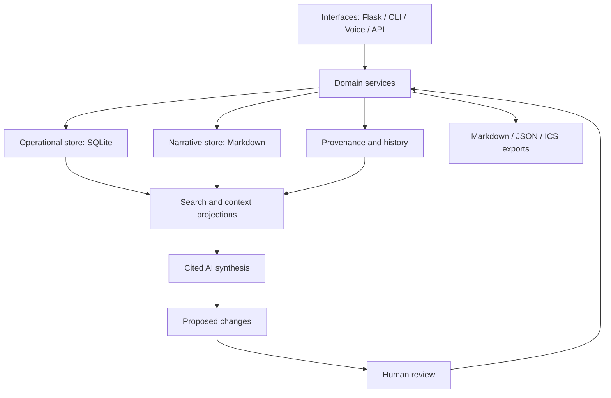

The clearest opportunity is not “build a second-brain app.” It is: help me resume accurately without rereading everything—and warn me when the knowledge base disagrees with itself.
I captured the full analysis in [Knowledge Assurance and Context Engine](../ideas/knowledge-assurance-and-context-engine.md) and updated the [Big Brain Time Ready-to-Resume state](../projects/big-brain-time.md).
Key findings:
The corpus has 91 source Markdown files—about 109K rough tokens.
views/now.md contains expired “today” language and repeats closed questions as open.
Five decision links are broken.
All 15 project pages lack the documented status field.
Typed question IDs are reused for unrelated questions.
The experiment log retains a zero-witness result that later evidence corrected to 25.
Project and knowledge indexes omit newer files.
A second independent backup and successful restore test could not be verified.
The separate Windows Documents folder contains no actual document corpus—only three tiny Git-initialization directories.
These failures demonstrate that the automation threshold has been crossed. The primary problem is propagation and epistemic integrity, not storage speed.
The recommended sequence is:
Verify an independent backup with one restore test.
Build a read-only Python bbt audit/bbt doctor command against the known defects.
Create a 15–20-question retrieval regression set.
Build project-scoped, citation-bearing context packs and compare them with the full handbook.
Introduce SQLite + FTS5 as a disposable, rebuildable read model.
Add Flask only as a thin localhost interface over proven commands.
Add conversational synthesis and proposed Git patches only after retrieval, conflict disclosure, and abstention tests pass.
Markdown and Git remain canonical. SQLite should contain derived documents, sections, links, project states, typed records, diagnostics, provenance, and FTS indexes—but must always be safely deletable.
This design is supported by research showing that nominal context capacity exceeds reliable effective context, especially with dispersed evidence or limited lexical overlap: Lost in the Middle, RULER, NoLiMa, and LongMemEval. Microsoft’s GraphRAG research also supports separating targeted retrieval from corpus-wide sensemaking. Retrieved documents must remain untrusted evidence because indirect prompt injection can manipulate tool-using systems (Greshake et al.).
No implementation was begun; the proposal deliberately freezes acceptance tests before code. The next small development slice is [Stage 0 and `bbt audit`](../ideas/knowledge-assurance-and-context-engine.md). The changed files passed whitespace and local-link verification.

Edited 3 files+419-16Review changesUndoReview

ideas/README.mdideas/README.md+3-2
ideas/knowledge-assurance-and-context-engine.mdideas/knowledge-assurance-and-context-engine.md+399-0
projects/big-brain-time.mdprojects/big-brain-time.md+17-14

5:07 PM

Is there any research or questions or advice or architectural decisions or anything that might be helpful that I could help pull and help give you? I mean, if we are going to start down the SQLite and Flask direction, which I would encourage, it's kind of where I want to go, you know, one of the things I want to think about is how I transition there. You know, I want to be able to transition there easily and things like that and intentionally. But the other thing I want to think about is all the subsystems and systems I might need in the things that I use, how I might build those systems, and how I can leverage like current research and things to really get a lot out of those systems. So, you know, I really want to think deeply about the whole plan and where we might go. And obviously, like our map, our plan may change as we go about it, but I would really have like a super ambitious plan that I can flesh out and then I go with, you know, something kind of small, even though when we go about it, it'll be in very, very, very small pieces, if that makes sense. So let me know what kind of questions I can answer, what kind of research I can provide, as I could do a much deeper and, you know, synthesis and pull for you. The goal here would be, you know, to have these different systems to help different things and things like that. Let me know what might be helpful to clarify if that needs as well.

5:12 PM

Worked for 1m 16s

Yes—your preference is enough to set a stronger north star: build toward a local-first Flask + SQLite personal operating system, while migrating into it subsystem by subsystem and preserving Markdown exportability.
The most promising architecture is not “everything stays Markdown forever” or “move everything into SQLite at once.” It is explicit authority by information type:
Narrative knowledge, research notes, and long-form reflection can remain Markdown-first initially.
Operational state—projects, tasks, transitions, schedules, reminders, relationships, and review triggers—can gradually become SQLite-first.
Search indexes, diagnostics, context packs, embeddings, and dashboards remain disposable derived data.
Flask, CLI, voice, and future agents are interfaces over the same domain services.

Flask’s official application-factory and blueprint patterns are well suited to separating these subsystems, while SQLite already provides native full-text search through FTS5 and structured JSON operations. Flask application factories, Flask blueprints, SQLite FTS5, SQLite JSON functions.
The questions only you can answer
These are more valuable than outside research because they determine what we are actually optimizing.
What should the system do during a real day?
Walk me through capture, work, interruptions, planning, research, health logistics, entertainment, and end-of-day transitions. Where do you currently lose context or repeat work?

What are the first five jobs the system should perform?
Examples:
“Catch me up accurately.”
“Tell me what I should work on.”
“Preserve this conversation.”
“Prepare context for another AI or project.”
“Notice that a decision changed but dependent pages did not.”
“Remind me at the relevant moment.”
“Help me investigate a research question.”
“Show why the system believes something.”

What should eventually be SQLite-canonical?
Consider tasks, projects, events, routines, transition plans, decisions, experiments, contacts, health observations, media logs, journals, research notes, and ordinary knowledge. It is completely acceptable to answer “unknown” for individual categories.

How and where will you use it?
One Windows computer?
Multiple personal computers?
Phone access?
Remote web access?
Fully offline use?
Voice while gaming or away from the keyboard?
Eventually other people or strictly one user?

What may the system do without asking?
For each domain, distinguish:
retrieve
warn
draft
modify
schedule
send or publish
monitor continuously

Which external systems remain authoritative?
Calendar, GitHub, health portal, email, Google Drive, work systems, password manager, financial tools, media services, and other repositories.

What failures would destroy your trust?
Examples include losing history, presenting an old belief as current, exposing private data, sending an unintended message, hiding something important, creating too many alerts, or changing your authentic writing voice.

What would make the system feel transformative after one year?
This defines the ambitious endpoint better than a feature list.

The most useful concrete artifact you could give me is:
10 questions you genuinely want to ask the system
5 recurring actions you want it to help perform
5 examples of information changing and needing propagation
3 things it must never do
1 narrated “typical week”
Research pulls that would materially affect the architecture
If you want to conduct deep research, I would prioritize these packets in order.
1. SQLite/Markdown migration and local-first architecture
Central question:
How should a single-user, local-first knowledge application migrate incrementally from Markdown/Git into SQLite while preserving portability, history, reversibility, and multi-device options?

Please investigate:
Markdown-canonical versus SQLite-canonical versus hybrid authority
strangler-style migrations and why dual writes fail
round-trip Markdown fidelity
event sourcing and append-only history
schema migrations and rollback
content-addressed storage and stable identifiers
SQLite backup, replication, and recovery
single-writer versus multi-device conflict models
whether CRDT complexity is warranted for one user
export guarantees if the application disappears
The local-first literature is a useful anchor because it emphasizes offline operation, ownership, longevity, and user control rather than merely local hosting. Kleppmann et al., “Local-First Software”.
Desired output:
three candidate migration architectures
irreversible choices and failure modes
recommended architecture for years 1, 2, and 5
a minimal migration experiment
2. Long-term AI memory and context engineering
Central question:
What memory architecture best supports temporally changing, source-backed personal knowledge across many sessions?

Investigate:
effective versus advertised context length
long-term conversational memory
temporal and supersession-aware retrieval
hybrid lexical, metadata, graph, and embedding retrieval
local versus global corpus questions
hierarchical context packs
context compression and information loss
abstention and contradiction disclosure
evaluation benchmarks such as LongMemEval and NoLiMa
coding-agent retrieval versus conventional RAG
model-independent storage and context formats
Relevant starting points include LongMemEval, NoLiMa, RULER, and GraphRAG.
Desired output:
recommended retrieval architecture at 100, 1,000, and 10,000 documents
known failure modes
a proposed evaluation set
what should be deterministic versus model-driven
3. Provenance, temporal truth, and correction
Central question:
How should the system represent what was claimed, by whom, from which source, during what effective period, and how it was corrected?

Research:
provenance models
bitemporal data: when something was true versus when it was recorded
claims versus observations versus interpretations
corrections and supersession
conflicting authorities
confidence and evidence quality
decision rationale and reconsideration triggers
immutable history versus editable current state
The W3C PROV model is a useful conceptual reference because it distinguishes entities, activities, agents, derivations, and responsibility. We probably need only a small subset, not an RDF implementation. W3C PROV overview.
Desired output:
a minimal claim/provenance schema
examples using actual Big Brain Time contradictions
rules for choosing current truth
cases where the system must show both sides rather than decide
4. Personal operations and temporal systems
Central question:
What common model can support tasks, events, habits, recurring responsibilities, reminders, dependencies, and interruptions without becoming another brittle task manager?

Research:
event versus task versus routine versus project
recurrence rules and occurrence exceptions
due dates, start dates, effective periods, and review triggers
dependency and blocking relationships
notification timing and interruption cost
prospective memory
graceful re-entry
archive and managed forgetting
calendar interoperability
We should reuse established recurrence semantics rather than inventing “every second Tuesday” ourselves; iCalendar’s RRULE model is the obvious reference. RFC 5545.
Desired output:
operational entity model
recurrence and exception examples
notification principles
clear boundaries between BBT and external calendars
5. Mixed initiative, permissions, and agent safety
Central question:
How can the system become proactive without becoming annoying, unsafe, or silently wrong?

Research:
mixed-initiative interaction
graduated autonomy
least-privilege tool access
reversible versus consequential actions
confirmation design
prompt injection from retrieved documents
separating evidence from instructions
privacy enforcement before model access
audit trails
correction and trust repair
Indirect prompt injection matters even for a personal system once imported documents, webpages, email, or external connectors enter the context. Greshake et al..
Desired output:
permission matrix by subsystem and action
threat model
confirmation policy
safe read → propose → review → write workflow
6. Evaluation of a human–AI cognitive system
Central question:
How do we determine whether Big Brain Time improves your capabilities rather than merely accumulating features and documentation?

Possible measures:
time to first productive action after resumption
number of corrections required
source accuracy
contradiction-detection recall
false-warning rate
time spent maintaining the system
repeated explanations to AI
capture-to-use conversion
reminders acted upon
decisions later understood
projects successfully resumed after long gaps
subjective cognitive burden and trust
Desired output:
a small scorecard
baseline collection method
experiments that take days rather than months
explicit failure or stop criteria
Ambitious horizons
The large plan can remain ambitious without making the first release large.
Horizon 1 — Observatory: Import, inspect, validate, search, cite, detect drift, and generate context packs.
Horizon 2 — Workbench: Manage structured projects, tasks, time, transitions, decisions, and experiments through Flask while retaining Markdown exports.
Horizon 3 — Cognitive interface: Conversational retrieval, voice interaction, contextual capture, research synthesis, and proposed propagation patches.
Horizon 4 — Adaptive partner: Permission-scoped monitoring, proactive preparation, personalized retrieval, system experiments, and measured co-adaptation.
Horizon 5 — Personal capability platform: Multiple specialized subsystems sharing identity, provenance, time, permissions, evaluation, and interface infrastructure.
The important architectural move is to build common foundations once—identity, provenance, time, authority, permissions, search, and evaluation—then let projects, research, planning, health preparation, media, learning, and other subsystems reuse them.
My recommended next input from you is not a giant literature review yet. Start with the 10 questions, 5 actions, 5 propagation examples, 3 prohibitions, and typical week. In parallel, the highest-value research pull is the SQLite/Markdown/local-first migration packet. Those two inputs would let us turn the current north star into a defensible architecture and a deliberately tiny first Flask/SQLite slice.

5:13 PM