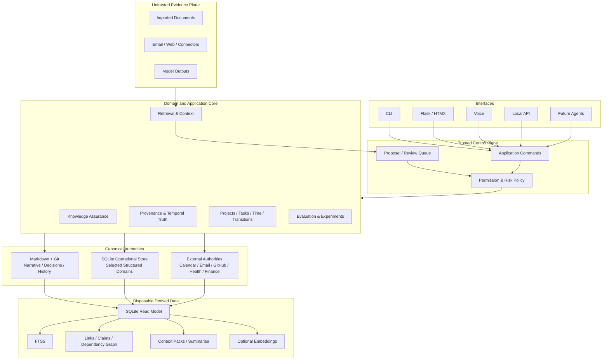
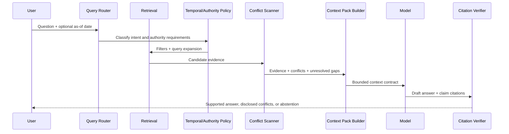
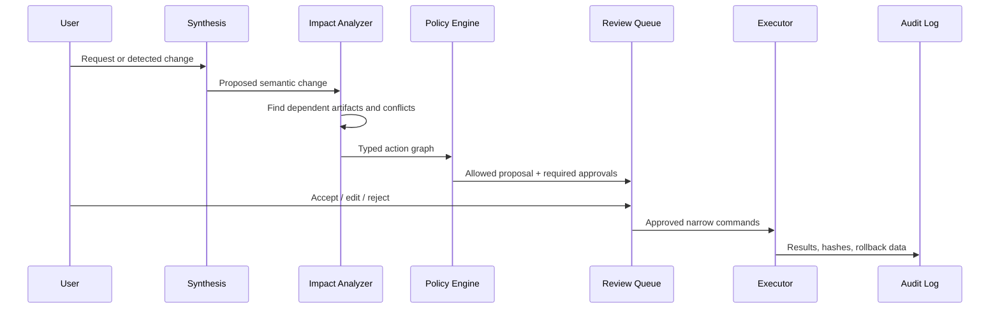

# 02 — Target Architecture

## 1. Architectural style

**[PROPOSAL]** Build Big Brain Time as a **local-first modular monolith with ports and adapters**, a canonical narrative store, a rebuildable read model, and narrowly scoped operational write models.



## 2. Authority matrix

Every information type must have an explicit authority declaration. “Stored in Big Brain Time” and “authoritative in Big Brain Time” are not equivalent.

| Information type | Year-one authority | Derived copies | Possible later authority | Notes |
|---|---|---|---|---|
| Narrative knowledge, research synthesis | Markdown/Git | SQLite sections, FTS, summaries | Remain Markdown | Human-readable, long-lived |
| Decisions and rationale | Markdown/Git append-oriented record | claim/decision projection | Remain Markdown or structured mirror | Never erase superseded rationale |
| Project outcome and durable narrative | Markdown/Git initially | project projection | Split: narrative Markdown, state SQLite | Authority migration is per field |
| Task execution state | Markdown initially | task projection | SQLite after Sprint 14 gate | Must export losslessly |
| Transition / re-entry state | Markdown initially | transition projection | SQLite after Sprint 15 gate | High operational value, structured |
| Recurrence / routines | External calendar or Markdown rules | occurrence projection | SQLite rule + external event link | Never duplicate raw calendar without need |
| Events and appointments | External calendar | local references / prep context | External remains authoritative | Store BBT-specific context only |
| Email | Email provider | indexed metadata/snippets with policy | External remains authoritative | Sensitive evidence, untrusted content |
| GitHub work | GitHub/repository | local project links and context | External remains authoritative | No duplicate issue system unless needed |
| Health records | Health portal/provider | questions, interpretations, prep notes | External remains authoritative | High-stakes; retrieve-only default |
| Secrets | Password manager | None | External only | Never enter corpus |
| Search indexes, diagnostics, graph, embeddings | None | SQLite/cache | Always derived | Safe to delete and rebuild |
| Context packs | None | generated files/cache | Always derived | Include manifest and expiration |
| AI output | None until reviewed | run log/proposal | Canonical only after explicit acceptance | Model output is not evidence by itself |

## 3. Application modules

### 3.1 `assurance`

Responsibilities:

- corpus inventory
- Markdown/frontmatter parsing
- stable ID registry
- required-field validation
- link and anchor validation
- stale view detection
- impossible date/state checks
- duplicate authority detection
- contradiction candidates
- index completeness
- backup/restore status
- diagnostic severity and suppression policy

Primary commands:

```text
bbt doctor
bbt audit --format human|json|sarif
bbt check links
bbt check ids
bbt check metadata
bbt check staleness
bbt check propagation
```

### 3.2 `corpus`

Responsibilities:

- file discovery and inclusion rules
- document and section fingerprinting
- Markdown AST normalization
- source path and Git commit tracking
- deterministic import
- export manifests
- content hash verification

### 3.3 `provenance`

Responsibilities:

- agents, sources, activities, claims, evidence links
- valid and recorded time
- supersession and correction
- authority selection rules
- conflict representation
- decision dependencies and reconsideration triggers
- “as-of” queries

### 3.4 `operations`

Submodules:

- projects
- tasks
- dependencies and blockers
- transitions / re-entry
- routines and recurrence
- reminders and review triggers
- decisions and experiments
- contacts/relationships only when a real workflow demands them

### 3.5 `retrieval`

Responsibilities:

- query classification
- exact ID/path lookup
- FTS5 retrieval
- metadata/time/authority filters
- link and graph expansion
- optional embedding retrieval
- reranking
- conflict scan
- evidence bundle construction
- retrieval explanations

### 3.6 `context`

Responsibilities:

- context-pack contracts and manifests
- project/area/research/global pack templates
- source citation mapping
- token budgeting
- compression lineage
- omissions and uncertainty sections
- pack expiration and invalidation

### 3.7 `synthesis`

Responsibilities:

- answer generation from supplied evidence only
- claim-to-citation alignment
- abstention
- contradiction disclosure
- proposed decisions and patches
- no direct canonical mutation

### 3.8 `permissions`

Responsibilities:

- domain initiative matrix
- tool scopes
- action risk classification
- confirmation requirements
- data privacy policy
- action graph validation
- kill switch and safe mode
- audit trail

### 3.9 `evaluation`

Responsibilities:

- gold question set
- seeded defects and contradictions
- retrieval/answer/action run logs
- regression reports
- human correction and coordination-cost measures
- experiment registry
- capability scorecard

### 3.10 `integrations`

Adapters, not core dependencies:

- Git / GitHub
- filesystem
- calendar / ICS
- email
- Google Drive or other file stores
- model providers
- voice transcription
- optional local model

## 4. Repository layout

```text
big-brain-time/
├── pyproject.toml
├── src/bbt/
│   ├── domain/
│   │   ├── assurance/
│   │   ├── provenance/
│   │   ├── operations/
│   │   ├── retrieval/
│   │   ├── permissions/
│   │   └── evaluation/
│   ├── application/
│   │   ├── commands/
│   │   ├── queries/
│   │   └── services/
│   ├── adapters/
│   │   ├── markdown/
│   │   ├── sqlite/
│   │   ├── git/
│   │   ├── calendar/
│   │   ├── models/
│   │   └── connectors/
│   ├── interfaces/
│   │   ├── cli/
│   │   ├── web/
│   │   ├── api/
│   │   └── voice/
│   └── config/
├── migrations/
├── tests/
│   ├── unit/
│   ├── integration/
│   ├── corpus_fixtures/
│   ├── retrieval_gold/
│   ├── safety/
│   └── recovery/
├── var/
│   ├── read-model.sqlite3
│   ├── operational.sqlite3
│   ├── backups/
│   ├── context-packs/
│   └── reports/
└── existing Markdown corpus...
```

The derived `var/` directory is ignored by Git except for manifests or golden fixtures intentionally committed for tests.

## 5. Command/query separation

Use explicit application messages:

- **Queries** never change canonical state: `GetProjectContext`, `SearchClaims`, `ExplainCurrentTruth`, `ListPropagationImpacts`.
- **Commands** represent intended change: `RecordTransition`, `AcceptProposal`, `SupersedeDecision`, `CompleteTask`.
- **Policies** authorize commands before adapters execute them.
- **Events** record completed domain changes for projection and audit, but the system does not need a full event-sourcing framework.

This makes CLI, Flask, tests, and future voice/agent interfaces consistent.

## 6. Data flow for a trusted answer



No answer is considered source-grounded until the citation verifier confirms that material claims map to included evidence.

## 7. Data flow for a proposed change



## 8. Read model build

The read model is a compiler output:

```text
Corpus commit + importer version + schema version
    -> discover files
    -> parse Markdown/frontmatter
    -> normalize documents/sections/typed records
    -> compute hashes
    -> validate
    -> build links/claims/provenance projections
    -> build FTS5
    -> emit diagnostics and manifest
```

A successful rebuild must be deterministic at the logical level. Timestamps and row IDs that would make comparisons unstable should be excluded from the canonical build fingerprint.

## 9. Deployment model

### Year one

- Single Windows workstation.
- Local Python environment.
- CLI is primary operational interface during early sprints.
- Flask binds to localhost only.
- Private Git repository remains canonical backup/sync for Markdown.
- Independent encrypted backup proves restore.
- SQLite read model is rebuilt locally.

### Year two

- Optional LAN/private remote access through an authenticated reverse proxy or VPN.
- Mobile capture through a narrow endpoint or synced inbox—not full remote administration.
- Optional encrypted device-to-device replication for operational SQLite after single-writer assumptions are reevaluated.

### Year five

- Multiple specialized local apps share the core service contract.
- A local capability bus exposes read/query/proposal operations.
- CRDT or append-log replication is considered only if multiple devices genuinely write concurrently.
- Model providers remain replaceable through adapters and model-independent context formats.

## 10. Migration sequence

1. **Inventory and protect:** snapshot, backup, restore test, corpus manifest.
2. **Observe without writing:** `bbt doctor` against known defects.
3. **Freeze evaluation:** retrieval and conflict gold set before search changes.
4. **Build projections:** SQLite read model and FTS5.
5. **Prove context:** project-scoped packs outperform full-handbook baseline.
6. **Add thin UI:** diagnostics and search in Flask.
7. **Migrate one operational aggregate:** transition plans, then tasks/projects if value is clear.
8. **Export continuously:** Markdown/JSON/ICS snapshots with round-trip fixtures.
9. **Add synthesis:** only after citation, conflict, temporal, and abstention gates.
10. **Add initiative:** shadow mode → suggestions → preparation → narrowly reversible local actions.

## 11. Technical standards

- Python 3.12+ unless repository constraints dictate otherwise.
- Type checking with `pyright` or `mypy`.
- Ruff for lint/format.
- `pytest`, property-based tests where valuable.
- SQL migrations with explicit up/down or restore-based rollback.
- SQLite foreign keys on, STRICT tables, integrity checks.
- ISO 8601 UTC timestamps plus original timezone when semantically needed.
- Stable typed IDs; never encode mutable dates/status in IDs.
- SHA-256 or BLAKE3 content fingerprints.
- Structured logging; no sensitive payloads by default.
- Dependency lock file and reproducible setup.
- All model calls recorded with model, prompt template version, evidence manifest, and output hash.


## Source conventions

This package distinguishes three kinds of statements:

- **[SOURCE]** — directly supported by the two supplied Big Brain Time documents.
- **[RESEARCH]** — supported by external primary literature or official technical documentation listed in `09_RESEARCH_BIBLIOGRAPHY.md`.
- **[PROPOSAL]** — a design recommendation, target, threshold, or inference introduced by this blueprint. It must be tested before being promoted into canonical Big Brain Time decisions.

Local source keys:

- **[S1]** `sources/handbook.md`, exact copy of the supplied Big Brain Time Handbook, compiled 2026-07-21.
- **[S2]** `sources/repository-audit-and-planning.txt`, exact copy of the supplied repository audit and architecture planning transcript.
